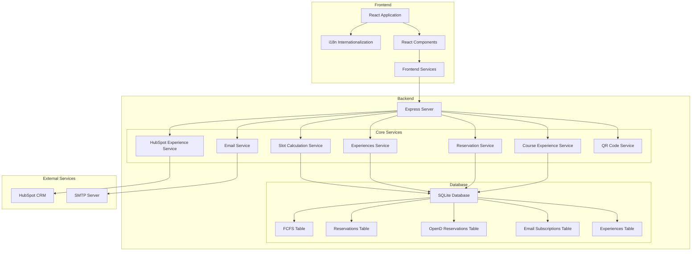
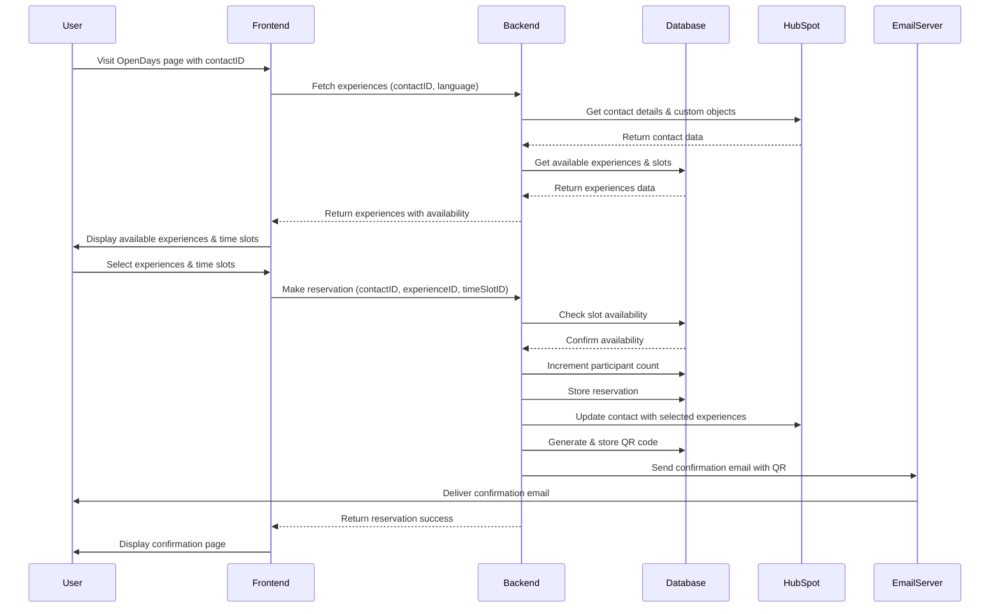
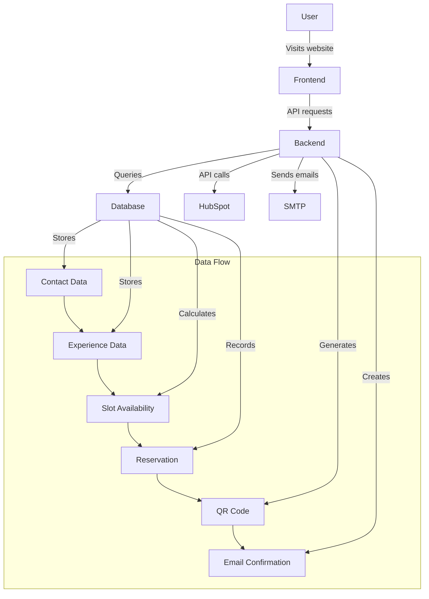
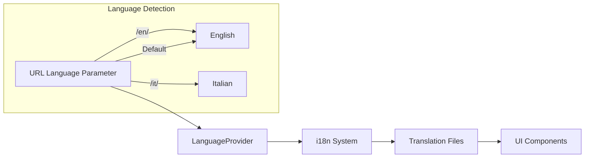
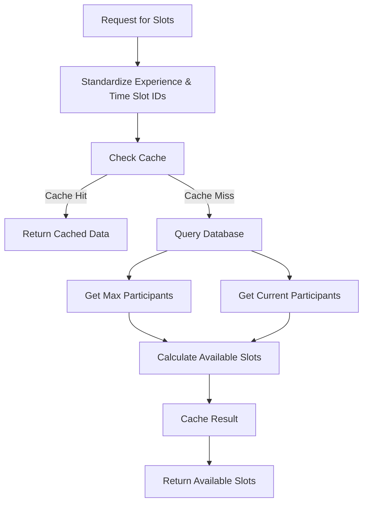
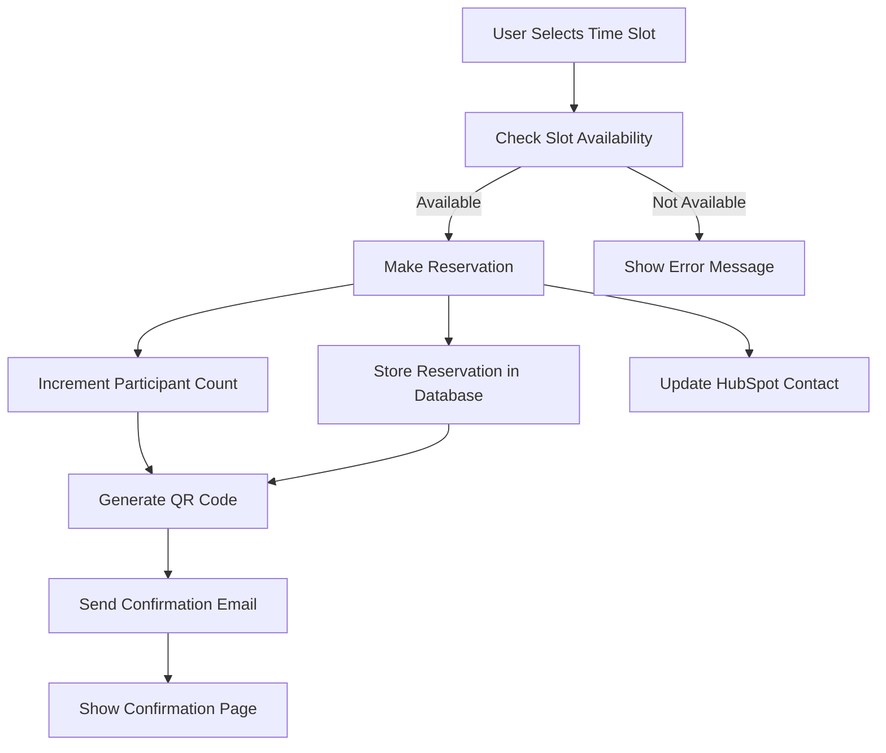
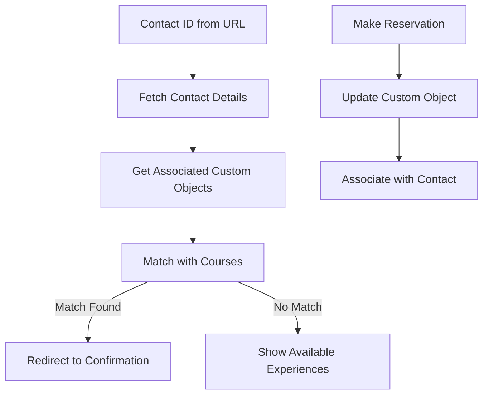

# UNISR OpenDays Application Architecture

## System Architecture Diagram



## Component Details

### Frontend Components

1. **React Application**
   - Main entry point for the frontend application
   - Handles routing and state management
   - Integrates with internationalization system

2. **i18n Internationalization**
   - Supports multiple languages (English and Italian)
   - Manages language switching based on URL parameters
   - Provides translation functions to components

3. **React Components**
   - **OpenDayRegistration**: Main component for registering for open day events
   - **ConfirmationPage**: Displays confirmation after successful registration
   - **GenitoriPage**: Special page for parents
   - **ActivityAccordion**: Displays available activities with time slots
   - **LoadingOverlay**: Shows loading state during API calls

4. **Frontend Services**
   - **experienceService**: Handles API calls to fetch experiences and make reservations
   - Manages communication with the backend server

### Backend Components

1. **Express Server**
   - Main entry point for the backend application
   - Handles HTTP requests and routing
   - Serves static files and renders EJS templates
   - Manages CORS and middleware configuration

2. **Core Services**
   - **Slot Calculation Service**: Manages slot availability calculations
   - **Experiences Service**: Handles CRUD operations for experiences
   - **Reservation Service**: Manages user reservations
   - **Course Experience Service**: Links courses with experiences
   - **HubSpot Experience Service**: Integrates with HubSpot CRM
   - **Email Service**: Sends confirmation emails with QR codes
   - **QR Code Service**: Generates QR codes for event check-in

3. **Database (SQLite)**
   - **FCFS Table**: First-come-first-served tracking
   - **Reservations Table**: Stores user reservations
   - **OpenD Reservations Table**: Stores open day reservations
   - **Email Subscriptions Table**: Tracks email subscriptions
   - **Experiences Table**: Stores experience details and availability

### External Services

1. **HubSpot CRM**
   - Stores contact information
   - Manages custom objects for courses and experiences
   - Tracks user registrations and participation

2. **SMTP Server**
   - Sends confirmation emails to users
   - Delivers QR codes for event check-in

## Main Application Flows



## Data Flow Diagram



## Internationalization Flow



## Slot Calculation Logic



## Reservation Process



## HubSpot Integration



## Email Service Flow

```mermaid
flowchart TD
    TriggerEmail[Trigger Email Send] --> PrepareData[Prepare Email Data]
    PrepareData --> GenerateQR[Generate QR Code]
    GenerateQR --> SaveQRImage[Save QR Image]
    SaveQRImage --> RenderTemplate[Render Email Template]
    RenderTemplate --> SendEmail[Send Email via SMTP]