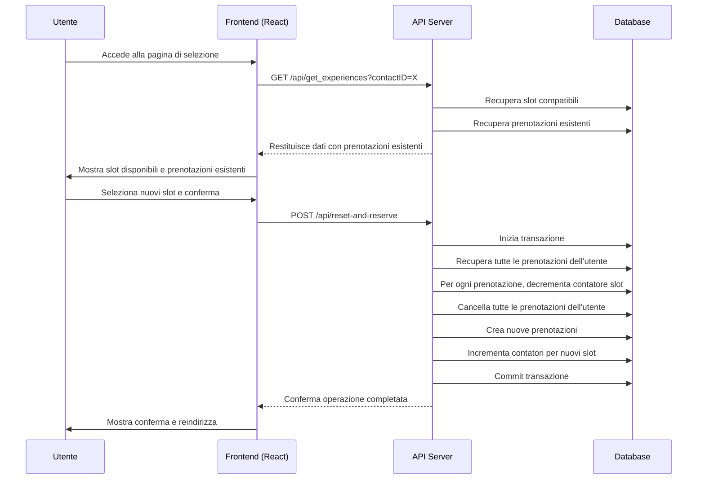

# Piano di Implementazione per la Cancellazione delle Prenotazioni OpenDays

Basandomi sull'analisi del codice esistente, propongo di implementare la cancellazione delle prenotazioni al momento del submit, quando l'utente conferma le nuove scelte. Questo approccio è più pratico perché:

1. Mantiene le prenotazioni esistenti finché l'utente non conferma le nuove scelte
2. Evita di cancellare prenotazioni se l'utente abbandona la pagina senza effettuare nuove scelte
3. Si integra meglio con il flusso esistente dell'applicazione

## Architettura della Soluzione

Ecco come implementerei questa funzionalità:



## Modifiche Necessarie

### 1. Nuovo Endpoint API

Creeremo un nuovo endpoint `/api/reset-and-reserve` che gestirà l'intero processo in un'unica transazione:

```javascript
// server.js
app.post('/api/reset-and-reserve', async (req, res) => {
    const { contactID, reservations } = req.body;
    
    if (!contactID || !Array.isArray(reservations)) {
        return res.status(400).json({
            error: 'Missing required fields'
        });
    }
    
    try {
        // Inizia una transazione
        await new Promise((resolve, reject) => {
            db.run("BEGIN TRANSACTION", (err) => {
                if (err) {
                    logger.error(`Errore nell'iniziare la transazione: ${err.message}`);
                    reject(err);
                } else {
                    resolve();
                }
            });
        });
        
        try {
            // 1. Recupera tutte le prenotazioni esistenti dell'utente
            const existingReservations = await reservationService.getReservationsForContact(db, contactID);
            
            // 2. Per ogni prenotazione esistente, decrementa il contatore dei partecipanti
            for (const reservation of existingReservations) {
                await experiencesService.decrementParticipantCountForTimeSlot(
                    db, 
                    reservation.experience_id, 
                    reservation.time_slot_id
                );
            }
            
            // 3. Cancella tutte le prenotazioni esistenti dell'utente
            await reservationService.deleteAllReservationsForContact(db, contactID);
            
            // 4. Crea le nuove prenotazioni
            const results = [];
            for (const { experienceId, timeSlotId, dbId } of reservations) {
                // Verifica che ci siano ancora posti disponibili
                let slot;
                if (dbId) {
                    slot = await new Promise((resolve, reject) => {
                        db.get(
                            "SELECT id, current_participants, max_participants FROM experiences WHERE id = ?",
                            [dbId],
                            (err, row) => {
                                if (err) reject(err);
                                else resolve(row);
                            }
                        );
                    });
                } else {
                    slot = await new Promise((resolve, reject) => {
                        db.get(
                            "SELECT id, current_participants, max_participants FROM experiences WHERE experience_id = ?",
                            [experienceId],
                            (err, row) => {
                                if (err) reject(err);
                                else resolve(row);
                            }
                        );
                    });
                }
                
                if (!slot) {
                    results.push({
                        experienceId,
                        success: false,
                        error: 'Slot not found',
                        errorCode: 'SLOT_NOT_FOUND'
                    });
                    continue;
                }
                
                if (slot.current_participants >= slot.max_participants) {
                    results.push({
                        experienceId,
                        success: false,
                        error: 'No spots available',
                        errorCode: 'NO_SPOTS_AVAILABLE'
                    });
                    continue;
                }
                
                // Salva la prenotazione
                await reservationService.saveReservation(db, contactID, experienceId, timeSlotId, null, false);
                
                // Incrementa il contatore dei partecipanti
                await experiencesService.incrementParticipantCount(db, slot.id);
                
                results.push({
                    experienceId,
                    success: true
                });
            }
            
            // Commit della transazione
            await new Promise((resolve, reject) => {
                db.run("COMMIT", (err) => {
                    if (err) {
                        logger.error(`Errore nel commit della transazione: ${err.message}`);
                        reject(err);
                    } else {
                        resolve();
                    }
                });
            });
            
            // Aggiorna i posti rimanenti
            await updateRemainingSlots();
            
            // Ritorna i risultati
            res.json({
                success: true,
                results
            });
        } catch (error) {
            // Rollback in caso di errore
            await new Promise((resolve) => {
                db.run("ROLLBACK", () => {
                    logger.info("Transazione annullata a causa di un errore");
                    resolve();
                });
            });
            throw error;
        }
    } catch (error) {
        logger.error('Error in /api/reset-and-reserve:', error);
        res.status(500).json({
            error: 'Internal server error'
        });
    }
});
```

### 2. Modifica al Frontend Service

Aggiungeremo una nuova funzione al servizio frontend per utilizzare il nuovo endpoint:

```typescript
// front/src/services/experienceService.ts
/**
 * Resets all existing reservations and creates new ones
 * @param contactID The ID of the contact
 * @param reservations Array of new reservations to create
 * @returns Promise with the operation result
 */
export const resetAndReserve = async (
  contactID: string,
  reservations: Array<{
    experienceId: string | number,
    timeSlotId: string,
    dbId?: number
  }>
): Promise<{ 
  success: boolean, 
  results?: Array<{
    experienceId: string | number,
    success: boolean,
    error?: string,
    errorCode?: string
  }>,
  error?: string 
}> => {
  try {
    console.log('Resetting and creating new reservations:', { contactID, reservations });
    
    const response = await fetch(' /api/reset-and-reserve', {
      method: 'POST',
      headers: {
        'Content-Type': 'application/json'
      },
      body: JSON.stringify({
        contactID,
        reservations
      })
    });
    
    const data = await response.json();
    console.log('Reset and reserve response:', data);
    
    if (!response.ok) {
      console.error('API response not OK:', response.status, response.statusText, data);
      return {
        success: false,
        error: data.error || 'Failed to reset and create reservations'
      };
    }
    
    return data;
  } catch (error) {
    console.error('Error resetting and creating reservations:', error);
    throw error;
  }
};
```

### 3. Modifica al Componente React

Modificheremo il metodo `handleSubmit` nel componente `OpenDayRegistration.tsx` per utilizzare la nuova funzione:

```typescript
// front/src/components/OpenDayRegistration.tsx
const handleSubmit = async () => {
  console.log('handleSubmit called');
  setSubmitting(true);
  setReservationError(null);
  
  try {
    console.log('Starting to reset and create reservations');
    const selectedSlots = Object.entries(selectedTimeSlots);
    
    // Verifica se ci sono slot selezionati
    if (selectedSlots.length > 0) {
      console.log(`Processing ${selectedSlots.length} selected slots`);
      
      // Prepara l'array di prenotazioni
      const reservationsToCreate = selectedSlots.map(([activityId, timeSlotId]) => {
        // Trova l'attività e lo slot selezionato
        const activity = activities.find(a => String(a.id) === String(activityId));
        const timeSlot = activity?.timeSlots.find(slot => slot.id === timeSlotId);
        
        // Ottieni l'ID della riga
        const dbId = timeSlot?.dbId;
        
        return {
          experienceId: activityId,
          timeSlotId: timeSlotId,
          dbId: dbId
        };
      });
      
      // Chiama il nuovo endpoint per resettare e creare prenotazioni
      const result = await resetAndReserve(contactID, reservationsToCreate);
      
      if (result.success) {
        console.log('All reservations completed successfully');
        
        // Prepara i dati per la pagina di conferma
        const selectedActivities = Object.entries(selectedTimeSlots).map(([activityId, timeSlotId]) => {
          const activity = activities.find(a => String(a.id) === String(activityId));
          const timeSlot = activity?.timeSlots.find(slot => slot.id === timeSlotId);
          return {
            activity: activity?.title,
            course: activity?.course,
            time: timeSlot?.time,
            location: activity?.location,
            duration: activity?.duration
          };
        });
        
        // Aggiorna HubSpot con le esperienze selezionate
        try {
          const language = lang || 'en';
          const selectedActivityIds = Object.keys(selectedTimeSlots);
          await updateSelectedExperiences(contactID, selectedActivityIds, language);
        } catch (updateError) {
          console.error('Error updating HubSpot:', updateError);
          // Continua con il flusso anche se questo aggiornamento fallisce
        }
        
        // Naviga alla pagina di conferma
        navigate(`/${lang}/opendays/confirmation?contactID=${contactID}`, {
          state: {
            activities: selectedActivities,
            matchingCourseIds: matchingCourseIds
          }
        });
      } else {
        // Gestisci gli errori
        if (result.results) {
          const failedReservation = result.results.find(r => !r.success);
          if (failedReservation && failedReservation.errorCode === 'NO_SPOTS_AVAILABLE') {
            const activity = activities.find(a => String(a.id) === String(failedReservation.experienceId));
            setReservationError(t('noSpotsAvailableForActivity', { activity: activity?.title || 'activity' }));
          } else {
            setReservationError('Failed to make reservations');
          }
        } else {
          setReservationError(result.error || 'Failed to make reservations');
        }
        
        // Aggiorna i dati per mostrare la disponibilità aggiornata
        const language = lang || 'en';
        const updatedResponse = await fetchExperiences(contactID, language);
        setActivities(updatedResponse.experiences);
        setMatchingCourseIds(updatedResponse.matchingCourseIds);
      }
    } else {
      console.log('No slots selected, proceeding without making reservations');
      
      // Se non ci sono slot selezionati, cancella comunque tutte le prenotazioni esistenti
      try {
        // Chiama il nuovo endpoint con un array vuoto di prenotazioni
        await resetAndReserve(contactID, []);
        console.log('Successfully reset all existing reservations');
        
        // Naviga alla pagina di conferma
        navigate(`/${lang}/opendays/confirmation?contactID=${contactID}`, {
          state: {
            activities: [],
            matchingCourseIds: matchingCourseIds
          }
        });
      } catch (error) {
        console.error('Error resetting reservations:', error);
        setReservationError('An error occurred while resetting reservations');
      }
    }
  } catch (error) {
    console.error('Error in handleSubmit:', error);
    setReservationError('An error occurred while processing your request');
  } finally {
    setSubmitting(false);
  }
};
```

## Vantaggi di questa Soluzione

1. **Atomicità**: Tutte le operazioni (cancellazione delle prenotazioni esistenti, decremento dei contatori, creazione delle nuove prenotazioni) avvengono in un'unica transazione, garantendo la coerenza dei dati.

2. **Efficienza**: Riduciamo il numero di richieste API necessarie, eseguendo tutto in un'unica chiamata.

3. **Robustezza**: In caso di errore in qualsiasi fase del processo, la transazione viene annullata, mantenendo il database in uno stato coerente.

4. **Flessibilità**: La soluzione funziona sia quando l'utente seleziona nuovi slot, sia quando decide di non selezionare nulla (in questo caso, vengono semplicemente cancellate tutte le prenotazioni esistenti).

5. **Compatibilità**: La soluzione è compatibile con la migrazione del campo `experience_id` descritta nel README, poiché utilizza sia l'ID testuale che il `dbId` numerico.

## Considerazioni Aggiuntive

1. **Prestazioni**: La soluzione potrebbe aumentare leggermente il tempo di risposta dell'API durante il submit, ma questo è accettabile considerando che si tratta di un'operazione relativamente poco frequente.

2. **Logging**: Ho incluso messaggi di log dettagliati per facilitare il debug in caso di problemi.

3. **Gestione degli Errori**: La soluzione include una gestione completa degli errori, con messaggi specifici per diversi tipi di errori (slot non trovato, posti non disponibili, ecc.).

## Alternativa: Cancellazione all'Accesso alla Pagina

In alternativa, si potrebbe implementare la cancellazione delle prenotazioni quando l'utente accede alla pagina di selezione. Questo approccio sarebbe più semplice ma meno flessibile:

```javascript
// server.js
app.get('/api/get_experiences', async (req, res) => {
    const { contactID, lang } = req.query;
    
    // Default to Italian if no language specified
    const language = lang === 'en' ? 'en' : 'it';
    
    if (!contactID) {
        return res.status(400).json({
            error: language === 'en' ? 'Contact ID is required' : 'ID contatto richiesto'
        });
    }
    
    try {
        // 1. Recupera tutte le prenotazioni esistenti dell'utente
        const existingReservations = await reservationService.getReservationsForContact(db, contactID);
        
        // 2. Per ogni prenotazione esistente, decrementa il contatore dei partecipanti
        for (const reservation of existingReservations) {
            await experiencesService.decrementParticipantCountForTimeSlot(
                db, 
                reservation.experience_id, 
                reservation.time_slot_id
            );
        }
        
        // 3. Cancella tutte le prenotazioni esistenti dell'utente
        await reservationService.deleteAllReservationsForContact(db, contactID);
        
        // 4. Aggiorna i posti rimanenti
        await updateRemainingSlots();
        
        // Continua con il codice esistente per recuperare le esperienze...
        // ...
    } catch (error) {
        // ...
    }
});
```

Tuttavia, questo approccio ha lo svantaggio di cancellare le prenotazioni anche se l'utente non effettua nuove scelte, quindi preferisco la soluzione proposta inizialmente.