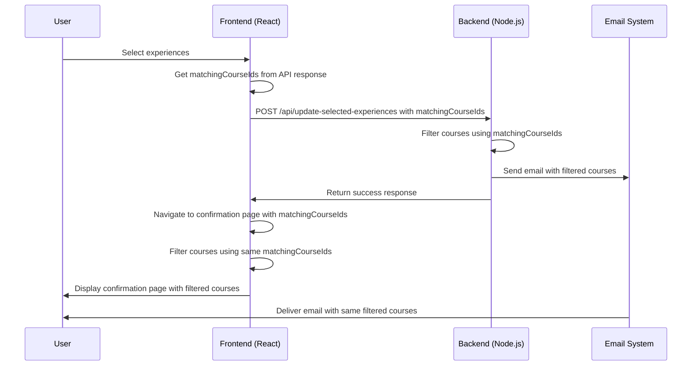

# Course Filtering Flow Diagram

## Current Flow

```mermaid
flowchart TD
    subgraph Frontend
        A[OpenDayRegistration Component] -->|Passes matchingCourseIds| B[ConfirmationPage Component]
        B -->|Fetches courses from JSON| C{isFromSelectionPage?}
        C -->|Yes| D[Load from corsi.json]
        C -->|No| E[Load from otto.json]
        D -->|Filter courses| F[Display filtered courses]
        E -->|Filter courses| F
    end
    
    subgraph Backend
        G[/api/update-selected-experiences Endpoint] -->|Receives matchingCourseIds| H{Has matchingCourseIds?}
        H -->|Yes| I[Use matchingCourseIds for filtering]
        H -->|No| J[Return all courses]
        I -->|Call getMatchingCourses| K[Filter courses from corsi.json]
        J -->|Call getMatchingCourses| K
        K -->|Pass to sendEmailWithQR| L[Transform courses for email]
        L -->|Include in email| M[Send email]
    end
```

## Proposed Flow with Shared Utilities

```mermaid
flowchart TD
    subgraph "Shared Utilities"
        SU1[filterCoursesByIds]
        SU2[transformCourseForDisplay]
    end
    
    subgraph Frontend
        A[OpenDayRegistration Component] -->|Passes matchingCourseIds & fromSelection=true| B[ConfirmationPage Component]
        B -->|Fetches courses from JSON| C{isFromSelectionPage?}
        C -->|Yes| D[Load from corsi.json]
        C -->|No| E[Load from otto.json]
        D & E -->|Use shared utility| SU1
        SU1 -->|Return filtered courses| F[Display filtered courses]
        F -->|Use shared utility| SU2
        SU2 -->|Return transformed courses| G[Display transformed courses]
    end
    
    subgraph Backend
        H[/api/update-selected-experiences Endpoint] -->|Receives matchingCourseIds & fromSelection| I{Has matchingCourseIds?}
        I -->|Yes| J[Use matchingCourseIds for filtering]
        I -->|No| K[Return all courses]
        J & K -->|Use shared utility| SU1
        SU1 -->|Return filtered courses| L[Pass to sendEmailWithQR]
        L -->|Use shared utility| SU2
        SU2 -->|Return transformed courses| M[Include in email]
        M -->|Send email| N[Email delivered]
    end
```

## Data Flow for Course IDs



This diagram illustrates how the shared utility functions ensure that both the frontend and backend use the same filtering logic, resulting in consistent course displays in both the confirmation page and the email.

## Implementation Benefits

1. **Consistency**: Users see the same courses in both the confirmation page and the email
2. **Maintainability**: Shared utility functions reduce code duplication
3. **Flexibility**: The same filtering logic can be applied in different contexts
4. **Testability**: Utility functions can be easily unit tested

By implementing this approach, we ensure a consistent user experience while also improving the codebase's maintainability and reliability.