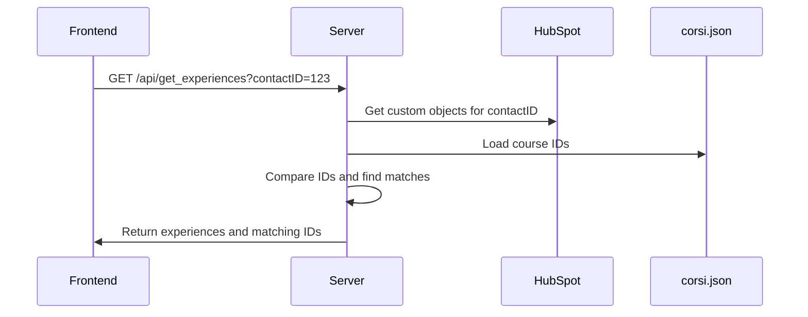
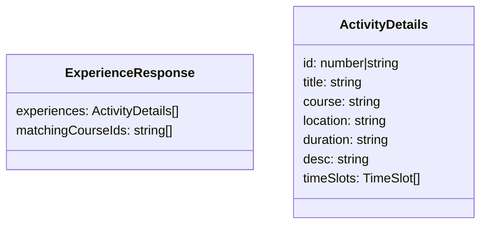
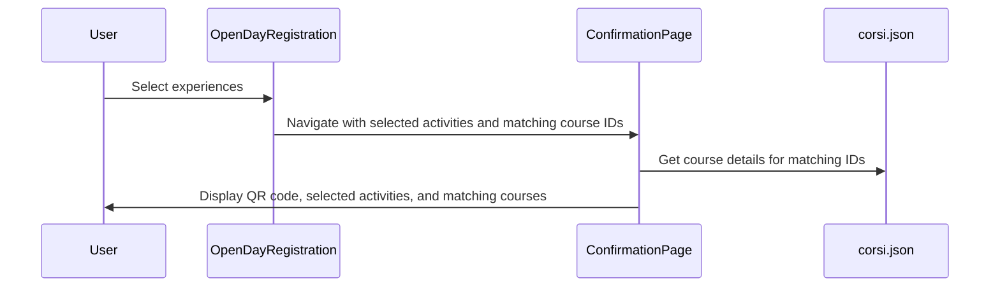

# Data Flow Implementation Plan

## Overview

This document outlines the implementation plan for passing the list of matching course IDs from the experience selection page to the QR code page.

## Current Flow

1. In the experience selection page (`/front`):
   - The server makes a request to HubSpot for custom objects associated with a contactID
   - These IDs are compared with those in corsi.json to find matches
   - The matching experiences are displayed to the user for selection

2. When the user selects experiences and submits:
   - The selected activity IDs are sent to HubSpot via `updateSelectedExperiences`
   - The user is navigated to the confirmation page with selected activities data

3. The confirmation page:
   - Displays the QR code and the selected activities
   - Currently doesn't show any information about the matching courses from corsi.json

## Implementation Plan

### 1. Modify the Server-Side API

We need to modify the `/api/get_experiences` endpoint to return the filtered object IDs (matching IDs from HubSpot and corsi.json) along with the experiences:



### 2. Update the Frontend Experience Service

Modify the `fetchExperiences` function in `experienceService.ts` to store the matching course IDs:



### 3. Update the OpenDayRegistration Component

Modify the OpenDayRegistration component to:
- Store the matching course IDs received from the API
- Pass these IDs to the confirmation page along with the selected activities

### 4. Enhance the ConfirmationPage Component

Update the ConfirmationPage component to:
- Accept the matching course IDs as a prop
- Fetch the course details from corsi.json for these IDs
- Display a recap of these courses along with the selected activities



## Detailed Code Changes

### 1. Modify server.js

```javascript
// Modify the /api/get_experiences endpoint
app.get('/api/get_experiences', async (req, res) => {
    // ... existing code ...
    
    // After finding the filtered IDs
    const filteredObjectIds = [];
    // ... existing filtering code ...
    
    // Get experiences from the database
    const experiences = await courseExperienceService.getExperiencesByCustomObjectIds(db, filteredObjectIds, language, contactID);
    
    // Return both the experiences and the matching IDs
    res.json({
        experiences: experiences,
        matchingCourseIds: filteredObjectIds
    });
});
```

### 2. Update experienceService.ts

```typescript
// Update the return type of fetchExperiences
export const fetchExperiences = async (contactID: string, lang: string): Promise<{
  experiences: ActivityDetails[];
  matchingCourseIds: string[];
}> => {
  try {
    // ... existing code ...
    
    const data = await response.json();
    
    // Return both experiences and matching IDs
    return {
      experiences: data.experiences || [],
      matchingCourseIds: data.matchingCourseIds || []
    };
  } catch (error) {
    console.error('Error fetching experiences:', error);
    return { experiences: [], matchingCourseIds: [] };
  }
};
```

### 3. Update OpenDayRegistration.tsx

```typescript
// Add state for matching course IDs
const [matchingCourseIds, setMatchingCourseIds] = useState<string[]>([]);

// Update loadExperiences function
const loadExperiences = async () => {
  try {
    // ... existing code ...
    
    const data = await fetchExperiences(contactID, language);
    
    // Store both experiences and matching IDs
    setActivities(data.experiences);
    setMatchingCourseIds(data.matchingCourseIds);
    
    // ... rest of the function ...
  } catch (err) {
    // ... error handling ...
  }
};

// Update navigation to confirmation page
navigate(`/${lang}/opendays/confirmation?contactID=${contactID}`, { 
  state: { 
    activities: selectedActivities,
    matchingCourseIds: matchingCourseIds 
  } 
});
```

### 4. Update ConfirmationPage.tsx

```typescript
// Update interface
interface ConfirmationPageProps {
  activities: SelectedActivity[];
  contactID?: string;
  matchingCourseIds?: string[]; // Add matching course IDs
}

// Update component
export const ConfirmationPage = ({ activities, contactID, matchingCourseIds = [] }: ConfirmationPageProps) => {
  const { t } = useTranslation();
  const [qrCodeUrl, setQrCodeUrl] = useState<string>('/images/qr.png');
  const [courses, setCourses] = useState<any[]>([]);
  
  useEffect(() => {
    // Fetch QR code
    if (contactID) {
      fetchQRCode(contactID)
        .then(url => setQrCodeUrl(url))
        .catch(error => console.error('Error fetching QR code:', error));
    }
    
    // Fetch course details for matching IDs
    const fetchCourses = async () => {
      try {
        const response = await fetch('/corsi.json');
        const allCourses = await response.json();
        
        // Filter courses by matching IDs
        const matchingCourses = allCourses.filter(course => 
          matchingCourseIds.includes(course.id)
        );
        
        setCourses(matchingCourses);
      } catch (error) {
        console.error('Error fetching courses:', error);
      }
    };
    
    if (matchingCourseIds.length > 0) {
      fetchCourses();
    }
  }, [contactID, matchingCourseIds]);
  
  return (
    <main className="min-h-screen bg-[#00A4E4] w-full">
      {/* ... existing code ... */}
      
      {/* Add section for matching courses */}
      {courses.length > 0 && (
        <div className="space-y-4 mb-16">
          <h2 className="text-2xl text-white font-bold text-center mb-4">
            {t('matchingCourses')}
          </h2>
          {courses.map((course, index) => (
            <div key={index} className="bg-[#0082b6] p-6 rounded">
              <h2 className="text-xl text-white font-extrabold mb-2">
                {course.name}
              </h2>
              {course.location && (
                <div className="text-yellow-300 font-bold">
                  {t('location')}: {course.location}
                </div>
              )}
            </div>
          ))}
        </div>
      )}
      
      {/* ... rest of the component ... */}
    </main>
  );
};
```

## Implementation Steps

1. Modify the server.js `/api/get_experiences` endpoint to include matching IDs in the response
2. Update the experienceService.ts to handle and store these IDs
3. Modify the OpenDayRegistration component to pass these IDs to the confirmation page
4. Enhance the ConfirmationPage component to display the matching courses

This implementation will ensure that the list of matching course IDs is passed from the experience selection page to the QR code page, which can then display content based on this list.