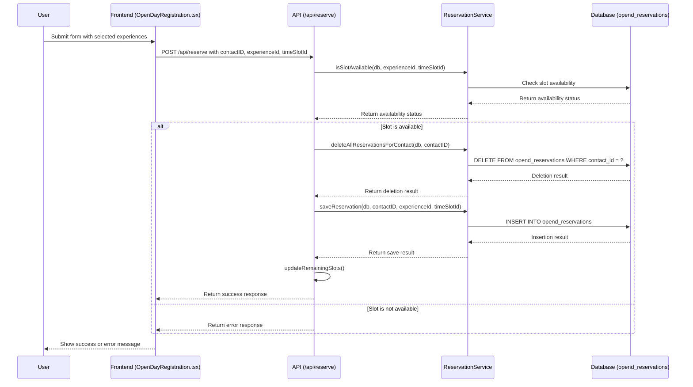

# Implementation Plan: Delete Previous Reservations on Submit

This document outlines the changes needed to modify the system so that when a form is submitted in the `/front` directory, all previous reservations for the same contactID are deleted from the `opend_reservations` table before the new reservations are saved.

## Current Behavior

Currently, when a user submits the form:
1. For each selected experience/time slot, the system either:
   - Updates an existing reservation if one exists for that contact and experience
   - Creates a new reservation if none exists

## Desired Behavior

When a user submits the form:
1. Delete ALL existing reservations for that contactID from the `opend_reservations` table
2. Create new reservations for each selected experience/time slot

## Implementation Steps

### 1. Add a New Function to `reservationService.js`

Add a new function to delete all reservations for a contact:

```javascript
/**
 * Delete all reservations for a contact
 * @param {Object} db - Database instance
 * @param {string} contactId - Contact ID
 * @returns {Promise<boolean>} - Success status
 */
async function deleteAllReservationsForContact(db, contactId) {
  try {
    logger.info(`Deleting all reservations for contact ${contactId}`);
    
    return new Promise((resolve, reject) => {
      db.run(
        "DELETE FROM opend_reservations WHERE contact_id = ?",
        [contactId],
        function(err) {
          if (err) {
            logger.error(`Error deleting reservations: ${err.message}`);
            reject(err);
          } else {
            logger.info(`Deleted ${this.changes} reservations for contact ${contactId}`);
            resolve(true);
          }
        }
      );
    });
  } catch (error) {
    logger.error(`Error in deleteAllReservationsForContact: ${error.message}`);
    throw error;
  }
}
```

Then export this function by adding it to the module.exports:

```javascript
module.exports = {
  saveReservation,
  getReservationsForContact,
  getReservationCounts,
  updateQrCodeUrl,
  isSlotAvailable,
  cancelReservation,
  deleteAllReservationsForContact  // Add this line
};
```

### 2. Modify the `/api/reserve` Endpoint in `server.js`

Update the endpoint to delete all existing reservations before saving the new one:

```javascript
// Endpoint to make a reservation
app.post('/api/reserve', async (req, res) => {
  const { contactID, experienceId, timeSlotId } = req.body;
  
  if (!contactID || !experienceId || !timeSlotId) {
    return res.status(400).json({
      error: 'Missing required fields'
    });
  }
  
  try {
    // Check if the slot is still available
    const isAvailable = await reservationService.isSlotAvailable(db, experienceId, timeSlotId);
    
    if (!isAvailable) {
      // No spots available, return an error
      logger.warn(`No spots available for experience ${experienceId}, time slot ${timeSlotId}`);
      return res.status(409).json({
        success: false,
        error: 'No spots available',
        errorCode: 'NO_SPOTS_AVAILABLE'
      });
    }
    
    // Delete all existing reservations for this contact
    await reservationService.deleteAllReservationsForContact(db, contactID);
    
    // Save the new reservation
    await reservationService.saveReservation(db, contactID, experienceId, timeSlotId);
    
    // Update the remaining slots
    await updateRemainingSlots();
    
    // Return success
    res.json({
      success: true
    });
  } catch (error) {
    logger.error('Error in /api/reserve:', error);
    res.status(500).json({
      error: 'Internal server error'
    });
  }
});
```

## Flow Diagram



## Implementation Notes

1. The changes are minimal and focused on the server-side code.
2. No changes are needed to the front-end code since the behavior of the `/api/reserve` endpoint remains the same from the front-end's perspective.
3. This implementation ensures that each user can only have one reservation per experience, which is the desired behavior.

## Next Steps

1. Switch to Code mode to implement these changes
2. Test the changes to ensure they work as expected