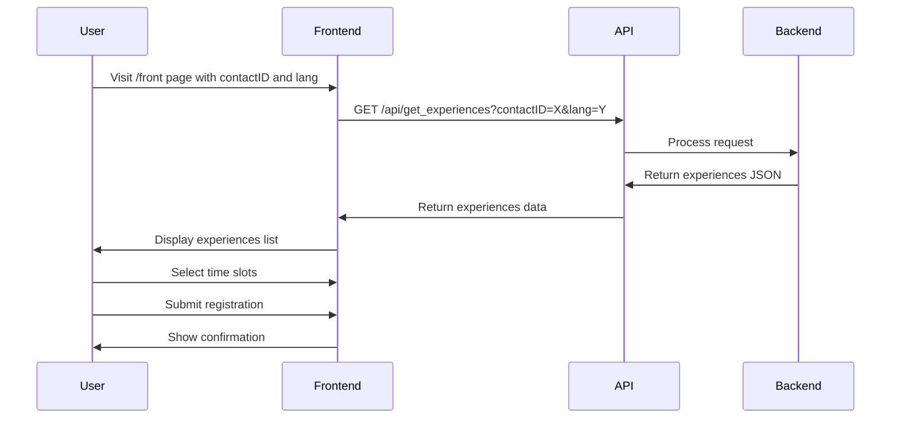

# Implementation Plan: Dynamic Events List for Frontend

Based on your requirements, I'll create a plan to make the list of events in the frontend dynamic, fetching data from a new API endpoint in server.js. For now, we'll implement a simple version that returns a fixed response, and we'll add a new "desc" field to both frontend and backend.

## 1. Backend Changes

### 1.1. Create a new API endpoint in server.js

We'll add a new endpoint called `get_experiences` that takes `contactID` and `lang` as parameters and returns a fixed JSON response matching the structure of the current activities.ts file, with an additional "desc" field.

```javascript
// New endpoint to get experiences
app.get('/api/get_experiences', (req, res) => {
    const { contactID, lang } = req.query;
    
    // For now, return a fixed response
    // Later, this will be replaced with actual data from the database
    const experiences = [
        {
            id: 1,
            title: lang === 'en' ? 'Mannequin with listening and viewing of the eardrum' : 'Manichino con ascolto e visione del timpano',
            course: lang === 'en' ? 'Medical Diagnostics' : 'Diagnostica Medica',
            location: lang === 'en' ? 'Medical Lab A' : 'Laboratorio Medico A',
            duration: lang === 'en' ? '45 minutes' : '45 minuti',
            desc: lang === 'en' ? 'Practice diagnostic techniques on a medical mannequin' : 'Pratica tecniche diagnostiche su un manichino medico',
            timeSlots: [
                {
                    id: '1-1',
                    time: '09:00 AM',
                    available: 5
                },
                {
                    id: '1-2',
                    time: '11:00 AM',
                    available: 3
                }
            ]
        },
        {
            id: 2,
            title: lang === 'en' ? 'Minor surgery, suturing' : 'Piccola chirurgia, sutura',
            course: lang === 'en' ? 'Basic Surgery' : 'Chirurgia di Base',
            location: lang === 'en' ? 'Surgical Lab B' : 'Laboratorio Chirurgico B',
            duration: lang === 'en' ? '60 minutes' : '60 minuti',
            desc: lang === 'en' ? 'Learn basic suturing techniques on practice materials' : 'Impara le tecniche di sutura di base su materiali di pratica',
            timeSlots: [
                {
                    id: '2-1',
                    time: '10:00 AM',
                    available: 4
                },
                {
                    id: '2-2',
                    time: '01:00 PM',
                    available: 6
                }
            ]
        },
        {
            id: 3,
            title: lang === 'en' ? 'Airway obstruction maneuver with mannequin' : 'Manovra di disostruzione delle vie aeree con manichino',
            course: lang === 'en' ? 'Emergency Medicine' : 'Medicina d\'Emergenza',
            location: lang === 'en' ? 'Emergency Lab C' : 'Laboratorio di Emergenza C',
            duration: lang === 'en' ? '30 minutes' : '30 minuti',
            desc: lang === 'en' ? 'Practice emergency airway management techniques' : 'Pratica tecniche di gestione delle vie aeree in emergenza',
            timeSlots: [
                {
                    id: '3-1',
                    time: '09:30 AM',
                    available: 8
                },
                {
                    id: '3-2',
                    time: '11:30 AM',
                    available: 5
                }
            ]
        }
    ];
    
    res.json(experiences);
});
```

## 2. Frontend Changes

### 2.1. Update the ActivityDetails interface in activities.ts

We'll add the new "desc" field to the ActivityDetails interface:

```typescript
export interface ActivityDetails {
  id: number;
  title: string;
  course: string;
  location: string;
  duration: string;
  desc: string; // New field
  timeSlots: TimeSlot[];
}
```

### 2.2. Create a new service for fetching experiences

We'll create a new service file to handle API calls:

```typescript
// src/services/experienceService.ts
import { ActivityDetails } from '../data/activities';

export const fetchExperiences = async (contactID: string, lang: string): Promise<ActivityDetails[]> => {
  try {
    const response = await fetch(`/api/get_experiences?contactID=${contactID}&lang=${lang}`);
    if (!response.ok) {
      throw new Error('Failed to fetch experiences');
    }
    return await response.json();
  } catch (error) {
    console.error('Error fetching experiences:', error);
    return [];
  }
};
```

### 2.3. Update the OpenDayRegistration component

We'll modify the OpenDayRegistration component to fetch experiences from the API instead of using the hardcoded data:

```typescript
import React, { useState, useEffect } from 'react';
import { useTranslation } from 'react-i18next';
import { useParams } from 'react-router-dom';
import { ActivityAccordion } from './ActivityAccordion';
import { ActivityDetails } from '../data/activities';
import { fetchExperiences } from '../services/experienceService';

export const OpenDayRegistration = () => {
  const { t, i18n } = useTranslation();
  const { lang } = useParams<{ lang: string }>();
  const [activities, setActivities] = useState<ActivityDetails[]>([]);
  const [loading, setLoading] = useState(true);
  const [error, setError] = useState<string | null>(null);
  
  // Get contactID from URL query parameters
  const urlParams = new URLSearchParams(window.location.search);
  const contactID = urlParams.get('contactID') || '';
  
  useEffect(() => {
    const loadExperiences = async () => {
      try {
        setLoading(true);
        const data = await fetchExperiences(contactID, i18n.language);
        setActivities(data);
        setError(null);
      } catch (err) {
        setError('Failed to load experiences');
        console.error(err);
      } finally {
        setLoading(false);
      }
    };
    
    loadExperiences();
  }, [contactID, i18n.language]);
  
  const [openAccordion, setOpenAccordion] = useState<number | null>(null);
  const [selectedTimeSlots, setSelectedTimeSlots] = useState<Record<number, string>>({});
  
  const handleTimeSlotSelect = (activityId: number, timeSlotId: string) => {
    setSelectedTimeSlots(prev => ({
      ...prev,
      [activityId]: timeSlotId
    }));
  };
  
  const handleSubmit = () => {
    const selectedActivities = Object.entries(selectedTimeSlots).map(([activityId, timeSlotId]) => {
      const activity = activities.find(a => a.id === parseInt(activityId));
      const timeSlot = activity?.timeSlots.find(slot => slot.id === timeSlotId);
      return {
        activity: activity?.title,
        course: activity?.course,
        time: timeSlot?.time
      };
    });
    alert(t('registrationSuccess'));
    console.log('Selected activities:', selectedActivities);
  };
  
  const hasSelections = Object.keys(selectedTimeSlots).length > 0;
  
  return (
    <main className="min-h-screen bg-[#00A4E4] w-full relative overflow-hidden">
      <div className="absolute inset-0 pointer-events-none opacity-10">
        
        
        
      </div>
      <div className="max-w-4xl mx-auto py-12 px-4 relative">
        <div className="text-center mb-12">
          <h1 className="text-6xl font-viridian text-yellow-300 tracking-wide leading-tight inline-block">
            {t('welcome')}
          </h1>
        </div>
        <div className="bg-[#0082b6]/80 backdrop-blur-sm rounded-lg p-6 mb-8 shadow-xl">
          <p className="text-white/90 leading-relaxed">
            {t('intro')}
          </p>
        </div>
        
        {loading ? (
          <div className="bg-[#0082b6]/80 backdrop-blur-sm rounded-lg p-6 mb-8 shadow-xl">
            <p className="text-white/90 leading-relaxed">{t('loading')}</p>
          </div>
        ) : error ? (
          <div className="bg-[#0082b6]/80 backdrop-blur-sm rounded-lg p-6 mb-8 shadow-xl">
            <p className="text-white/90 leading-relaxed">{t('error')}: {error}</p>
          </div>
        ) : (
          <div className="bg-[#0082b6]/80 backdrop-blur-sm rounded-lg divide-y divide-white/10 mb-8 shadow-xl">
            {activities.map(activity => (
              <ActivityAccordion 
                key={activity.id} 
                activity={activity} 
                isOpen={openAccordion === activity.id} 
                onClick={() => setOpenAccordion(openAccordion === activity.id ? null : activity.id)} 
                selectedSlot={selectedTimeSlots[activity.id] || null} 
                onTimeSlotSelect={handleTimeSlotSelect} 
              />
            ))}
          </div>
        )}
        
        <div className="flex justify-center">
          <button 
            onClick={handleSubmit} 
            disabled={!hasSelections} 
            className={`px-8 py-4 rounded-md text-white font-bold tracking-wide transition-colors shadow-lg font-viridian text-6xl font-viridian text-yellow-300 tracking-wide leading-tight ${hasSelections ? 'bg-[#0082b6]/80 bg-[#0082b6]/60 text-blue-900' : 'bg-white/20 cursor-not-allowed'}`}
          >
            {t('submitRegistration')}
          </button>
        </div>
      </div>
    </main>
  );
};
```

### 2.4. Update the ActivityAccordion component

We'll modify the ActivityAccordion component to display the new "desc" field:

```typescript
// Inside the ActivityAccordion component's render function
{isOpen && (
  <div className="px-6 py-4 bg-white/10">
    <div className="space-y-4">
      <div className="grid grid-cols-2 gap-4 text-sm text-white/90">
        <div>
          <span className="font-medium text-yellow-300">{t('location')}:</span>{' '}
          {activity.location}
        </div>
        <div>
          <span className="font-medium text-yellow-300">{t('duration')}:</span>{' '}
          {activity.duration}
        </div>
      </div>
      
      {/* Add description */}
      <div className="text-sm text-white/90">
        <p>{activity.desc}</p>
      </div>
      
      <div className="space-y-2">
        <h3 className="font-medium text-yellow-300">
          {t('availableTimeSlots')}:
        </h3>
        <div className="space-y-2">
          {activity.timeSlots.map(slot => (
            <label key={slot.id} className="flex items-center space-x-3 p-2 rounded hover:bg-white/5">
              <input 
                type="radio" 
                name={`timeSlot-${activity.id}`} 
                value={slot.id} 
                checked={selectedSlot === slot.id} 
                onChange={() => onTimeSlotSelect(activity.id, slot.id)} 
                className="h-4 w-4 text-yellow-300 border-white/30" 
              />
              <span className="text-white">{slot.time}</span>
              <span className="text-sm text-white/70">
                ({t('spotsAvailable', { count: slot.available })})
              </span>
            </label>
          ))}
        </div>
      </div>
      
      {selectedSlot ? (
        <div className="bg-white/10 p-3 rounded-md">
          <p className="text-yellow-300 text-sm">
            {t('registeredFor', { time: activity.timeSlots.find(slot => slot.id === selectedSlot)?.time })}
          </p>
        </div>
      ) : (
        <p className="text-white/70 text-sm">
          {t('selectTimeSlot')}
        </p>
      )}
    </div>
  </div>
)}
```

### 2.5. Update the translation files

We'll add new translation keys for loading and error states:

```json
// en/translation.json
{
  "loading": "Loading experiences...",
  "error": "Error loading experiences"
}

// it/translation.json
{
  "loading": "Caricamento esperienze...",
  "error": "Errore nel caricamento delle esperienze"
}
```

## 3. Implementation Steps

1. **Backend Implementation**:
   - Add the new `get_experiences` endpoint to server.js
   - Create a fixed response structure with the required fields

2. **Frontend Implementation**:
   - Update the ActivityDetails interface to include the "desc" field
   - Create the experienceService.ts file for API calls
   - Update the OpenDayRegistration component to fetch data from the API
   - Update the ActivityAccordion component to display the description
   - Add new translation keys for loading and error states

3. **Testing**:
   - Test the API endpoint using a tool like Postman or directly in the browser
   - Test the frontend with different contactIDs and languages
   - Verify that the description field is displayed correctly

## 4. Future Enhancements

In the future, the backend implementation will be enhanced to:
- Filter experiences based on the contactID
- Retrieve actual data from the database instead of using fixed responses
- Handle error cases more gracefully
- Add caching to improve performance

## 5. Implementation Flow Diagram



## 6. Component Structure Diagram

```mermaid
graph TD
    A[OpenDayRegistration] -->|Fetches data| B[experienceService.ts]
    B -->|API call| C[/api/get_experiences endpoint]
    A -->|Renders| D[ActivityAccordion]
    D -->|Displays| E[Activity Details]
    E -->|Includes| F[Description]
    E -->|Includes| G[Time Slots]