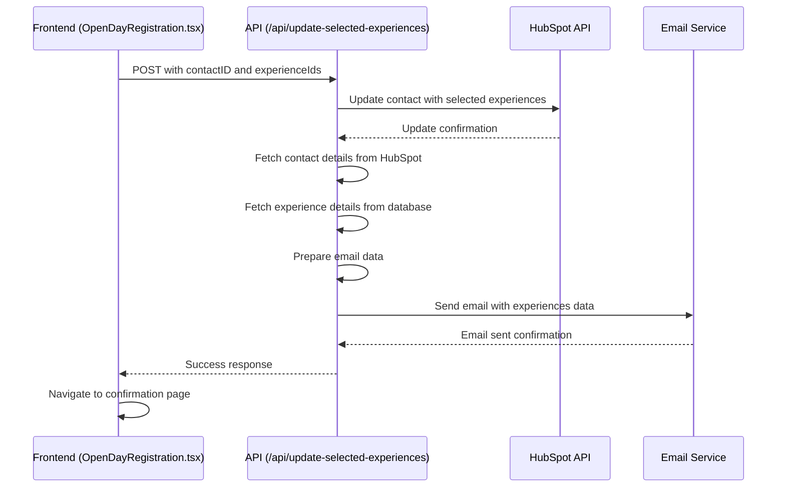

# Email Implementation Plan for Front Page Form Submission

## Current Understanding

1. **Frontend Flow**:
   - The OpenDayRegistration.tsx component allows users to select experiences
   - When the user submits the form, it calls the `updateSelectedExperiences` function in experienceService.ts
   - This function sends a POST request to `/api/update-selected-experiences` with the contactID and selected experienceIds
   - After successful submission, the user is redirected to the confirmation page

2. **Backend Flow**:
   - The `/api/update-selected-experiences` endpoint in server.js receives the request
   - It updates the HubSpot contact with the selected experiences
   - Currently, it doesn't send an email after the update

3. **Email System**:
   - The server uses nodemailer for sending emails
   - Email templates are in EJS format in the views directory
   - There are two types of email templates:
     - Type 1: The original email template (email.ejs)
     - Type 2: The courses/experiences email template (email_courses.ejs)
   - Both templates have English and Italian versions

4. **Confirmation Page**:
   - The confirmation page displays the selected activities
   - It has a blue background (#00A4E4) with white text
   - Activities are displayed in cards with a darker blue background (#0082b6)
   - Activity details are shown in yellow text

## Implementation Plan

To add email sending functionality to the form submission in "/front" after updating HubSpot, I'll need to:

1. **Modify the `/api/update-selected-experiences` endpoint** to:
   - Continue updating HubSpot as it currently does
   - Fetch additional data needed for the email (contact details, experience details)
   - Generate and send an email using the email_courses.ejs template (type 2)

2. **Create a function to prepare the email data** that:
   - Formats the selected experiences data for the email template
   - Includes the contact's name, email, and other relevant information
   - Generates a QR code if needed

3. **Ensure the email styling matches the confirmation page** by:
   - Using the same color scheme (#00A4E4 for background, #0082b6 for cards)
   - Formatting the experience details similarly to the confirmation page

## Implementation Flow Diagram



## Code Implementation Details

1. **Modify the `/api/update-selected-experiences` endpoint**:
   - After successfully updating HubSpot, fetch the contact's details
   - Retrieve the full details of the selected experiences from the database
   - Prepare the data for the email template
   - Render the email_courses.ejs template with the prepared data
   - Send the email using nodemailer

2. **Email Template Data Structure**:
   ```javascript
   {
     name: contact.firstname,
     email: contact.email,
     qrCode: qrCodeUrl, // If applicable
     type: 2, // To use the email_courses.ejs template
     fieldData: {
       experiences: [
         {
           title: "Experience Title",
           date: "May 10, 2025",
           location: "Room 101",
           time: "14:00"
         },
         // More experiences...
       ]
     }
   }
   ```

3. **Email Styling**:
   - The email_courses.ejs template already has a good structure
   - We'll ensure the experience cards match the confirmation page styling:
     - Background color: #0082b6
     - Text color: white for titles, yellow for details
     - Proper spacing and formatting

## Considerations and Potential Challenges

1. **Language Handling**:
   - Need to determine the user's language preference (from the URL or request)
   - Use the appropriate language template (en/it)
   - Ensure all text is properly translated

2. **QR Code Generation**:
   - Determine if QR codes are needed for this flow
   - If needed, generate and include them in the email

3. **Error Handling**:
   - Implement proper error handling for email sending failures
   - Ensure the API still returns success even if email sending fails (non-critical)

4. **Testing**:
   - Test with different languages
   - Test with various experience selections
   - Verify email rendering in different email clients