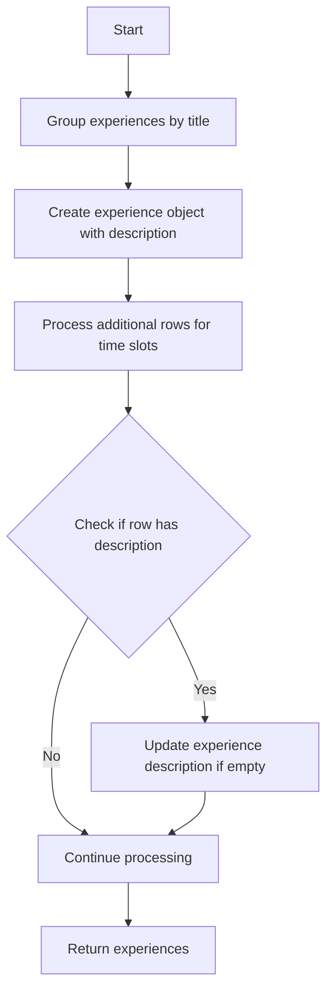

# Implementation Plan: Fix Experience Description Display Issue

## Problem Analysis

The issue is in the `getExperiencesByCustomObjectIds` function in `courseExperienceService.js`. Currently, experiences are grouped by title, and the description is only set when creating a new experience object. If the first row for an experience doesn't have a description but subsequent rows do, the description won't be included in the final experience object.

## Solution

We need to modify the `getExperiencesByCustomObjectIds` function to ensure descriptions are properly processed for all experiences.



## Code Changes

We need to modify the code in `courseExperienceService.js` to update the description field when processing additional rows for the same experience. Here's the specific change:

```javascript
// Current code (around line 500)
const experience = experienceMap.get(groupKey);

// Add time slot if ora_inizio exists and is not an empty string
logger.info(`Checking ora_inizio for ${row.experience_id}: ${row.ora_inizio}, type: ${typeof row.ora_inizio}`);

// Check if timeSlots array exists
if (!experience.timeSlots) {
    logger.info(`Creating timeSlots array for ${row.experience_id}`);
    experience.timeSlots = [];
}
```

This should be modified to:

```javascript
// Modified code
const experience = experienceMap.get(groupKey);

// Update description if it's empty in the current experience object but exists in this row
if (!experience.desc && row.desc) {
    logger.info(`Updating description for ${row.experience_id} from row with ora_inizio: ${row.ora_inizio}`);
    experience.desc = row.desc;
}

// Add time slot if ora_inizio exists and is not an empty string
logger.info(`Checking ora_inizio for ${row.experience_id}: ${row.ora_inizio}, type: ${typeof row.ora_inizio}`);

// Check if timeSlots array exists
if (!experience.timeSlots) {
    logger.info(`Creating timeSlots array for ${row.experience_id}`);
    experience.timeSlots = [];
}
```

## Testing

After implementing this change, we should test the application by:

1. Ensuring all experiences in the database have description data
2. Verifying that all experiences display their descriptions in the frontend
3. Checking the server logs to confirm the descriptions are being properly processed

## Expected Outcome

With this change, the description field will be properly displayed for all experiences, not just the first one. The code will now check each row for a description and update the experience object if a description is found, ensuring that no description data is lost during processing.