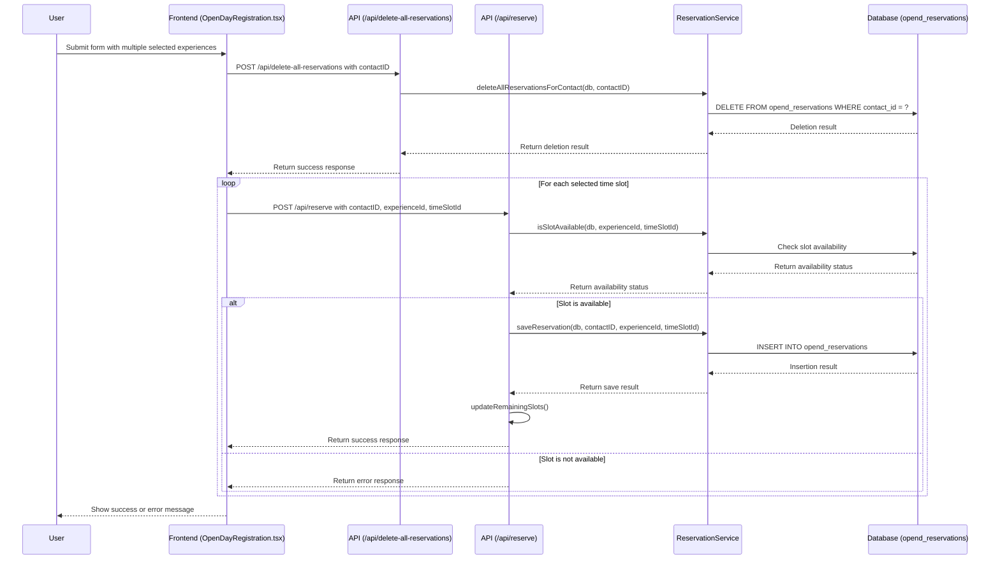

# Frontend Deletion Implementation Plan

## Overview

Instead of creating a new API endpoint, we'll add the deletion of all reservations in the `handleSubmit` function before the loop that makes individual reservations.

## Implementation Steps

### 1. Create a New API Endpoint in `server.js`

Add a new endpoint `/api/delete-all-reservations` to delete all reservations for a contact:

```javascript
// Endpoint to delete all reservations for a contact
app.post('/api/delete-all-reservations', async (req, res) => {
    const { contactID } = req.body;
    
    if (!contactID) {
        return res.status(400).json({
            error: 'Missing required fields'
        });
    }
    
    try {
        // Delete all reservations for the contact
        await reservationService.deleteAllReservationsForContact(db, contactID);
        
        // Update the remaining slots
        await updateRemainingSlots();
        
        // Return success
        res.json({
            success: true
        });
    } catch (error) {
        logger.error('Error in /api/delete-all-reservations:', error);
        res.status(500).json({
            error: 'Internal server error'
        });
    }
});
```

### 2. Add a New Function to `experienceService.ts`

Add a function to call the new API endpoint:

```typescript
/**
 * Deletes all reservations for a contact
 * @param contactID The ID of the contact
 * @returns Promise with the deletion result
 */
export const deleteAllReservations = async (
  contactID: string
): Promise<{ success: boolean, error?: string }> => {
  try {
    console.log('Deleting all reservations for contact:', contactID);
    const response = await fetch('http://localhost:3000/api/delete-all-reservations', {
      method: 'POST',
      headers: {
        'Content-Type': 'application/json'
      },
      body: JSON.stringify({
        contactID
      })
    });
    
    const data = await response.json();
    console.log('Delete all reservations response:', data);
    
    if (!response.ok) {
      console.error('API response not OK:', response.status, response.statusText, data);
      return {
        success: false,
        error: data.error || 'Failed to delete reservations'
      };
    }
    
    return data;
  } catch (error) {
    console.error('Error deleting reservations:', error);
    throw error;
  }
};
```

### 3. Modify the `handleSubmit` Function in `OpenDayRegistration.tsx`

Update the function to delete all reservations before making new ones:

```typescript
const handleSubmit = async () => {
  console.log('handleSubmit called - this should appear in the console when the submit button is clicked');
  // Set submitting state
  setSubmitting(true);
  setReservationError(null);
  
  try {
    // First, delete all existing reservations for this contact
    console.log('Deleting all existing reservations for contact:', contactID);
    const deleteResult = await deleteAllReservations(contactID);
    
    if (!deleteResult.success) {
      setReservationError('Failed to delete existing reservations');
      setSubmitting(false);
      return;
    }
    
    console.log('Starting to make reservations for selected time slots');
    // Make reservations for all selected time slots
    for (const [activityId, timeSlotId] of Object.entries(selectedTimeSlots)) {
      console.log(`Making reservation for activity ${activityId}, time slot ${timeSlotId}`);
      
      // Make the reservation
      const result = await makeReservation(contactID, activityId, timeSlotId);
      console.log(`Reservation result for ${activityId}:`, result);
      
      if (!result.success) {
        // ... existing error handling code ...
      }
    }
    
    // ... rest of the existing code ...
  } catch (error) {
    // ... existing error handling code ...
  }
};
```

### 4. Remove the Deletion from the `/api/reserve` Endpoint

Modify the `/api/reserve` endpoint in `server.js` to remove the deletion of all reservations:

```javascript
// Endpoint to make a reservation
app.post('/api/reserve', async (req, res) => {
    const { contactID, experienceId, timeSlotId } = req.body;
    
    if (!contactID || !experienceId || !timeSlotId) {
        return res.status(400).json({
            error: 'Missing required fields'
        });
    }
    
    try {
        // Check if the slot is still available
        const isAvailable = await reservationService.isSlotAvailable(db, experienceId, timeSlotId);
        
        if (!isAvailable) {
            // No spots available, return an error
            logger.warn(`No spots available for experience ${experienceId}, time slot ${timeSlotId}`);
            return res.status(409).json({
                success: false,
                error: 'No spots available',
                errorCode: 'NO_SPOTS_AVAILABLE'
            });
        }
        
        // Save the new reservation (no deletion here)
        await reservationService.saveReservation(db, contactID, experienceId, timeSlotId);
        
        // Update the remaining slots
        await updateRemainingSlots();
        
        // Return success
        res.json({
            success: true
        });
    } catch (error) {
        logger.error('Error in /api/reserve:', error);
        res.status(500).json({
            error: 'Internal server error'
        });
    }
});
```

## Flow Diagram



This approach is simpler and requires fewer changes to the existing code. It also maintains the separation of concerns, with the front-end handling the deletion of all reservations before making new ones.