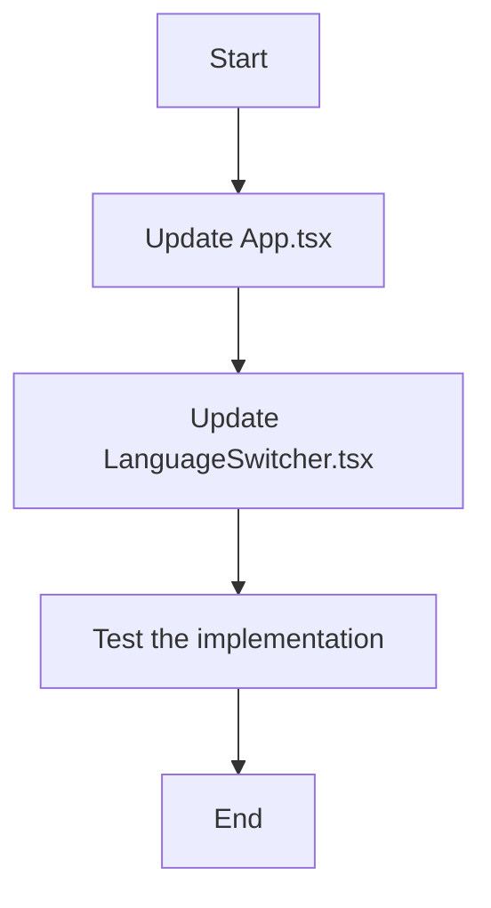

# Frontend URL Parameters Implementation Plan

## Current Implementation

1. **Frontend Structure**:
   - React application with TypeScript
   - Uses React Router for routing
   - Uses i18next for internationalization (English and Italian)

2. **Language Handling**:
   - Language is included in the URL path (/:lang/front)
   - LanguageProvider component changes the i18n language based on the URL parameter
   - LanguageSwitcher component allows users to switch between languages by navigating to a new URL

3. **API Calls**:
   - The OpenDayRegistration component already extracts contactID from URL query parameters
   - The experienceService already includes both contactID and language in API calls

## Required Changes

The task is to modify the frontend to receive contactID and language parameters from the URL and use them in API calls. From our analysis, most of this functionality is already implemented, but we need to make a few adjustments:

1. **Update the App component** to handle the contactID parameter in the URL
2. **Update the LanguageSwitcher component** to preserve the contactID when switching languages

## Implementation Plan



### 1. Update App.tsx

We need to modify the App component to handle the contactID parameter in the URL. Currently, it only handles the language parameter. We'll update it to include a route that accepts both language and contactID parameters.

### 2. Update LanguageSwitcher.tsx

We need to modify the LanguageSwitcher component to preserve the contactID when switching languages. Currently, it navigates to a new URL with just the language parameter, but we need to include the contactID as well.

### 3. Test the Implementation

After making these changes, we'll need to test that:
- The application correctly handles URLs with both language and contactID parameters
- The language switcher preserves the contactID when switching languages
- API calls include both parameters correctly

## Code Changes

### 1. Update App.tsx

```typescript
import React from 'react';
import { BrowserRouter, Routes, Route, Navigate, useLocation } from 'react-router-dom';
import { OpenDayRegistration } from './components/OpenDayRegistration';
import { LanguageProvider } from './components/LanguageProvider';
import './i18n'; // Import i18n configuration

// Helper component to handle default redirect with query parameters
const DefaultRedirect = () => {
  const location = useLocation();
  // Preserve query parameters when redirecting to default language
  return <Navigate to={`/en/front${location.search}`} replace />;
};

export const App = () => {
  return (
    <BrowserRouter>
      <Routes>
        <Route path="/" element={<DefaultRedirect />} />
        <Route 
          path="/:lang/front" 
          element={
            <LanguageProvider>
              <OpenDayRegistration />
            </LanguageProvider>
          } 
        />
      </Routes>
    </BrowserRouter>
  );
};
```

The main change here is to create a `DefaultRedirect` component that preserves query parameters when redirecting to the default language route.

### 2. Update LanguageSwitcher.tsx

```typescript
import React from 'react';
import { useNavigate, useParams, useLocation } from 'react-router-dom';
import { useTranslation } from 'react-i18next';

export const LanguageSwitcher: React.FC = () => {
  const { lang } = useParams<{ lang: string }>();
  const navigate = useNavigate();
  const location = useLocation();
  const { t } = useTranslation();

  const switchLanguage = (newLang: string) => {
    if (newLang !== lang) {
      // Preserve query parameters when switching languages
      navigate(`/${newLang}/front${location.search}`, { replace: true });
    }
  };

  return (
    <div className="absolute top-4 right-4 flex space-x-2">
      <button
        onClick={() => switchLanguage('en')}
        className={`px-2 py-1 rounded ${lang === 'en' ? 'bg-yellow-300 text-blue-900' : 'bg-white/20 text-white'}`}
      >
        EN
      </button>
      <button
        onClick={() => switchLanguage('it')}
        className={`px-2 py-1 rounded ${lang === 'it' ? 'bg-yellow-300 text-blue-900' : 'bg-white/20 text-white'}`}
      >
        IT
      </button>
    </div>
  );
};
```

The main change here is to use `location.search` to preserve all query parameters (including contactID) when navigating to a new URL with a different language.

## Conclusion

With these changes, the frontend will be able to receive both contactID and language parameters from the URL and use them in API calls. The language switcher will preserve the contactID when switching languages, ensuring a seamless user experience.