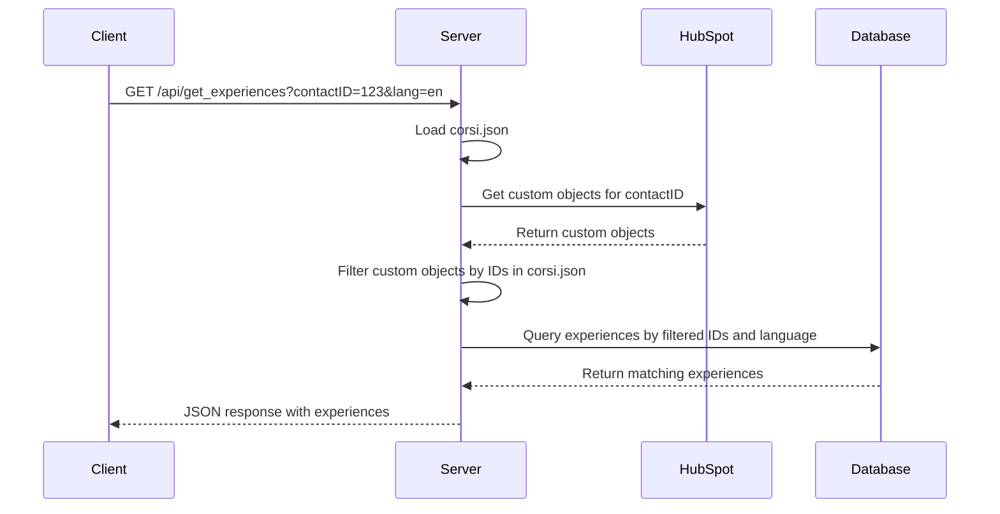

# Implementation Plan for `/get_experiences` Endpoint

## Overview

This document outlines the plan for implementing the `/get_experiences` endpoint, which will receive a contactID and a language parameter, and return a JSON list of experiences based on HubSpot custom objects and local database data.

## Requirements

1. The endpoint will receive a contactID and a language parameter
2. It will query HubSpot for custom objects associated with the contactID
3. It will compare the IDs received with the codes in a JSON file (corsi.json)
4. It will query the local database for experiences matching the codes and language
5. It will return a JSON response with the matching experiences

## Database Modifications

We need to modify the existing 'experiences' table to add a language field and a description field:

```sql
ALTER TABLE experiences 
ADD COLUMN language TEXT DEFAULT 'it',
ADD COLUMN desc TEXT;
```

## Create JSON File with Course IDs and Names

Create a new file called 'corsi.json' in the root directory with a list of course IDs and names:

```json
[
  {
    "id": "12345",
    "name": "Medicina"
  },
  {
    "id": "67890",
    "name": "Chirurgia"
  },
  {
    "id": "54321",
    "name": "Diagnostica"
  },
  {
    "id": "09876",
    "name": "Laboratorio"
  }
]
```

These IDs represent the custom objects in HubSpot that correspond to experiences.

## Sample Data for Experiences

We'll use the current example data from the server.js file as a basis for our experiences data:

```javascript
const experiences = [
  {
    id: 1,
    title: lang === 'en' ? 'Mannequin with listening and viewing of the eardrum' : 'Manichino con ascolto e visione del timpano',
    course: lang === 'en' ? 'Medical Diagnostics' : 'Diagnostica Medica',
    location: lang === 'en' ? 'Medical Lab A' : 'Laboratorio Medico A',
    duration: lang === 'en' ? '45 minutes' : '45 minuti',
    desc: lang === 'en' ? 'Practice diagnostic techniques on a medical mannequin' : 'Pratica tecniche diagnostiche su un manichino medico',
    timeSlots: [
      {
        id: '1-1',
        time: '09:00 AM',
        available: 5
      },
      {
        id: '1-2',
        time: '11:00 AM',
        available: 3
      },
      {
        id: '1-3',
        time: '02:00 PM',
        available: 4
      }
    ]
  },
  {
    id: 2,
    title: lang === 'en' ? 'Minor surgery, suturing' : 'Piccola chirurgia, sutura',
    course: lang === 'en' ? 'Basic Surgery' : 'Chirurgia di Base',
    location: lang === 'en' ? 'Surgical Lab B' : 'Laboratorio Chirurgico B',
    duration: lang === 'en' ? '60 minutes' : '60 minuti',
    desc: lang === 'en' ? 'Learn basic suturing techniques on practice materials' : 'Impara le tecniche di sutura di base su materiali di pratica',
    timeSlots: [
      {
        id: '2-1',
        time: '10:00 AM',
        available: 4
      },
      {
        id: '2-2',
        time: '01:00 PM',
        available: 6
      },
      {
        id: '2-3',
        time: '03:00 PM',
        available: 2
      }
    ]
  }
]
```

We'll need to adapt this data to fit our database schema.

## Implementation Steps

### 1. Add Function to courseExperienceService.js

Add a new function to courseExperienceService.js to handle the retrieval of experiences based on custom object IDs and language:

```javascript
/**
 * Retrieves experiences based on custom object IDs and language
 * @param {Object} db - Database instance
 * @param {Array<string>} customObjectIds - Array of custom object IDs
 * @param {string} language - Language code (e.g., 'en', 'it')
 * @returns {Promise<Array<Object>>} - Array of experience objects
 */
async function getExperiencesByCustomObjectIds(db, customObjectIds, language) {
  try {
    logger.info(`Retrieving experiences for custom object IDs: ${customObjectIds.join(', ')} in language: ${language}`);
    
    // Create placeholders for the SQL query
    const placeholders = customObjectIds.map(() => '?').join(',');
    
    return new Promise((resolve, reject) => {
      db.all(
        `SELECT experience_id, title, date, location, desc, max_participants, current_participants, duration 
         FROM experiences 
         WHERE experience_id IN (${placeholders}) AND language = ?`,
        [...customObjectIds, language],
        (err, rows) => {
          if (err) {
            logger.error(`Error retrieving experiences: ${err.message}`);
            reject(err);
          } else {
            logger.info(`Retrieved ${rows.length} experiences`);
            
            // Transform the results into the desired format with timeSlots
            const experiences = rows.map(row => {
              // Create a basic experience object
              const experience = {
                id: row.experience_id,
                title: row.title,
                course: row.course || '',
                location: row.location,
                duration: row.duration,
                desc: row.desc,
                timeSlots: []
              };
              
              // Add time slots (this would be retrieved from another table in a real implementation)
              // For now, we'll add mock time slots
              experience.timeSlots = [
                {
                  id: `${row.experience_id}-1`,
                  time: '09:00 AM',
                  available: Math.max(0, row.max_participants - row.current_participants)
                },
                {
                  id: `${row.experience_id}-2`,
                  time: '11:00 AM',
                  available: Math.max(0, row.max_participants - row.current_participants - 2)
                },
                {
                  id: `${row.experience_id}-3`,
                  time: '02:00 PM',
                  available: Math.max(0, row.max_participants - row.current_participants - 1)
                }
              ];
              
              return experience;
            });
            
            resolve(experiences);
          }
        }
      );
    });
  } catch (error) {
    logger.error('Error in getExperiencesByCustomObjectIds:', error);
    throw error;
  }
}
```

### 2. Update the `/api/get_experiences` Endpoint

Update the existing `/api/get_experiences` endpoint in server.js:

```javascript
// Endpoint to get experiences based on contactID and language
app.get('/api/get_experiences', async (req, res) => {
  const { contactID, lang } = req.query;
  
  // Default to Italian if no language specified
  const language = lang === 'en' ? 'en' : 'it';
  
  if (!contactID) {
    return res.status(400).json({ error: language === 'en' ? 'Contact ID is required' : 'ID contatto richiesto' });
  }
  
  try {
    // Load the list of course IDs and names
    const courses = require('./corsi.json');
    const courseIds = courses.map(course => course.id);
    
    // Get all custom objects associated with the contact
    const allCustomObjects = await getAllCustomObjects(contactID);
    
    if (allCustomObjects.error) {
      logger.error(`Error getting custom objects: ${allCustomObjects.error}`);
      return res.status(500).json({ error: language === 'en' ? 'Error retrieving custom objects' : 'Errore nel recupero degli oggetti personalizzati' });
    }
    
    // Filter custom objects to only include those with IDs in our list
    const filteredObjectIds = allCustomObjects
      .filter(obj => courseIds.includes(obj.id))
      .map(obj => obj.id);
    
    // If no matching custom objects found, return an empty array
    if (filteredObjectIds.length === 0) {
      logger.info(`No matching custom objects found for contact ID: ${contactID}`);
      return res.json([]);
    }
    
    // Get experiences from the database based on the filtered IDs and language
    const experiences = await courseExperienceService.getExperiencesByCustomObjectIds(db, filteredObjectIds, language);
    
    // Return the experiences as JSON
    res.json(experiences);
  } catch (error) {
    logger.error('Error in /api/get_experiences:', error);
    res.status(500).json({ error: language === 'en' ? 'Internal server error' : 'Errore interno del server' });
  }
});
```

### 3. Add the getAllCustomObjects Function

Add the function to get all custom objects associated with a contact:

```javascript
/**
 * Gets all custom objects associated with a contact
 * @param {string} contactId - The HubSpot contact ID
 * @returns {Promise<Array<Object>>} - Array of custom objects
 */
async function getAllCustomObjects(contactId) {
  try {
    // Get all custom object types
    const customObjectTypes = await getAllCustomObjectTypes();
    
    if (customObjectTypes.length === 0) {
      return { error: "No custom object types found in the HubSpot account" };
    }
    
    const allCustomObjects = [];
    
    // For each custom object type
    for (const objectTypeId of customObjectTypes) {
      try {
        // Find associations between the contact and this custom object type
        const associationsResponse = await axios.get(
          `https://api.hubapi.com/crm/v4/objects/contact/${contactId}/associations/${objectTypeId}`
        );
        
        // If associations were found
        if (associationsResponse.data.results && associationsResponse.data.results.length > 0) {
          // For each associated custom object
          for (const association of associationsResponse.data.results) {
            const customObjectId = association.toObjectId;
            
            // Get the custom object details
            const customObjectResponse = await axios.get(
              `https://api.hubapi.com/crm/v3/objects/${objectTypeId}/${customObjectId}`
            );
            
            // Add to the results
            allCustomObjects.push({
              type: objectTypeId,
              id: customObjectId,
              ...customObjectResponse.data
            });
          }
        }
      } catch (typeError) {
        logger.error(`Error checking associations for type ${objectTypeId}:`, typeError);
        // Continue with the next type even if there's an error
      }
    }
    
    return allCustomObjects;
  } catch (error) {
    logger.error('Error getting all custom objects:', error);
    return { error: `Error getting custom objects: ${error.message}` };
  }
}
```

## Flow Diagram



## Testing Plan

1. Create test data in the experiences table with different languages, using the sample data from the current server.js implementation
2. Test the endpoint with various contactIDs and languages
3. Verify that only experiences matching the filtered custom object IDs and requested language are returned
4. Test error handling for invalid contactIDs or languages

## Next Steps

1. Modify the experiences table to add language and description fields
2. Create the corsi.json file with IDs and names
3. Add the new function to courseExperienceService.js
4. Update the /api/get_experiences endpoint in server.js
5. Test the implementation