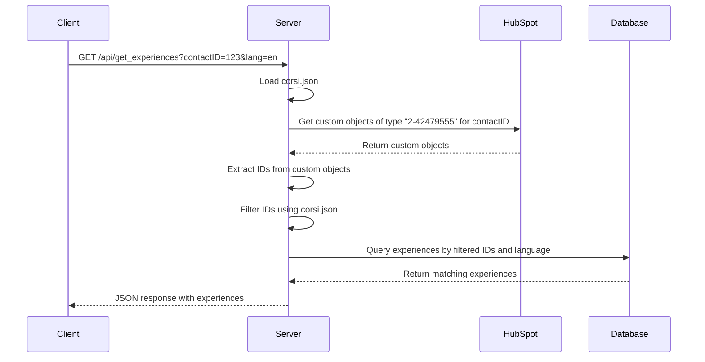

# Revised Implementation Plan for `/get_experiences` Endpoint

## Understanding the HubSpot Custom Object Structure

Based on the provided example, we have:
- One custom object type (2-42479555)
- Multiple custom object instances with different IDs
- Each custom object has an "evento_open_day" property with the event name

## Revised Approach

1. The endpoint will receive a contactID and a language parameter
2. It will query HubSpot for custom objects of type "2-42479555" associated with the contactID
3. It will extract the IDs of these custom objects (e.g., 26674027062, 26674027064)
4. It will compare these IDs with the codes in corsi.json
5. It will query the local database for experiences matching the codes and language
6. It will return a JSON response with the matching experiences

## Updates Needed

1. **Update corsi.json**:
   - We need to update corsi.json to contain the actual custom object IDs and names:

```json
[
  {
    "id": "26674027062",
    "name": "Medicina e Chirurgia 3"
  },
  {
    "id": "26674027064",
    "name": "Odontoiatria e Igiene Dentale"
  },
  {
    "id": "26732280185",
    "name": "Talk: Scuole di Specializzazione - Area dei Servizi"
  },
  {
    "id": "26732280186",
    "name": "Talk: Scuole di Specializzazione - Area Sanitaria"
  }
]
```

2. **Update .env file**:
   - Add the custom object type ID to the .env file:

```
HUBSPOT_CUSTOM_OBJECT_TYPE_ID=2-42479555
```

3. **Update hubspot_experience_service.js**:
   - Modify the getAllCustomObjects function to use the custom object type ID from the .env file
   - Extract the IDs directly from these custom objects

```javascript
/**
 * Gets all custom objects of the specified type associated with a contact
 * @param {string} contactId - The HubSpot contact ID
 * @returns {Promise<Array<Object>|Object>} - Array of custom objects or error object
 */
async function getAllCustomObjects(contactId) {
    try {
        const objectTypeId = process.env.HUBSPOT_CUSTOM_OBJECT_TYPE_ID; // Get from .env file
        logger.info(`Retrieving custom objects of type ${objectTypeId} for contact ID: ${contactId}`);
        
        // Get properties for this custom object type
        const propertyNames = await getCustomObjectProperties(objectTypeId);
        
        // Find associations between the contact and this custom object type
        const associationsResponse = await axios.get(
            `https://api.hubapi.com/crm/v4/objects/contact/${contactId}/associations/${objectTypeId}`
        );
        
        const allCustomObjects = [];
        
        // If associations were found
        if (associationsResponse.data.results && associationsResponse.data.results.length > 0) {
            logger.info(`Found ${associationsResponse.data.results.length} associations for type ${objectTypeId}`);
            
            // For each associated custom object
            for (const association of associationsResponse.data.results) {
                const customObjectId = association.toObjectId;
                
                logger.info(`Retrieving details for custom object ID: ${customObjectId}`);
                
                // Create the properties parameter string
                const propertiesParam = propertyNames.join(',');
                
                // Get the custom object details with all properties
                const customObjectResponse = await axios.get(
                    `https://api.hubapi.com/crm/v3/objects/${objectTypeId}/${customObjectId}?properties=${propertiesParam}`
                );
                
                // Add to the results with ID and event name
                allCustomObjects.push({
                    id: customObjectId,
                    name: customObjectResponse.data.properties.evento_open_day || '',
                    ...customObjectResponse.data
                });
            }
        } else {
            logger.info(`No associations found for type ${objectTypeId}`);
        }
        
        return allCustomObjects;
    } catch (error) {
        logger.error('Error getting custom objects:', error);
        return { error: `Error getting custom objects: ${error.message}` };
    }
}
```

3. **Update the `/api/get_experiences` endpoint**:
   - Modify the filtering logic to compare the custom object IDs with the IDs in corsi.json

```javascript
// Endpoint to get experiences based on contactID and language
app.get('/api/get_experiences', async (req, res) => {
    const { contactID, lang } = req.query;
    
    // Default to Italian if no language specified
    const language = lang === 'en' ? 'en' : 'it';
    
    if (!contactID) {
        return res.status(400).json({ 
            error: language === 'en' ? 'Contact ID is required' : 'ID contatto richiesto' 
        });
    }
    
    try {
        logger.info(`Getting experiences for contact ID: ${contactID} in language: ${language}`);
        
        // Load the list of course IDs and names
        const courses = require('./corsi.json');
        const courseIds = courses.map(course => course.id);
        
        // Get all custom objects associated with the contact
        const customObjects = await hubspotExperienceService.getAllCustomObjects(contactID);
        
        if (customObjects.error) {
            logger.error(`Error getting custom objects: ${customObjects.error}`);
            return res.status(500).json({ 
                error: language === 'en' ? 'Error retrieving custom objects' : 'Errore nel recupero degli oggetti personalizzati' 
            });
        }
        
        // Extract IDs from custom objects
        const customObjectIds = customObjects.map(obj => obj.id);
        
        // Filter IDs to only include those in our corsi.json file
        const filteredObjectIds = customObjectIds.filter(id => courseIds.includes(id));
        
        // If no matching custom objects found, return an empty array
        if (filteredObjectIds.length === 0) {
            logger.info(`No matching custom objects found for contact ID: ${contactID}`);
            return res.json([]);
        }
        
        // Get experiences from the database based on the filtered IDs and language
        const experiences = await courseExperienceService.getExperiencesByCustomObjectIds(db, filteredObjectIds, language);
        
        // Return the experiences as JSON
        res.json(experiences);
    } catch (error) {
        logger.error('Error in /api/get_experiences:', error);
        res.status(500).json({ 
            error: language === 'en' ? 'Internal server error' : 'Errore interno del server' 
        });
    }
});
```

## Flow Diagram



## Implementation Steps

1. Update corsi.json with the actual custom object IDs and names
2. Update the .env file to add the HUBSPOT_CUSTOM_OBJECT_TYPE_ID variable
3. Update hubspot_experience_service.js to use the custom object type ID from the .env file
4. Update the /api/get_experiences endpoint to use the new filtering logic
5. Test the implementation with a real contactID