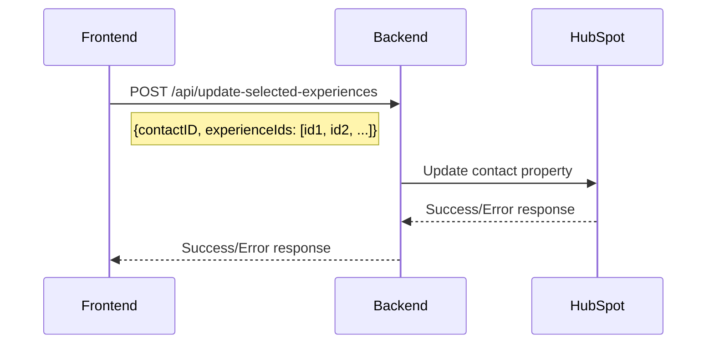

# Implementation Plan: Update HubSpot Contact with Selected Experiences

Based on my analysis of the codebase, I need to create a solution that will update the HubSpot contact property "open_day__iscrizione_esperienze_10_05_2025" with a comma-separated list of the experience IDs selected by the user in the front-end.

## Current System Overview

1. **Front-end Flow**:
   - Users select experiences in the OpenDayRegistration component
   - When they submit, the `handleSubmit` function makes reservations for each selected time slot
   - After successful reservations, the user is redirected to a confirmation page

2. **Back-end Flow**:
   - The `/api/reserve` endpoint handles individual experience reservations
   - There are various HubSpot integration points, but none specifically for updating the "open_day__iscrizione_esperienze_10_05_2025" property

## Implementation Plan

### 1. Create a New Back-end Endpoint

We need to create a new endpoint that will:
- Receive the selected experience IDs
- Format them into a comma-separated string
- Update the HubSpot contact property



### 2. Modify the Front-end

We need to modify the front-end to:
- Collect all selected experience IDs
- Send them to the new back-end endpoint after successful reservations

## Detailed Implementation Steps

### Step 1: Create a New Back-end Endpoint

Add a new route to `server.js` that will handle updating the HubSpot contact with the selected experiences:

```javascript
// Endpoint to update selected experiences in HubSpot
app.post('/api/update-selected-experiences', async (req, res) => {
    const { contactID, experienceIds } = req.body;
    
    if (!contactID || !experienceIds) {
        return res.status(400).json({
            error: 'Missing required fields'
        });
    }
    
    try {
        // Format the experience IDs as a comma-separated string
        const experiencesString = Array.isArray(experienceIds) 
            ? experienceIds.join(',') 
            : experienceIds;
        
        logger.info(`Updating HubSpot contact ${contactID} with selected experiences: ${experiencesString}`);
        
        // Update the HubSpot contact property
        await axios.patch(`https://api.hubapi.com/crm/v3/objects/contacts/${contactID}`, {
            properties: {
                open_day__iscrizione_esperienze_10_05_2025: experiencesString
            }
        });
        
        // Return success
        res.json({
            success: true
        });
    } catch (error) {
        logger.error('Error updating HubSpot contact with selected experiences:', error);
        res.status(500).json({
            error: 'Internal server error'
        });
    }
});
```

### Step 2: Create a New Front-end Service Function

Add a new function to `experienceService.ts` to call the new endpoint:

```typescript
/**
 * Updates the HubSpot contact with selected experiences
 * @param contactID The ID of the contact
 * @param experienceIds Array of selected experience IDs
 * @returns Promise with the update result
 */
export const updateSelectedExperiences = async (
  contactID: string,
  experienceIds: (string | number)[]
): Promise<{ success: boolean, error?: string }> => {
  try {
    console.log('Updating selected experiences:', { contactID, experienceIds });
    const response = await fetch(' /api/update-selected-experiences', {
      method: 'POST',
      headers: {
        'Content-Type': 'application/json'
      },
      body: JSON.stringify({
        contactID,
        experienceIds
      })
    });
    
    const data = await response.json();
    console.log('Update response:', data);
    
    if (!response.ok) {
      console.error('API response not OK:', response.status, response.statusText, data);
      return {
        success: false,
        error: data.error || 'Failed to update selected experiences'
      };
    }
    
    return data;
  } catch (error) {
    console.error('Error updating selected experiences:', error);
    throw error;
  }
};
```

### Step 3: Modify the OpenDayRegistration Component

Update the `handleSubmit` function in `OpenDayRegistration.tsx` to call the new service function after successful reservations:

```typescript
const handleSubmit = async () => {
  // Set submitting state
  setSubmitting(true);
  setReservationError(null);
  
  try {
    // Make reservations for all selected time slots
    for (const [activityId, timeSlotId] of Object.entries(selectedTimeSlots)) {
      console.log(`Making reservation for activity ${activityId}, time slot ${timeSlotId}`);
      
      // Make the reservation
      const result = await makeReservation(contactID, activityId, timeSlotId);
      
      if (!result.success) {
        // Handle reservation errors (existing code)
        // ...
      }
    }
    
    // All reservations successful
    
    // Extract just the activity IDs from the selected time slots
    const selectedActivityIds = Object.keys(selectedTimeSlots);
    
    // Update the HubSpot contact with the selected experience IDs
    try {
      await updateSelectedExperiences(contactID, selectedActivityIds);
      console.log('Successfully updated HubSpot contact with selected experiences');
    } catch (updateError) {
      console.error('Error updating HubSpot contact with selected experiences:', updateError);
      // Continue with the flow even if this update fails
    }
    
    // Prepare data for confirmation page (existing code)
    const selectedActivities = Object.entries(selectedTimeSlots).map(([activityId, timeSlotId]) => {
      // ...existing code...
    });
    
    // Refresh the experiences data (existing code)
    // ...
    
    // Navigate to the confirmation page (existing code)
    navigate(`/${lang}/front/confirmation`, { state: { activities: selectedActivities } });
  } catch (error) {
    // Handle errors (existing code)
    // ...
  }
};
```

### Step 4: Import the New Function

Make sure to import the new function at the top of `OpenDayRegistration.tsx`:

```typescript
import { fetchExperiences, makeReservation, updateSelectedExperiences } from '../services/experienceService';
```

## Testing Plan

1. **Unit Testing**:
   - Test the new back-end endpoint with various input combinations
   - Test the new front-end service function with mocked responses

2. **Integration Testing**:
   - Test the complete flow from selecting experiences to confirming the HubSpot property is updated
   - Verify that the property contains the correct comma-separated list of experience IDs

3. **Edge Cases**:
   - Test with no selected experiences
   - Test with a single selected experience
   - Test with many selected experiences
   - Test with invalid contact ID
   - Test with network failures

## Conclusion

This implementation will ensure that when a user submits their selected experiences in the front-end, those experience IDs will be sent to the back-end, formatted as a comma-separated string, and used to update the "open_day__iscrizione_esperienze_10_05_2025" property of the user's HubSpot contact.

The solution is designed to be robust, handling various edge cases and potential errors, while maintaining the existing functionality of the application.