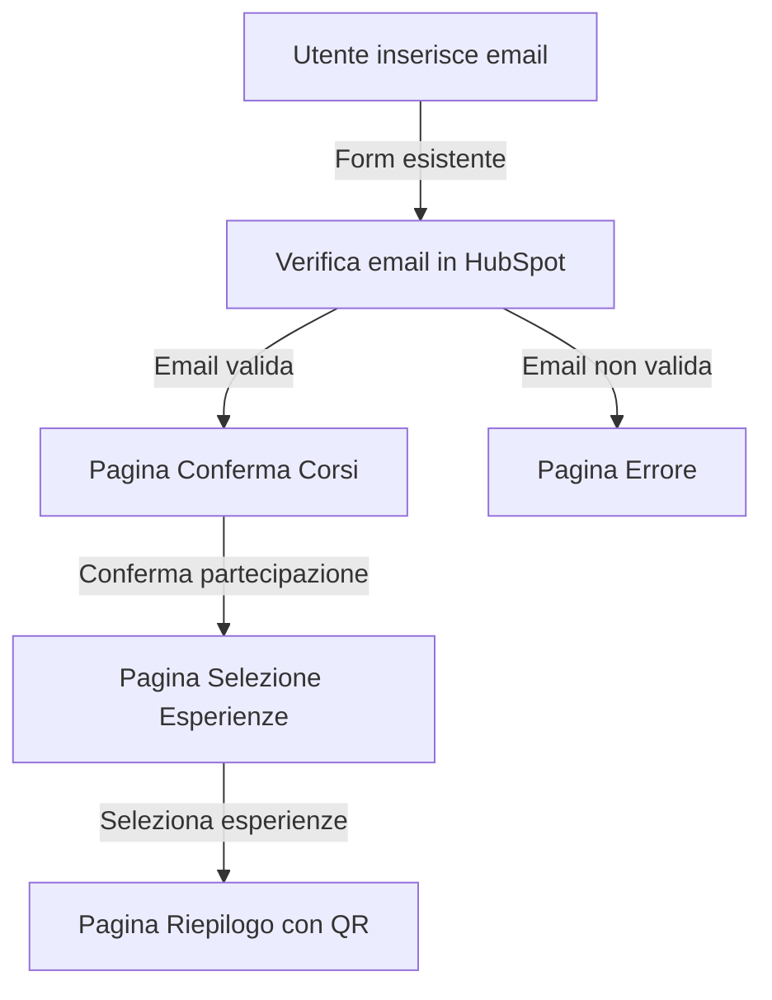

# Piano di Implementazione per la Nuova Modalità di Registrazione

## Panoramica del Flusso



## 1. Modifiche al Database

Dobbiamo creare nuove tabelle per gestire corsi ed esperienze:

```sql
-- Tabella per i corsi confermati dall'utente
CREATE TABLE IF NOT EXISTS user_courses (
    id INTEGER PRIMARY KEY AUTOINCREMENT,
    user_id TEXT,                -- ID del contatto HubSpot
    course_id TEXT,              -- ID del corso in HubSpot
    course_title TEXT,           -- Titolo del corso
    course_date TEXT,            -- Data/orario del corso
    course_location TEXT,        -- Location del corso
    confirmed BOOLEAN DEFAULT 0, -- Flag di conferma
    created_at DATETIME DEFAULT CURRENT_TIMESTAMP
);

-- Tabella per le esperienze selezionate dall'utente
CREATE TABLE IF NOT EXISTS user_experiences (
    id INTEGER PRIMARY KEY AUTOINCREMENT,
    user_id TEXT,                -- ID del contatto HubSpot
    experience_id TEXT,          -- ID dell'esperienza
    experience_title TEXT,       -- Titolo dell'esperienza
    experience_date TEXT,        -- Data/orario dell'esperienza
    experience_location TEXT,    -- Location dell'esperienza
    created_at DATETIME DEFAULT CURRENT_TIMESTAMP
);

-- Tabella per le esperienze disponibili
CREATE TABLE IF NOT EXISTS experiences (
    id INTEGER PRIMARY KEY AUTOINCREMENT,
    experience_id TEXT UNIQUE,   -- ID univoco dell'esperienza
    title TEXT,                  -- Titolo dell'esperienza
    date TEXT,                   -- Data/orario dell'esperienza
    location TEXT,               -- Location dell'esperienza
    course_type TEXT,            -- Tipo di corso associato
    max_participants INTEGER,    -- Numero massimo di partecipanti
    current_participants INTEGER DEFAULT 0, -- Partecipanti attuali
    created_at DATETIME DEFAULT CURRENT_TIMESTAMP
);

-- Tabella per la relazione tra corsi ed esperienze
CREATE TABLE IF NOT EXISTS course_experience_mapping (
    id INTEGER PRIMARY KEY AUTOINCREMENT,
    course_type TEXT,            -- Tipo di corso
    experience_id TEXT,          -- ID dell'esperienza associata
    FOREIGN KEY (experience_id) REFERENCES experiences(experience_id)
);
```

## 2. Nuove Rotte e Controller

Aggiungeremo le seguenti rotte al file `server.js`:

```javascript
// 1. Pagina di conferma corsi
app.get('/confirm-courses', async (req, res) => {
    const { contactID, lang } = req.query;
    const language = lang === 'en' ? 'en' : 'it';
    
    // Per ora, utilizziamo dati mock
    const mockCourses = [
        { id: 'course1', title: 'Introduzione alla Medicina', date: '2025-05-10 10:00', location: 'Aula Magna' },
        { id: 'course2', title: 'Biologia Cellulare', date: '2025-05-11 14:30', location: 'Laboratorio B' }
    ];
    
    res.render(`${language}/confirmCourses`, {
        contactId: contactID,
        courses: mockCourses
    });
});

// 2. Elaborazione della conferma dei corsi
app.post('/submit-course-confirmation', async (req, res) => {
    const { contactID, courses, lang } = req.body;
    const language = lang === 'en' ? 'en' : 'it';
    
    try {
        // Salva i corsi confermati nel database
        await saveConfirmedCourses(contactID, courses);
        
        // Recupera le esperienze disponibili in base ai corsi confermati
        const mockExperiences = [
            { id: 'exp1', title: 'Visita Laboratorio Ricerca', date: '2025-05-12 09:00', location: 'Edificio A', course_type: 'course1' },
            { id: 'exp2', title: 'Simulazione Chirurgica', date: '2025-05-12 11:00', location: 'Sala Operatoria Didattica', course_type: 'course1' },
            { id: 'exp3', title: 'Analisi Microscopica', date: '2025-05-13 10:00', location: 'Laboratorio C', course_type: 'course2' }
        ];
        
        // Filtra le esperienze in base ai corsi confermati
        const availableExperiences = mockExperiences.filter(exp => 
            courses.includes(exp.course_type)
        );
        
        // Reindirizza alla pagina di selezione esperienze
        res.render(`${language}/selectExperiences`, {
            contactId: contactID,
            experiences: availableExperiences,
            confirmedCourses: courses
        });
    } catch (error) {
        console.error('Errore nella conferma dei corsi:', error);
        res.render(`${language}/error`, {
            message: language === 'en' 
                ? 'Error confirming courses. Please try again.' 
                : 'Errore nella conferma dei corsi. Riprova.',
            contactID: contactID
        });
    }
});

// 3. Elaborazione della selezione delle esperienze
app.post('/submit-experiences', async (req, res) => {
    const { contactID, experiences, confirmedCourses, lang } = req.body;
    const language = lang === 'en' ? 'en' : 'it';
    
    try {
        // Salva le esperienze selezionate nel database
        await saveSelectedExperiences(contactID, experiences);
        
        // Recupera i dettagli dei corsi confermati
        const mockCourses = [
            { id: 'course1', title: 'Introduzione alla Medicina', date: '2025-05-10 10:00', location: 'Aula Magna' },
            { id: 'course2', title: 'Biologia Cellulare', date: '2025-05-11 14:30', location: 'Laboratorio B' }
        ];
        
        // Filtra i corsi confermati
        const coursesDetails = mockCourses.filter(course => 
            confirmedCourses.includes(course.id)
        );
        
        // Recupera i dettagli delle esperienze selezionate
        const mockExperiences = [
            { id: 'exp1', title: 'Visita Laboratorio Ricerca', date: '2025-05-12 09:00', location: 'Edificio A' },
            { id: 'exp2', title: 'Simulazione Chirurgica', date: '2025-05-12 11:00', location: 'Sala Operatoria Didattica' },
            { id: 'exp3', title: 'Analisi Microscopica', date: '2025-05-13 10:00', location: 'Laboratorio C' }
        ];
        
        // Filtra le esperienze selezionate
        const experiencesDetails = mockExperiences.filter(exp => 
            experiences.includes(exp.id)
        );
        
        // Genera QR code
        // Utilizziamo la stessa logica del sistema esistente
        const contact = await getContactDetails(contactID);
        const text2encode = contact.email + '**' + contactID;
        const encoded = xorCipher.encode(text2encode, xorKey);
        
        QRCode.toDataURL(encoded, (err, qrCode) => {
            if (err) {
                console.error('Error generating QR code:', err);
                return res.render(`${language}/error`, {
                    message: language === 'en'
                        ? 'Error generating QR code. Please try again.'
                        : 'Errore nella generazione del codice QR. Riprova.',
                    contactID: contactID
                });
            }
            
            // Renderizza la pagina di riepilogo
            res.render(`${language}/registrationSummary`, {
                contactId: contactID,
                courses: coursesDetails,
                experiences: experiencesDetails,
                qrCode: qrCode
            });
        });
    } catch (error) {
        console.error('Errore nella selezione delle esperienze:', error);
        res.render(`${language}/error`, {
            message: language === 'en' 
                ? 'Error selecting experiences. Please try again.' 
                : 'Errore nella selezione delle esperienze. Riprova.',
            contactID: contactID
        });
    }
});
```

## 3. Nuovi Template EJS

Dovremo creare i seguenti template EJS (sia in italiano che in inglese):

### 1. confirmCourses.ejs
```html
<!-- views/it/confirmCourses.ejs -->
<!DOCTYPE html>
<html lang="it">
<head>
    <meta charset="UTF-8">
    <meta name="viewport" content="width=device-width, initial-scale=1.0">
    <title>Conferma Corsi</title>
    <!-- CSS e altri asset -->
</head>
<body>
    <div class="container">
        <h1>Conferma la tua partecipazione ai corsi</h1>
        <p>Seleziona i corsi a cui desideri partecipare:</p>
        
        <form action="/submit-course-confirmation" method="POST">
            <input type="hidden" name="contactID" value="<%= contactId %>">
            <input type="hidden" name="lang" value="it">
            
            <% courses.forEach(course => { %>
                <div class="course-card">
                    <h3><%= course.title %></h3>
                    <p>Data: <%= course.date %></p>
                    <p>Luogo: <%= course.location %></p>
                    <label>
                        <input type="checkbox" name="courses" value="<%= course.id %>" checked>
                        Confermo la partecipazione
                    </label>
                </div>
            <% }); %>
            
            <button type="submit" class="btn-primary">Continua</button>
        </form>
    </div>
</body>
</html>
```

### 2. selectExperiences.ejs
```html
<!-- views/it/selectExperiences.ejs -->
<!DOCTYPE html>
<html lang="it">
<head>
    <meta charset="UTF-8">
    <meta name="viewport" content="width=device-width, initial-scale=1.0">
    <title>Seleziona Esperienze</title>
    <!-- CSS e altri asset -->
</head>
<body>
    <div class="container">
        <h1>Seleziona le esperienze</h1>
        <p>Scegli una o più esperienze a cui desideri partecipare:</p>
        
        <form action="/submit-experiences" method="POST">
            <input type="hidden" name="contactID" value="<%= contactId %>">
            <input type="hidden" name="lang" value="it">
            
            <% confirmedCourses.forEach(course => { %>
                <input type="hidden" name="confirmedCourses" value="<%= course %>">
            <% }); %>
            
            <% if (experiences.length === 0) { %>
                <p>Non ci sono esperienze disponibili per i corsi selezionati.</p>
            <% } else { %>
                <% experiences.forEach(exp => { %>
                    <div class="experience-card">
                        <h3><%= exp.title %></h3>
                        <p>Data: <%= exp.date %></p>
                        <p>Luogo: <%= exp.location %></p>
                        <label>
                            <input type="checkbox" name="experiences" value="<%= exp.id %>">
                            Seleziona questa esperienza
                        </label>
                    </div>
                <% }); %>
            <% } %>
            
            <button type="submit" class="btn-primary">Continua</button>
        </form>
    </div>
</body>
</html>
```

### 3. registrationSummary.ejs
```html
<!-- views/it/registrationSummary.ejs -->
<!DOCTYPE html>
<html lang="it">
<head>
    <meta charset="UTF-8">
    <meta name="viewport" content="width=device-width, initial-scale=1.0">
    <title>Riepilogo Registrazione</title>
    <!-- CSS e altri asset -->
</head>
<body>
    <div class="container">
        <h1>Riepilogo della tua registrazione</h1>
        
        <section>
            <h2>Corsi confermati</h2>
            <% if (courses.length === 0) { %>
                <p>Nessun corso confermato.</p>
            <% } else { %>
                <% courses.forEach(course => { %>
                    <div class="summary-card">
                        <h3><%= course.title %></h3>
                        <p>Data: <%= course.date %></p>
                        <p>Luogo: <%= course.location %></p>
                    </div>
                <% }); %>
            <% } %>
        </section>
        
        <section>
            <h2>Esperienze selezionate</h2>
            <% if (experiences.length === 0) { %>
                <p>Nessuna esperienza selezionata.</p>
            <% } else { %>
                <% experiences.forEach(exp => { %>
                    <div class="summary-card">
                        <h3><%= exp.title %></h3>
                        <p>Data: <%= exp.date %></p>
                        <p>Luogo: <%= exp.location %></p>
                    </div>
                <% }); %>
            <% } %>
        </section>
        
        <section class="qr-section">
            <h2>Il tuo QR Code</h2>
            <p>Mostra questo QR code all'ingresso dell'evento:</p>
            <div class="qr-container">
                " alt="QR Code">
            </div>
            <p>Ti abbiamo inviato una email con tutte le informazioni e il QR code.</p>
        </section>
    </div>
</body>
</html>
```

## 4. Modifiche alla Logica di Business

### 1. Funzione per recuperare i dettagli del contatto

```javascript
// Funzione per recuperare i dettagli del contatto da HubSpot
async function getContactDetails(contactId) {
    try {
        const response = await axios.get('https://api.hubapi.com/crm/v3/objects/contacts/' + contactId + '?properties=email,firstname,lastname');
        return response.data.properties;
    } catch (error) {
        console.error('Error fetching contact details:', error);
        throw error;
    }
}
```

### 2. Funzione per salvare i corsi confermati

```javascript
// Funzione per salvare i corsi confermati nel database
async function saveConfirmedCourses(contactId, courseIds) {
    try {
        // Elimina eventuali corsi confermati in precedenza
        await new Promise((resolve, reject) => {
            db.run("DELETE FROM user_courses WHERE user_id = ?", [contactId], (err) => {
                if (err) reject(err);
                else resolve();
            });
        });
        
        // Recupera i dettagli dei corsi (in produzione, da HubSpot)
        const mockCourses = [
            { id: 'course1', title: 'Introduzione alla Medicina', date: '2025-05-10 10:00', location: 'Aula Magna' },
            { id: 'course2', title: 'Biologia Cellulare', date: '2025-05-11 14:30', location: 'Laboratorio B' }
        ];
        
        // Inserisci i nuovi corsi confermati
        for (const courseId of courseIds) {
            const course = mockCourses.find(c => c.id === courseId);
            if (course) {
                await new Promise((resolve, reject) => {
                    db.run(
                        "INSERT INTO user_courses (user_id, course_id, course_title, course_date, course_location, confirmed) VALUES (?, ?, ?, ?, ?, ?)",
                        [contactId, course.id, course.title, course.date, course.location, 1],
                        (err) => {
                            if (err) reject(err);
                            else resolve();
                        }
                    );
                });
            }
        }
        
        return true;
    } catch (error) {
        console.error('Error saving confirmed courses:', error);
        throw error;
    }
}
```

### 3. Funzione per salvare le esperienze selezionate

```javascript
// Funzione per salvare le esperienze selezionate nel database
async function saveSelectedExperiences(contactId, experienceIds) {
    try {
        // Elimina eventuali esperienze selezionate in precedenza
        await new Promise((resolve, reject) => {
            db.run("DELETE FROM user_experiences WHERE user_id = ?", [contactId], (err) => {
                if (err) reject(err);
                else resolve();
            });
        });
        
        // Recupera i dettagli delle esperienze
        const mockExperiences = [
            { id: 'exp1', title: 'Visita Laboratorio Ricerca', date: '2025-05-12 09:00', location: 'Edificio A' },
            { id: 'exp2', title: 'Simulazione Chirurgica', date: '2025-05-12 11:00', location: 'Sala Operatoria Didattica' },
            { id: 'exp3', title: 'Analisi Microscopica', date: '2025-05-13 10:00', location: 'Laboratorio C' }
        ];
        
        // Inserisci le nuove esperienze selezionate
        for (const expId of experienceIds) {
            const experience = mockExperiences.find(e => e.id === expId);
            if (experience) {
                await new Promise((resolve, reject) => {
                    db.run(
                        "INSERT INTO user_experiences (user_id, experience_id, experience_title, experience_date, experience_location) VALUES (?, ?, ?, ?, ?)",
                        [contactId, experience.id, experience.title, experience.date, experience.location],
                        (err) => {
                            if (err) reject(err);
                            else resolve();
                        }
                    );
                });
                
                // Aggiorna il conteggio dei partecipanti per questa esperienza
                await new Promise((resolve, reject) => {
                    db.run(
                        "UPDATE experiences SET current_participants = current_participants + 1 WHERE experience_id = ?",
                        [experience.id],
                        (err) => {
                            if (err) reject(err);
                            else resolve();
                        }
                    );
                });
            }
        }
        
        return true;
    } catch (error) {
        console.error('Error saving selected experiences:', error);
        throw error;
    }
}
```

## 5. Modifiche al Flusso di Registrazione Esistente

Dobbiamo modificare il flusso di registrazione esistente per integrare la nuova modalità. In particolare, dobbiamo modificare la rotta `/submit-email` per reindirizzare alla pagina di conferma corsi:

```javascript
app.post('/submit-email', async (req, res) => {
    const { email, lang } = req.body;
    const language = lang === 'en' ? 'en' : 'it';
    
    // Validazione email (codice esistente)
    
    try {
        // Cerca il contatto in HubSpot (codice esistente)
        
        if (searchResponse.data.results && searchResponse.data.results.length > 0) {
            const contact = searchResponse.data.results[0];
            
            // Verifica se il contatto ha un oggetto personalizzato associato (codice esistente)
            
            // Modifica: invece di reindirizzare a /selection, reindirizza a /confirm-courses
            res.redirect(`/confirm-courses?contactID=${contact.id}&lang=${language}`);
        } else {
            // Contatto non trovato (codice esistente)
        }
    } catch (error) {
        // Gestione errori (codice esistente)
    }
});
```

## 6. Script di Migrazione del Database

Creeremo uno script per aggiungere le nuove tabelle al database:

```javascript
// create_course_experience_tables.js
const sqlite3 = require('sqlite3').verbose();
const db = new sqlite3.Database('fcfs.sqlite');

console.log('Avvio creazione tabelle per corsi ed esperienze...');

db.serialize(() => {
    // Crea la tabella user_courses
    db.run(`CREATE TABLE IF NOT EXISTS user_courses (
        id INTEGER PRIMARY KEY AUTOINCREMENT,
        user_id TEXT,
        course_id TEXT,
        course_title TEXT,
        course_date TEXT,
        course_location TEXT,
        confirmed BOOLEAN DEFAULT 0,
        created_at DATETIME DEFAULT CURRENT_TIMESTAMP
    )`);
    
    // Crea la tabella user_experiences
    db.run(`CREATE TABLE IF NOT EXISTS user_experiences (
        id INTEGER PRIMARY KEY AUTOINCREMENT,
        user_id TEXT,
        experience_id TEXT,
        experience_title TEXT,
        experience_date TEXT,
        experience_location TEXT,
        created_at DATETIME DEFAULT CURRENT_TIMESTAMP
    )`);
    
    // Crea la tabella experiences
    db.run(`CREATE TABLE IF NOT EXISTS experiences (
        id INTEGER PRIMARY KEY AUTOINCREMENT,
        experience_id TEXT UNIQUE,
        title TEXT,
        date TEXT,
        location TEXT,
        course_type TEXT,
        max_participants INTEGER,
        current_participants INTEGER DEFAULT 0,
        created_at DATETIME DEFAULT CURRENT_TIMESTAMP
    )`);
    
    // Crea la tabella course_experience_mapping
    db.run(`CREATE TABLE IF NOT EXISTS course_experience_mapping (
        id INTEGER PRIMARY KEY AUTOINCREMENT,
        course_type TEXT,
        experience_id TEXT,
        FOREIGN KEY (experience_id) REFERENCES experiences(experience_id)
    )`);
    
    console.log('Tabelle create con successo!');
    
    // Inserisci dati di esempio per le esperienze
    db.run(`INSERT OR IGNORE INTO experiences 
        (experience_id, title, date, location, course_type, max_participants) VALUES 
        ('exp1', 'Visita Laboratorio Ricerca', '2025-05-12 09:00', 'Edificio A', 'course1', 20),
        ('exp2', 'Simulazione Chirurgica', '2025-05-12 11:00', 'Sala Operatoria Didattica', 'course1', 15),
        ('exp3', 'Analisi Microscopica', '2025-05-13 10:00', 'Laboratorio C', 'course2', 25)
    `);
    
    // Inserisci dati di esempio per il mapping corso-esperienza
    db.run(`INSERT OR IGNORE INTO course_experience_mapping 
        (course_type, experience_id) VALUES 
        ('course1', 'exp1'),
        ('course1', 'exp2'),
        ('course2', 'exp3')
    `);
    
    console.log('Dati di esempio inseriti con successo!');
});

db.close();
```

## 7. Considerazioni per l'Integrazione con HubSpot

In produzione, dovremo:

1. Definire come recuperare i corsi da HubSpot (API, oggetti personalizzati, ecc.)
2. Determinare come memorizzare le conferme dei corsi e le selezioni delle esperienze in HubSpot
3. Aggiornare le proprietà del contatto o degli oggetti personalizzati in base alle selezioni dell'utente

## 8. Prossimi Passi

1. Implementare lo script di migrazione del database
2. Creare i nuovi template EJS
3. Implementare le nuove rotte e controller
4. Testare il flusso completo con dati mock
5. Integrare con HubSpot per i dati reali