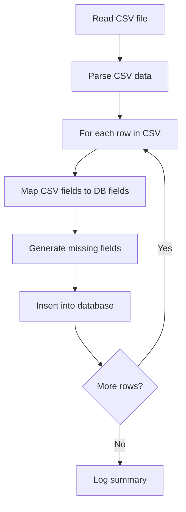

# Implementation Plan: Import Experiences from CSV

This document outlines the plan for creating a script to import experience data from the `exp.csv` file into the experiences table in the database.

## CSV Structure

The `exp.csv` file contains the following columns:
- CORSO (Course)
- NOME (Name)
- ORARIO INIZIO (Start Time)
- ORARIO FINE (End Time)
- POSTI DISPONIBILI (Available Slots)
- LOCATION
- DESCRIZIONE ATTIVITA' (Activity Description)

## Database Structure

The experiences table has the following fields:
1. id (auto-incremented primary key)
2. experience_id (unique identifier)
3. title (corresponds to NOME in CSV)
4. course (corresponds to CORSO in CSV)
5. location (corresponds to LOCATION in CSV)
6. date (date of the experience)
7. duration (duration of the experience)
8. desc (corresponds to DESCRIZIONE ATTIVITA' in CSV)
9. language (language of the experience - it or en)
10. course_type (type of course)
11. max_participants (corresponds to POSTI DISPONIBILI in CSV)
12. current_participants (current number of participants)
13. ora_inizio (corresponds to ORARIO INIZIO in CSV)
14. ora_fine (corresponds to ORARIO FINE in CSV)

## Field Mapping

| CSV Column | Database Field | Notes |
|------------|----------------|-------|
| CORSO | course | Direct mapping |
| NOME | title | Direct mapping |
| ORARIO INIZIO | ora_inizio | Direct mapping |
| ORARIO FINE | ora_fine | Direct mapping |
| POSTI DISPONIBILI | max_participants | Direct mapping |
| LOCATION | location | Direct mapping |
| DESCRIZIONE ATTIVITA' | desc | Direct mapping |
| N/A | experience_id | Generate based on course and title |
| N/A | date | Use current date |
| N/A | duration | Calculate from ora_inizio and ora_fine |
| N/A | language | Default to 'it' (Italian) |
| N/A | course_type | Use CORSO field |
| N/A | current_participants | Default to 0 |

## Implementation Steps

1. **Read and Parse CSV File**
   - Use the `fs` module to read the CSV file
   - Use the `csv-parser` package to parse the CSV data

2. **Process Each Row**
   - Map CSV fields to database fields
   - Generate values for missing fields:
     - experience_id: Generate a unique ID based on the course and title (e.g., slugify and add a timestamp)
     - date: Use the current date
     - duration: Calculate from ora_inizio and ora_fine
     - language: Default to 'it'
     - course_type: Use the CORSO field
     - current_participants: Default to 0

3. **Insert Data into Database**
   - Connect to the SQLite database
   - For each processed row, insert a new record into the experiences table
   - Handle duplicates by checking if an experience with the same title and course already exists

4. **Logging and Error Handling**
   - Log the progress and results
   - Handle errors gracefully
   - Provide a summary of the import process (total records, successful imports, failures)

## Script Structure

```javascript
#!/usr/bin/env node

/**
 * Script for importing experiences from CSV file into the database
 * 
 * This script:
 * 1. Reads the exp.csv file
 * 2. Parses each row
 * 3. Maps the CSV fields to the database fields
 * 4. Generates values for the missing fields
 * 5. Inserts the data into the database
 */

const fs = require('fs');
const csv = require('csv-parser');
const sqlite3 = require('sqlite3').verbose();
const logger = require('./logger');
const path = require('path');
const { v4: uuidv4 } = require('uuid'); // For generating unique IDs

// Function to calculate duration from start and end times
function calculateDuration(startTime, endTime) {
  // Implementation details
}

// Function to generate a unique experience_id
function generateExperienceId(course, title) {
  // Implementation details
}

// Main function
async function importExperiencesFromCsv() {
  // Implementation details
}

// Run the import function
importExperiencesFromCsv()
  .then(() => {
    console.log('Import completed successfully');
  })
  .catch((error) => {
    console.error('Error during import:', error);
  });
```

## Flow Diagram



## Next Steps

After creating this implementation plan, we should:

1. Switch to Code mode to implement the actual script
2. Test the script with the exp.csv file
3. Verify the imported data in the database
4. Make any necessary adjustments to the script