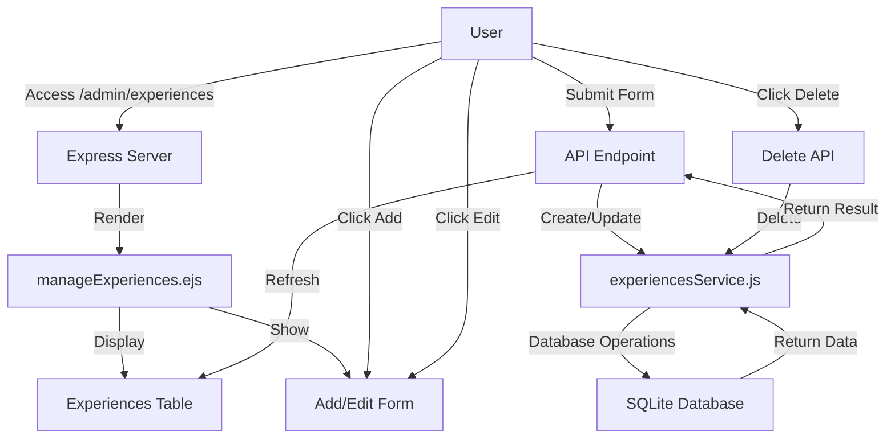

# Experiences Management Admin Panel - Implementation Plan

## Overview

We'll create a simple web-based admin panel that will:
1. Display all experiences in a table format
2. Allow adding new experiences via a form
3. Allow editing existing experiences
4. Allow deleting experiences
5. Provide basic filtering and sorting capabilities

## Technical Approach

We'll leverage the existing Express.js server and the experiencesService.js module that already has all the necessary CRUD operations. We'll create:

1. A new EJS template for the admin panel
2. New routes in server.js to handle the admin panel requests
3. Client-side JavaScript for enhanced interactivity

## Detailed Implementation Plan

### 1. Create Admin Panel EJS Template

We'll create a new EJS template file called `manageExperiences.ejs` in the views directory. This template will include:

- A table to display all experiences
- A form to add/edit experiences
- JavaScript for client-side interactivity

### 2. Add Routes to server.js

We'll add the following routes to server.js:

```javascript
// GET route to display the admin panel
app.get('/admin/experiences', async (req, res) => {
  try {
    const experiences = await experiencesService.getAllExperiences(db);
    res.render('manageExperiences', { experiences });
  } catch (error) {
    logger.error('Error loading experiences admin panel:', error);
    res.status(500).send('Error loading experiences admin panel');
  }
});

// API routes for CRUD operations
// GET all experiences
app.get('/api/experiences', async (req, res) => {
  try {
    const { language, orderBy } = req.query;
    const experiences = await experiencesService.getAllExperiences(db, language, orderBy);
    res.json(experiences);
  } catch (error) {
    logger.error('Error getting experiences:', error);
    res.status(500).json({ error: 'Error getting experiences' });
  }
});

// GET a single experience
app.get('/api/experiences/:id', async (req, res) => {
  try {
    const experience = await experiencesService.getExperienceById(db, req.params.id);
    if (!experience) {
      return res.status(404).json({ error: 'Experience not found' });
    }
    res.json(experience);
  } catch (error) {
    logger.error('Error getting experience:', error);
    res.status(500).json({ error: 'Error getting experience' });
  }
});

// POST a new experience
app.post('/api/experiences', async (req, res) => {
  try {
    const result = await experiencesService.createExperience(db, req.body);
    res.status(201).json(result);
  } catch (error) {
    logger.error('Error creating experience:', error);
    res.status(500).json({ error: 'Error creating experience' });
  }
});

// PUT (update) an experience
app.put('/api/experiences/:id', async (req, res) => {
  try {
    const result = await experiencesService.updateExperience(db, req.params.id, req.body);
    if (!result.success) {
      return res.status(404).json(result);
    }
    res.json(result);
  } catch (error) {
    logger.error('Error updating experience:', error);
    res.status(500).json({ error: 'Error updating experience' });
  }
});

// DELETE an experience
app.delete('/api/experiences/:id', async (req, res) => {
  try {
    const result = await experiencesService.deleteExperience(db, req.params.id);
    if (!result.success) {
      return res.status(404).json(result);
    }
    res.json(result);
  } catch (error) {
    logger.error('Error deleting experience:', error);
    res.status(500).json({ error: 'Error deleting experience' });
  }
});
```

### 3. Create the EJS Template Content

The `manageExperiences.ejs` template will include:

- HTML structure for the admin panel
- CSS for styling
- JavaScript for client-side interactivity
- Table for displaying experiences
- Form for adding/editing experiences
- Event handlers for CRUD operations

## Implementation Steps

1. **Create the EJS Template**:
   - Create a new file `views/manageExperiences.ejs` with the HTML/CSS/JavaScript code.

2. **Add Routes to server.js**:
   - Add the new routes to server.js to handle the admin panel and API requests.

3. **Test the Implementation**:
   - Start the server and navigate to `/admin/experiences` to test the admin panel.
   - Test all CRUD operations to ensure they work correctly.

## Technical Considerations

1. **Performance**:
   - The admin panel loads all experiences at once, which could be slow if there are many records.
   - For a production environment, we might want to add pagination.

2. **Error Handling**:
   - The implementation includes basic error handling, but it could be enhanced for a production environment.

3. **Security**:
   - As requested, there's no authentication, but the panel should only be accessible on a secure network.
   - Consider adding basic authentication if the panel will be accessible from outside the secure network.

## Flow Diagram



## Conclusion

This implementation provides a simple but functional admin panel for managing experiences. It leverages the existing experiencesService.js module and adds new routes and a template to create a user-friendly interface.

The panel allows users to:
- View all experiences in a table
- Filter experiences by language
- Sort experiences by any column
- Add new experiences
- Edit existing experiences
- Delete experiences