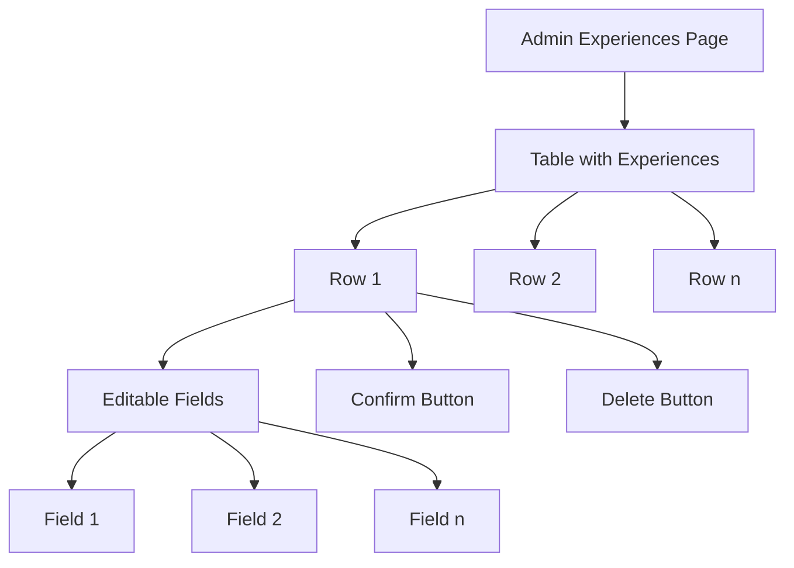

# Plan for Simplifying the Admin Experiences CRUD Interface

## Current Understanding
- The current admin interface for experiences is at `/admin/experiences` and uses the `manageExperiences.ejs` view
- The experiences table has the following fields:
  - id
  - experience_id
  - title
  - course
  - location
  - date
  - duration
  - desc
  - language
  - course_type
  - max_participants
  - current_participants
  - ora_inizio
  - ora_fine
- The backend already has complete CRUD API endpoints at `/api/experiences`
- The user wants inline editing for each row with a confirmation button to save changes
- All fields should be included by default, but there should be a configurable list of fields in the source code

## Implementation Plan

### 1. Create a New Admin Experiences Page

We'll create a simplified version of the admin experiences page with the following features:
- A clean, modern table layout
- Inline editing for all fields
- A confirmation button for each row to save changes
- A configurable list of fields to display

### 2. Backend Changes

1. Create a new route for the simplified admin experiences page
2. Reuse the existing API endpoints for CRUD operations
3. Add a configuration option for the list of fields to display

### 3. Frontend Implementation

1. Create a new EJS template for the simplified admin experiences page
2. Implement inline editing with JavaScript
3. Add confirmation buttons for each row
4. Implement field configuration

## Detailed Implementation Steps

### Step 1: Create a New Route for the Simplified Admin Experiences Page

We'll add a new route to `server.js` or `add_experiences_routes.js` for the simplified admin experiences page.

### Step 2: Create a New EJS Template

We'll create a new EJS template called `manageExperiencesSimple.ejs` with a clean, modern design.

### Step 3: Implement Inline Editing

We'll use JavaScript to make each field editable when clicked, with a confirmation button to save changes.

### Step 4: Add Field Configuration

We'll add a configuration option in the source code to specify which fields to display.

### Step 5: Connect to Existing API Endpoints

We'll use the existing API endpoints for CRUD operations.

## Technical Details

### New EJS Template Structure

The new template will have:
- A table with all experiences
- Editable fields for each row
- A confirmation button for each row
- A delete button for each row
- A "Add New Experience" button at the top

### JavaScript Implementation

We'll use JavaScript to:
- Make fields editable when clicked
- Track changes to fields
- Send updates to the server when the confirmation button is clicked
- Handle adding and deleting experiences

### CSS Styling

We'll use simple CSS to style the table and make it user-friendly.

## Benefits of the New Implementation

1. **Simplicity**: The new interface will be cleaner and more focused
2. **Efficiency**: Inline editing with confirmation buttons makes it faster to update experiences
3. **Flexibility**: The configurable field list allows for customization
4. **Reusability**: We'll reuse the existing API endpoints