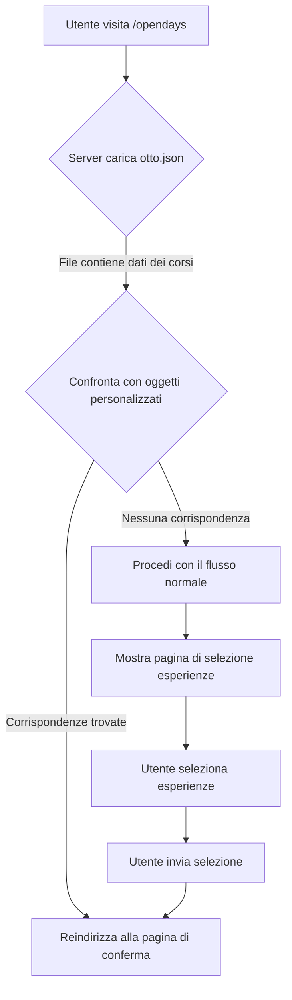

# Piano di implementazione per la correzione di otto.json

## Problema identificato

L'applicazione sta cercando corrispondenze tra gli oggetti personalizzati di HubSpot e gli ID dei corsi in `otto.json`, ma questo file contiene un array vuoto `[]`. Di conseguenza, non vengono trovate corrispondenze e l'applicazione procede sempre con il flusso normale invece di utilizzare il flusso diretto quando appropriato.

## Soluzione proposta

Popolare `otto.json` con i dati dei corsi appropriati. Ci sono due opzioni:

### Opzione 1: Copiare il contenuto da corsi.json a otto.json

Questa è l'opzione consigliata secondo il piano di implementazione originale. In questo modo, gli stessi corsi saranno disponibili sia per il flusso normale che per il flusso diretto.

```javascript
// Codice per copiare il contenuto da corsi.json a otto.json
const fs = require('fs');
const path = require('path');

// Leggi il contenuto di corsi.json
const corsiPath = path.join(__dirname, 'corsi.json');
const corsiData = fs.readFileSync(corsiPath, 'utf8');
const corsiJson = JSON.parse(corsiData);

// Scrivi il contenuto in otto.json
const ottoPath = path.join(__dirname, 'otto.json');
fs.writeFileSync(ottoPath, JSON.stringify(corsiJson, null, 2));

console.log('Contenuto copiato con successo da corsi.json a otto.json');
```

### Opzione 2: Copiare il contenuto da otto_vero.json a otto.json

Se si desidera utilizzare un set diverso di corsi per il flusso diretto, è possibile copiare il contenuto da `otto_vero.json` a `otto.json`.

```javascript
// Codice per copiare il contenuto da otto_vero.json a otto.json
const fs = require('fs');
const path = require('path');

// Leggi il contenuto di otto_vero.json
const ottoVeroPath = path.join(__dirname, 'otto_vero.json');
const ottoVeroData = fs.readFileSync(ottoVeroPath, 'utf8');
const ottoVeroJson = JSON.parse(ottoVeroData);

// Scrivi il contenuto in otto.json
const ottoPath = path.join(__dirname, 'otto.json');
fs.writeFileSync(ottoPath, JSON.stringify(ottoVeroJson, null, 2));

console.log('Contenuto copiato con successo da otto_vero.json a otto.json');
```

## Passi di implementazione

1. Passare alla modalità Code per poter modificare file non Markdown
2. Creare un nuovo file JavaScript (ad esempio `fix_otto_json.js`) con uno dei blocchi di codice sopra, a seconda dell'opzione scelta
3. Eseguire lo script per copiare il contenuto nel file `otto.json`
4. Verificare che `otto.json` contenga ora i dati dei corsi corretti
5. Testare la funzionalità accedendo alla route `/opendays` con un ID contatto che ha oggetti personalizzati corrispondenti

## Verifica della soluzione

Dopo aver implementato la soluzione, è possibile verificare che funzioni correttamente controllando i log del server. Se la soluzione è stata implementata correttamente, dovremmo vedere messaggi di log come:

```
[2025-05-02T03:43:25.866Z] INFO: Otto course IDs: 25417865498, 25326449768, 25417865392, ...
[2025-05-02T03:43:25.866Z] INFO: Match found in otto.json: 140261653720 matches 25417865498
[2025-05-02T03:43:25.866Z] INFO: Found 1 matches in otto.json: 140261653720
[2025-05-02T03:43:25.866Z] INFO: Redirecting to: /it/opendays/confirmation?contactID=32115900465&matchingCourseIds=140261653720
```

Invece di:

```
[2025-05-02T03:43:25.866Z] INFO: Otto course IDs:
[2025-05-02T03:43:25.866Z] INFO: No matches found in otto.json, proceeding with normal flow
```

## Diagramma del flusso di lavoro corretto



## Conclusione

Questa soluzione risolverà il problema attuale consentendo all'applicazione di trovare corrispondenze in `otto.json` quando appropriate, permettendo agli utenti di bypassare la pagina di selezione delle esperienze e andare direttamente alla pagina di conferma quando hanno oggetti personalizzati corrispondenti in HubSpot.