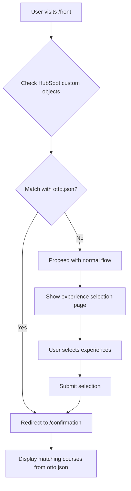

# Implementation Plan: Direct Confirmation with otto.json

## Overview

This document outlines the implementation plan for a new feature that will allow users to bypass the experience selection step and go directly to the confirmation page if they have matching custom objects in `otto.json`.

## Current Flow

1. User arrives at `/front`
2. HubSpot is queried for custom objects associated with the user's contactID
3. These custom objects are compared with IDs in `corsi.json`
4. User is shown the experience selection page
5. User selects experiences and submits
6. User is redirected to the confirmation page

## New Flow

1. User arrives at `/front`
2. HubSpot is queried for custom objects associated with the user's contactID
3. These custom objects are compared with IDs in both `corsi.json` and `otto.json`
4. If matches are found in `otto.json`:
   - User is redirected directly to the confirmation page
   - Matching courses from `otto.json` are displayed
5. If no matches are found in `otto.json`:
   - Proceed with the normal flow (steps 4-6 from the current flow)

## Implementation Steps

### 1. Create otto.json

Create a copy of `corsi.json` called `otto.json` with the same structure:

```json
[
  {
    "id": "25417865530",
    "name": "Filosofia",
    "orario_inizio": "",
    "orario_fine": "",
    "location": ""
  },
  ...
]
```

### 2. Add a new route for /front

Add a new route handler in `server.js` that:

```javascript
// New route for /front
app.get('/front', async (req, res) => {
  const { contactID, lang } = req.query;
  const language = lang === 'en' ? 'en' : 'it';
  
  if (!contactID) {
    return res.render(`${language}/error`, {
      message: language === 'en' ? 'Contact ID is required' : 'ID contatto richiesto',
      contactID: ''
    });
  }
  
  try {
    // Get custom objects from HubSpot
    const customObjects = await hubspotExperienceService.getAllCustomObjects(contactID);
    
    if (customObjects.error) {
      return res.status(500).json({
        error: language === 'en' ? 'Error retrieving custom objects' : 'Errore nel recupero degli oggetti personalizzati'
      });
    }
    
    // Extract IDs from custom objects
    const customObjectIds = customObjects.map(obj => obj.id);
    
    // Load otto.json
    const ottoCourses = require('./otto.json');
    const ottoCourseIds = ottoCourses.map(course => course.id);
    
    // Check for matches between custom objects and otto.json
    const matchingOttoCourseIds = [];
    for (const customId of customObjectIds) {
      for (const courseId of ottoCourseIds) {
        // Try string comparison
        if (String(customId) === String(courseId)) {
          matchingOttoCourseIds.push(customId);
          break;
        }
        // Try number comparison if both can be converted to numbers
        else if (!isNaN(Number(customId)) && !isNaN(Number(courseId)) && Number(customId) === Number(courseId)) {
          matchingOttoCourseIds.push(customId);
          break;
        }
      }
    }
    
    // If matches found in otto.json, redirect to confirmation page
    if (matchingOttoCourseIds.length > 0) {
      // Redirect to the confirmation page with the matching course IDs
      return res.redirect(`/${language}/opendays/confirmation?contactID=${contactID}&matchingCourseIds=${matchingOttoCourseIds.join(',')}`);
    }
    
    // If no matches found, proceed with normal flow
    return res.redirect(`/${language}/opendays?contactID=${contactID}`);
  } catch (error) {
    console.error('Error in /front route:', error);
    return res.render(`${language}/error`, {
      message: language === 'en' ? 'Internal server error' : 'Errore interno del server',
      contactID: contactID
    });
  }
});
```

### 3. Modify the ConfirmationPage component

Update the `ConfirmationPage.tsx` component to handle receiving matchingCourseIds as a URL parameter:

```typescript
// In ConfirmationPage.tsx
useEffect(() => {
  // Extract matchingCourseIds from URL if present
  const urlParams = new URLSearchParams(location.search);
  const matchingCourseIdsParam = urlParams.get('matchingCourseIds');
  
  if (matchingCourseIdsParam) {
    const courseIds = matchingCourseIdsParam.split(',');
    setMatchingCourseIds(courseIds);
  }
}, [location]);
```

### 4. Update the server.js file to serve otto.json

Make sure otto.json is accessible to the frontend:

```javascript
// In server.js
app.get('/otto.json', (req, res) => {
  res.sendFile(path.join(__dirname, 'otto.json'));
});
```

## Flow Diagram



## Testing Plan

1. Create a test contact in HubSpot with custom objects that match IDs in otto.json
2. Visit `/front?contactID=[test-contact-id]`
3. Verify that the user is redirected directly to the confirmation page
4. Verify that the matching courses from otto.json are displayed correctly

5. Create a test contact in HubSpot with custom objects that do not match IDs in otto.json
6. Visit `/front?contactID=[test-contact-id]`
7. Verify that the user proceeds through the normal flow (experience selection page)

## Conclusion

This implementation will allow users with matching custom objects in otto.json to bypass the experience selection step and go directly to the confirmation page, while maintaining the existing flow for users without matches.