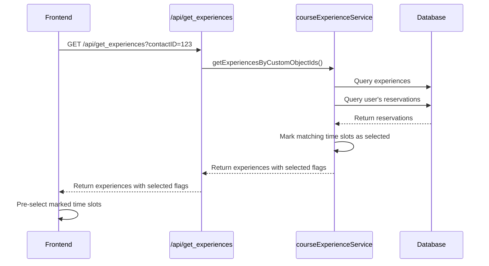

# Implementation Plan: Pre-select Reserved Slots on Selection Page

Based on my analysis of the codebase, I'll now create a detailed plan to implement the requested feature: when a user arrives at the selection page in `/front`, the system should query the `opend_reservations` table and pre-select the slots for which the user already has reservations.

## Current System Overview

1. **Frontend Selection Page**:
   - The `/front` route renders the `OpenDayRegistration` component
   - This component fetches experiences from the backend using the `/api/get_experiences` endpoint
   - Users can select time slots and make reservations

2. **Backend API**:
   - The `/api/get_experiences` endpoint calls `courseExperienceService.getExperiencesByCustomObjectIds`
   - This function retrieves experiences and their time slots based on the user's contactID
   - The `opend_reservations` table stores user reservations with `contact_id`, `experience_id`, and `time_slot_id`

3. **Reservation System**:
   - The `reservationService.js` provides functions to manage reservations
   - `getReservationsForContact` retrieves all reservations for a specific contactID

## Implementation Steps

### 1. Modify Backend API to Include User's Reservations

We need to modify the `getExperiencesByCustomObjectIds` function in `courseExperienceService.js` to:
- Fetch the user's existing reservations from the `opend_reservations` table
- Add a `selected: true` flag to time slots that match the user's reservations



### 2. Update Frontend to Use Pre-selected Slots

We need to modify the `OpenDayRegistration.tsx` component to:
- Initialize the `selectedTimeSlots` state with the pre-selected slots from the API response
- Ensure the UI correctly displays these pre-selected slots

## Detailed Code Changes

### Backend Changes

1. **Modify `courseExperienceService.js`**:
   - Update the `getExperiencesByCustomObjectIds` function to accept a `contactId` parameter
   - Fetch the user's reservations using `reservationService.getReservationsForContact`
   - Create a map of the user's reservations for quick lookup
   - When creating time slots, check if the user has a reservation for that slot and add a `selected` flag

2. **Update `/api/get_experiences` endpoint in `server.js`**:
   - Pass the contactID to the `getExperiencesByCustomObjectIds` function

### Frontend Changes

1. **Modify `OpenDayRegistration.tsx`**:
   - Process the `selected` flag in the API response
   - Initialize the `selectedTimeSlots` state with the pre-selected slots
   - Ensure the UI correctly displays these pre-selected slots

## Implementation Details

### Backend Changes

#### 1. Modify `courseExperienceService.js`:

```javascript
// Update function signature to accept contactId
async function getExperiencesByCustomObjectIds(db, customObjectIds, language, contactId) {
    try {
        logger.info(`Retrieving experiences for custom object IDs: ${customObjectIds.join(', ')} in language: ${language} for contact: ${contactId}`);
        
        // Existing code...
        
        // Fetch user's reservations if contactId is provided
        let userReservations = [];
        if (contactId) {
            userReservations = await reservationService.getReservationsForContact(db, contactId);
            logger.info(`Found ${userReservations.length} reservations for contact ${contactId}`);
        }
        
        // Create a map for quick lookup of user's reservations
        const reservationMap = {};
        userReservations.forEach(reservation => {
            const key = `${reservation.experience_id}_${reservation.time_slot_id}`;
            reservationMap[key] = true;
        });
        
        // Existing code...
        
        // When creating time slots, check if the user has a reservation for this slot
        if (row.ora_inizio && row.ora_inizio.trim() !== '') {
            const timeSlotId = `${row.experience_id}-${experience.timeSlots.length + 1}`;
            const reservationKey = `${row.experience_id}_${timeSlotId}`;
            
            experience.timeSlots.push({
                id: timeSlotId,
                time: formatTime(row.ora_inizio),
                endTime: formatTime(row.ora_fine),
                available: Math.max(0, row.max_participants - row.current_participants),
                reserved: row.current_participants || 0,
                selected: reservationMap[reservationKey] || false // Add selected flag
            });
        }
        
        // Existing code...
    } catch (error) {
        // Error handling...
    }
}
```

#### 2. Update `/api/get_experiences` endpoint in `server.js`:

```javascript
app.get('/api/get_experiences', async (req, res) => {
    const { contactID, lang } = req.query;
    
    // Default to Italian if no language specified
    const language = lang === 'en' ? 'en' : 'it';
    
    if (!contactID) {
        return res.status(400).json({
            error: language === 'en' ? 'Contact ID is required' : 'ID contatto richiesto'
        });
    }
    
    try {
        // Existing code...
        
        // Pass contactID to getExperiencesByCustomObjectIds
        const experiences = await courseExperienceService.getExperiencesByCustomObjectIds(db, filteredObjectIds, language, contactID);
        
        // Existing code...
    } catch (error) {
        // Error handling...
    }
});
```

### Frontend Changes

#### Modify `OpenDayRegistration.tsx`:

```typescript
// In the useEffect hook where experiences are loaded
useEffect(() => {
    if (!contactID) {
        setContactIdMissing(true);
        setLoading(false);
        return;
    }
    
    setContactIdMissing(false);
    
    const loadExperiences = async () => {
        try {
            setLoading(true);
            const language = lang || 'en';
            console.log('Fetching experiences for contactID:', contactID, 'language:', language);
            
            const data = await fetchExperiences(contactID, language);
            
            // Process data and fix any string available slots
            const fixedData = data.map(exp => ({
                ...exp,
                timeSlots: exp.timeSlots.map(slot => ({
                    ...slot,
                    available: typeof slot.available === 'string'
                        ? parseInt(String(slot.available), 10)
                        : slot.available
                }))
            }));
            
            console.log('Fixed data:', fixedData);
            setActivities(fixedData);
            
            // Initialize selectedTimeSlots with pre-selected slots from the API
            const initialSelectedSlots = {};
            fixedData.forEach(activity => {
                activity.timeSlots.forEach(slot => {
                    if (slot.selected) {
                        initialSelectedSlots[activity.id] = slot.id;
                    }
                });
            });
            
            console.log('Initial selected slots:', initialSelectedSlots);
            setSelectedTimeSlots(initialSelectedSlots);
            
            // Calculate overlapping slots based on initial selections
            if (Object.keys(initialSelectedSlots).length > 0) {
                const initialOverlappingSlots = checkTimeSlotOverlaps(initialSelectedSlots);
                setOverlappingSlots(initialOverlappingSlots);
            }
            
            setError(null);
        } catch (err) {
            setError('Failed to load experiences');
            console.error('Error loading experiences:', err);
        } finally {
            setLoading(false);
        }
    };
    
    loadExperiences();
}, [contactID, lang]);
```

## Important UI Consideration

As per the requirement, the pre-selected slots should appear exactly as if the user had just selected them manually. There should be no visual difference between slots that were pre-selected based on existing reservations and slots that the user selects during the current session. The UI should treat both types of selections identically.

This means:
- The radio buttons for pre-selected slots will be checked
- The "booked" indicator will be shown next to the activity title
- Any overlapping slots will be marked as unavailable
- The user can deselect these pre-selected slots if they wish to change their reservations

## Testing Plan

1. **Backend Testing**:
   - Verify that the API returns the correct `selected` flags for reserved slots
   - Test with a user who has existing reservations

2. **Frontend Testing**:
   - Verify that the UI correctly displays pre-selected slots
   - Test the user flow for adding/removing selections

## Questions and Considerations

1. **Database Schema**: The current `opend_reservations` table appears to have all the necessary columns (`contact_id`, `experience_id`, `time_slot_id`).

2. **Performance**: Fetching reservations adds an additional database query, but the impact should be minimal since we're only fetching reservations for a single user.

3. **Edge Cases**:
   - What happens if a previously reserved slot is no longer available?
   - How should the UI handle conflicts with pre-selected slots?

## Next Steps

1. Implement the backend changes to include reservation information in the API response
2. Implement the frontend changes to use the pre-selected slots
3. Test the implementation with users who have existing reservations
4. Deploy the changes to the production environment