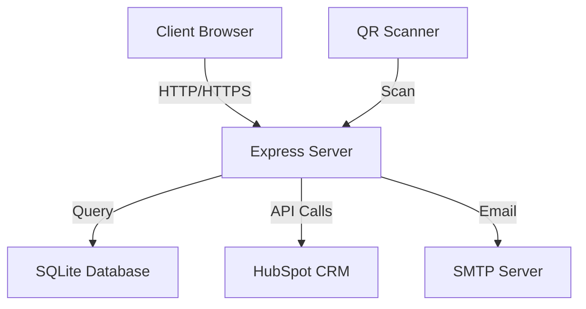
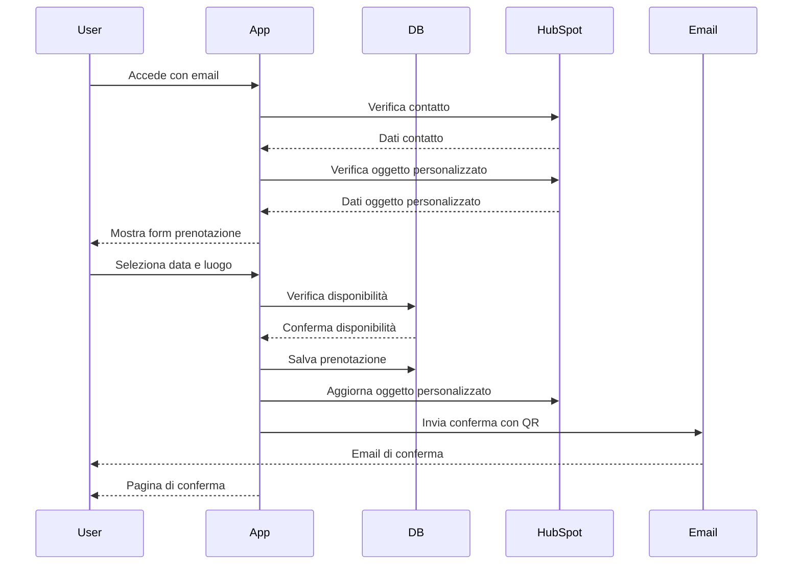
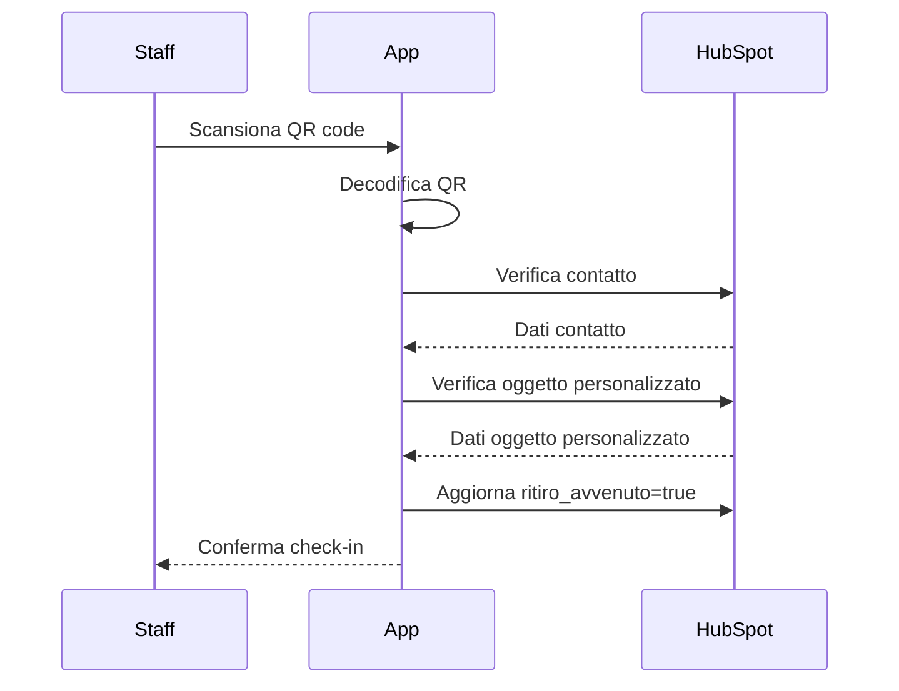

# Documentazione Applicazione UniSR Open Days

## Panoramica dell'Architettura

L'applicazione è un sistema di prenotazione per eventi UniSR che consente agli utenti di prenotare slot per ritirare materiali (come zaini) in date e luoghi specifici. È costruita con Node.js e Express, utilizza SQLite come database e si integra con HubSpot CRM.

## Struttura dei File e Funzionalità

### File Principali

| File | Descrizione |
|------|-------------|
| `server.js` | File principale dell'applicazione che configura Express, definisce le rotte e avvia il server |
| `remainingSlots.js` | Gestisce il calcolo dei posti rimanenti per ogni combinazione di data e luogo |
| `reservationOptions.json` | Contiene la configurazione delle opzioni di prenotazione (date, limiti) |
| `reservationFields.json` | Definisce i campi del modulo di prenotazione |
| `logger.js` | Implementa le funzionalità di logging |
| `xorCipher.js` | Fornisce funzioni per la crittografia/decrittografia dei codici QR |
| `add_location_field.js` | Script per aggiungere il campo location al database |
| `update_location.js` | Script per aggiornare il campo location negli oggetti personalizzati HubSpot |
| `check_reservation.js` | Script per verificare le prenotazioni esistenti |
| `test_location_implementation.js` | Script per testare l'implementazione del campo location |

### Directory Principali

| Directory | Descrizione |
|-----------|-------------|
| `views/` | Contiene i template EJS per le pagine web |
| `views/en/` | Template in inglese |
| `views/it/` | Template in italiano |
| `public/` | File statici (CSS, JavaScript, immagini) |
| `public/js/` | Script client-side |
| `public/css/` | Fogli di stile |
| `public/images/` | Immagini |

## Database

### Tabelle

1. **reservations**
   - `id`: INTEGER PRIMARY KEY AUTOINCREMENT
   - `user_id`: TEXT (ID del contatto HubSpot)
   - `day`: TEXT (data della prenotazione)
   - `custom_object_location`: TEXT (luogo della prenotazione)

2. **fcfs**
   - `id`: INTEGER PRIMARY KEY AUTOINCREMENT
   - `user`: INTEGER

3. **email_subscriptions**
   - `id`: INTEGER PRIMARY KEY AUTOINCREMENT
   - `email`: TEXT UNIQUE
   - `created_at`: DATETIME DEFAULT CURRENT_TIMESTAMP

## Flussi di Lavoro Principali

### 1. Processo di Prenotazione

### 2. Processo di Check-in

## Integrazione con HubSpot

### Oggetti e Proprietà

1. **Contatti**
   - `email`: Email del contatto
   - `firstname`: Nome
   - `lastname`: Cognome
   - `isregistered`: Booleano che indica se il contatto è registrato
   - `ischeckin`: Booleano che indica se il contatto ha effettuato il check-in
   - `eventdate`: Data dell'evento

2. **Oggetto Personalizzato**
   - `location`: Luogo dell'evento
   - `ritiro_avvenuto`: Booleano che indica se il ritiro è avvenuto
   - `data_ritiro_text`: Data del ritiro in formato testo

### API Utilizzate

- `GET /crm/v3/objects/contacts/{id}`: Recupera informazioni sul contatto
- `PATCH /crm/v3/objects/contacts/{id}`: Aggiorna le proprietà del contatto
- `GET /crm/v4/objects/contact/{id}/associations/{customObjectTypeId}`: Recupera le associazioni tra contatto e oggetto personalizzato
- `GET /crm/v3/objects/{customObjectTypeId}/{id}`: Recupera informazioni sull'oggetto personalizzato
- `PATCH /crm/v3/objects/{customObjectTypeId}/{id}`: Aggiorna le proprietà dell'oggetto personalizzato
- `POST /crm/v3/objects/contacts/search`: Cerca contatti in base a criteri specifici

## Sistema di Prenotazione Attuale

### Configurazione delle Opzioni di Prenotazione

Il file `reservationOptions.json` definisce:
- `fields`: Array di campi disponibili per la prenotazione (es. day)
- `limits`: Oggetto che definisce i limiti di posti per ogni combinazione di data e luogo

### Calcolo dei Posti Rimanenti

Il modulo `remainingSlots.js` calcola i posti rimanenti per ogni slot:
1. Inizializza i posti rimanenti con i limiti definiti in `reservationOptions.json`
2. Conta le prenotazioni esistenti per ogni combinazione di data e luogo
3. Sottrae il conteggio dai limiti per ottenere i posti rimanenti

### Gestione delle Prenotazioni

1. Verifica se l'utente ha già una prenotazione
2. Se esiste, elimina la prenotazione precedente
3. Verifica la disponibilità dello slot selezionato
4. Salva la nuova prenotazione nel database
5. Aggiorna l'oggetto personalizzato in HubSpot
6. Genera un codice QR con i dati dell'utente
7. Invia un'email di conferma con il codice QR

## Endpoint API

| Endpoint | Metodo | Descrizione |
|----------|--------|-------------|
| `/selection` | GET | Mostra il form di selezione data/luogo |
| `/submit-reservation` | POST | Elabora la prenotazione |
| `/manage-reservations` | GET | Interfaccia di gestione prenotazioni |
| `/api/reservation-options` | POST | Aggiorna le opzioni di prenotazione |
| `/submit-registration` | POST | Reindirizza alla pagina di selezione |
| `/migrate-data` | GET | Converte il formato dei dati |
| `/landing` | GET | Pagina di atterraggio |
| `/new-registration` | GET | Form di nuova registrazione |
| `/register` | GET | Form di registrazione email |
| `/submit-email` | POST | Elabora la registrazione email |
| `/decodeqr` | POST | Decodifica un codice QR |
| `/docheckin/:contactID` | GET | Esegue il check-in di un contatto |

## Sicurezza e Crittografia

Il modulo `xorCipher.js` implementa:
- `encode(text, key)`: Codifica un testo usando XOR e lo converte in base64
- `decode(encoded, key)`: Decodifica un testo base64 usando XOR
- `generateKey()`: Genera una chiave casuale

## Variabili d'Ambiente

| Variabile | Descrizione |
|-----------|-------------|
| `PORT` | Porta su cui il server ascolta |
| `SITE_NAME` | Nome del sito per il certificato SSL |
| `SMTP_HOST` | Host del server SMTP |
| `SMTP_PORT` | Porta del server SMTP |
| `SMTP_SECURE` | Se usare una connessione sicura per SMTP |
| `SMTP_USER` | Username per l'autenticazione SMTP |
| `SMTP_PASS` | Password per l'autenticazione SMTP |
| `HUBSPOT_DEV` | Flag per ambiente di sviluppo HubSpot |
| `HUBSPOT_APIKEY_PROD` | API key HubSpot per produzione |
| `HUBSPOT_APIKEY_SAND` | API key HubSpot per sandbox |
| `HUBSPOT_CUSTOM_OBJECT_TYPE_ID` | ID del tipo di oggetto personalizzato HubSpot |
| `XOR_SECRET` | Chiave segreta per la crittografia XOR |
| `SENDMAIL` | Flag per abilitare l'invio di email |
| `PLACEAVAILABLE` | Numero di posti disponibili |
| `RUNLOCAL` | Flag per eseguire il server in modalità locale |

## Supporto Multilingua

L'applicazione supporta italiano e inglese:
- Determina la lingua dall'URL (`lang=en` o `lang=it`)
- Utilizza template specifici per lingua in `views/en/` e `views/it/`
- Fornisce messaggi di errore localizzati
- Invia email in base alla lingua selezionata

## Note per l'Implementazione di Nuove Funzionalità

Quando si implementa una nuova modalità di prenotazione, considerare:

1. **Modifiche al Database**:
   - Potrebbe essere necessario aggiungere nuove tabelle o campi

2. **Aggiornamento delle Opzioni di Prenotazione**:
   - Modificare `reservationOptions.json` per includere nuovi campi o limiti

3. **Modifiche all'Interfaccia Utente**:
   - Aggiornare i template EJS in entrambe le lingue

4. **Integrazione con HubSpot**:
   - Considerare se sono necessarie nuove proprietà o oggetti personalizzati

5. **Logica di Business**:
   - Aggiornare il calcolo dei posti rimanenti
   - Modificare la logica di verifica delle prenotazioni

6. **Test**:
   - Creare script di test per la nuova modalità
   - Verificare la compatibilità con il sistema esistente