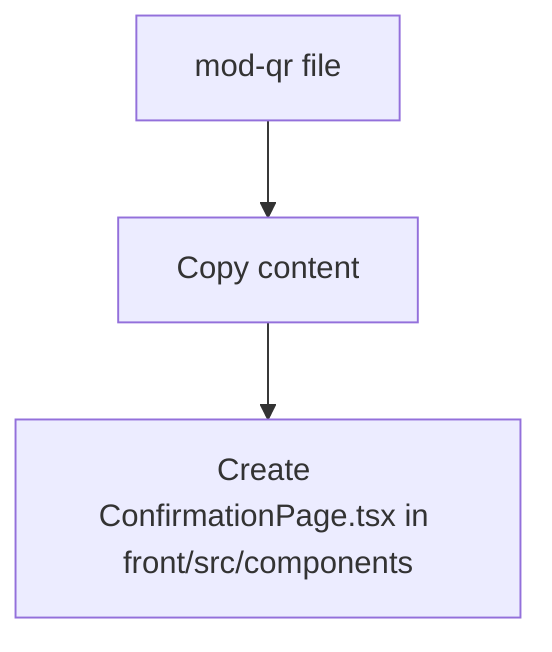
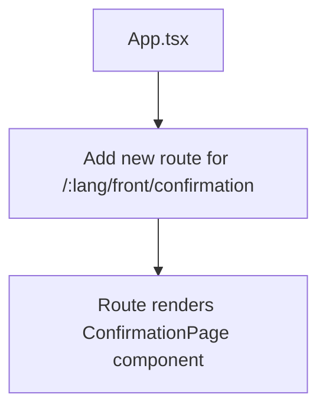
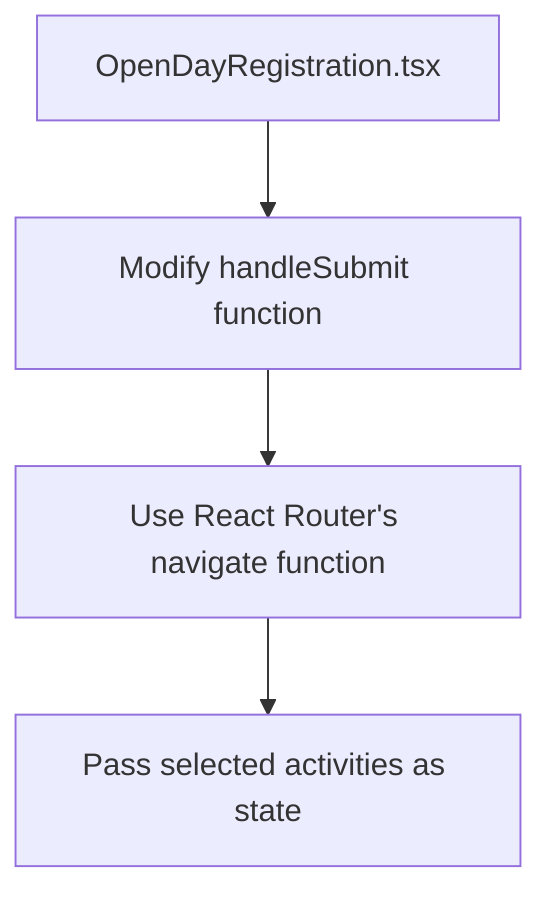

# QR Code Confirmation Page Integration Plan

## Overview

The `mod-qr` file contains a React component called `ConfirmationPage` that displays a confirmation page with a QR code and details of selected activities. This component needs to be integrated into the existing React application in the `/front` directory.

## Current System Analysis

1. **Front-end Application Structure**:
   - Uses React with React Router for navigation
   - Has internationalization (i18n) support
   - Main component is `OpenDayRegistration` which allows users to select activities and time slots

2. **Registration Flow**:
   - Users select activities and time slots in the `OpenDayRegistration` component
   - Currently, when users submit their selections, it only shows an alert and logs to console
   - The `ConfirmationPage` component would be the next logical step in this flow

3. **Data Structure**:
   - Activities have properties like id, title, course, location, duration, description, and time slots
   - The `handleSubmit` function in `OpenDayRegistration` already creates an array of selected activities in the format expected by `ConfirmationPage`

## Integration Plan

### 1. Add the ConfirmationPage Component

Create a new file `ConfirmationPage.tsx` in the `front/src/components` directory with the content from the `mod-qr` file.



### 2. Update App.tsx with a New Route

Add a new route in `App.tsx` for the confirmation page:



### 3. Modify OpenDayRegistration Component

Update the `handleSubmit` function in `OpenDayRegistration.tsx` to navigate to the confirmation page with the selected activities:



### 4. Ensure Proper Styling

Make sure the `ConfirmationPage` component has access to the same styling (Tailwind CSS) as the rest of the application.

### 5. Add Internationalization Support

Update the `ConfirmationPage` component to use the i18n translation system for text elements.

## Detailed Implementation Steps

1. **Create ConfirmationPage.tsx**:
   - Create a new file `front/src/components/ConfirmationPage.tsx`
   - Copy the content from `mod-qr`
   - Add imports for React Router and i18n
   - Update the component to use the i18n translation system

   ```typescript
   import React from 'react';
   import { useTranslation } from 'react-i18next';
   import { useLocation } from 'react-router-dom';

   interface SelectedActivity {
     activity?: string;
     course?: string;
     time?: string;
   }

   interface ConfirmationPageProps {
     activities: SelectedActivity[];
   }

   export const ConfirmationPage = ({ activities }: ConfirmationPageProps) => {
     const { t } = useTranslation();
     
     return (
       <main className="min-h-screen bg-[#00A4E4] w-full">
         <div className="max-w-4xl mx-auto py-12 px-4">
           <h1 className="text-6xl font-viridian text-white tracking-wide leading-tight text-center mb-12">
             {t('welcomeToOpenDays')}
           </h1>
           <div className="max-w-lg mx-auto">
             <div className="text-center text-white text-xl mb-8 font-bold">
               {t('emailRecapSent')}
             </div>
             <div className="bg-white p-8 rounded-lg shadow-lg mb-12">
               
             </div>
             <div className="space-y-4 mb-16">
               {activities.map((activity, index) => (
                 <div key={index} className="bg-[#0082b6] p-6 rounded">
                   <h2 className="text-xl text-white font-extrabold mb-2">
                     {activity.activity}
                   </h2>
                   <div className="text-yellow-300 font-bold">
                     {activity.course}
                   </div>
                   <div className="flex justify-between mt-2">
                     <div className="text-yellow-300 font-bold">
                       {t('location')}: Room 101
                     </div>
                     <div className="text-yellow-300 font-bold">
                       {t('duration')}: 45 minutes
                     </div>
                   </div>
                   <div className="text-yellow-300 mt-2 font-bold">
                     ({t('booked')}: {activity.time})
                   </div>
                 </div>
               ))}
             </div>
             <div className="flex justify-center">
               
             </div>
           </div>
         </div>
       </main>
     );
   };
   ```

2. **Update App.tsx**:
   - Add a new route for `/:lang/front/confirmation`
   - Ensure the route is wrapped in the `LanguageProvider`

   ```typescript
   import React from 'react';
   import { BrowserRouter, Routes, Route, Navigate, useLocation } from 'react-router-dom';
   import { OpenDayRegistration } from './components/OpenDayRegistration';
   import { ConfirmationPage } from './components/ConfirmationPage';
   import { LanguageProvider } from './components/LanguageProvider';
   import './i18n';

   // Helper component to handle default redirect with query parameters
   const DefaultRedirect = () => {
     const location = useLocation();
     // Preserve query parameters when redirecting to default language
     return <Navigate to={`/en/front${location.search}`} replace />;
   };

   // Helper component to handle the confirmation page with location state
   const ConfirmationPageWrapper = () => {
     const location = useLocation();
     const activities = location.state?.activities || [];
     
     return (
       <LanguageProvider>
         <ConfirmationPage activities={activities} />
       </LanguageProvider>
     );
   };

   export const App = () => {
     return (
       <BrowserRouter>
         <Routes>
           <Route path="/" element={<DefaultRedirect />} />
           <Route
             path="/:lang/front"
             element={
               <LanguageProvider>
                 <OpenDayRegistration />
               </LanguageProvider>
             }
           />
           <Route
             path="/:lang/front/confirmation"
             element={<ConfirmationPageWrapper />}
           />
         </Routes>
       </BrowserRouter>
     );
   };
   ```

3. **Modify OpenDayRegistration.tsx**:
   - Import `useNavigate` from React Router
   - Update the `handleSubmit` function to navigate to the confirmation page
   - Pass the selected activities as state in the navigation

   ```typescript
   import { useNavigate } from 'react-router-dom';
   
   // Inside the OpenDayRegistration component
   const navigate = useNavigate();
   
   const handleSubmit = () => {
     const selectedActivities = Object.entries(selectedTimeSlots).map(([activityId, timeSlotId]) => {
       const activity = activities.find(a => String(a.id) === String(activityId));
       const timeSlot = activity?.timeSlots.find(slot => slot.id === timeSlotId);
       return {
         activity: activity?.title,
         course: activity?.course,
         time: timeSlot?.time
       };
     });
     
     // Navigate to the confirmation page with the selected activities
     navigate(`/${lang}/front/confirmation`, { state: { activities: selectedActivities } });
   };
   ```

4. **Add Translations**:
   - Add the necessary translation keys to the locales files

   For English (en.json):
   ```json
   {
     "welcomeToOpenDays": "Welcome to Open Days",
     "emailRecapSent": "You received this recap also by email",
     "location": "Location",
     "duration": "Duration",
     "booked": "Booked"
   }
   ```

   For Italian (it.json):
   ```json
   {
     "welcomeToOpenDays": "Benvenuto agli Open Days",
     "emailRecapSent": "Hai ricevuto questo riepilogo anche via email",
     "location": "Posizione",
     "duration": "Durata",
     "booked": "Prenotato"
   }
   ```

## Potential Challenges and Considerations

1. **QR Code Generation**:
   - The current implementation uses a static QR code image URL
   - Consider implementing dynamic QR code generation based on the selected activities
   - Could use a library like `qrcode.react` to generate QR codes on the client side

2. **Data Persistence**:
   - If the user refreshes the confirmation page, the selected activities data will be lost
   - Consider implementing a solution to persist this data:
     - Store in localStorage
     - Send to backend and retrieve via URL parameter
     - Use React Query or similar for state management

3. **Back Navigation**:
   - Add a way for users to go back to the registration page if needed
   - Consider adding a "Back" button on the confirmation page

4. **Mobile Responsiveness**:
   - Ensure the confirmation page is responsive on mobile devices
   - Test on various screen sizes

## Testing Plan

1. Test the navigation from the registration page to the confirmation page
2. Verify that all selected activities are displayed correctly on the confirmation page
3. Test with different numbers of selected activities
4. Test the internationalization support (switch between languages)
5. Test on different screen sizes for responsiveness

## Future Enhancements

1. **Dynamic QR Code Generation**:
   - Implement a QR code generator that creates unique codes based on the user's selections
   - This could be used for check-in at the event

2. **Email Integration**:
   - Add functionality to send the confirmation details via email
   - Include the QR code in the email

3. **Calendar Integration**:
   - Add the ability to add the selected activities to the user's calendar
   - Support for iCal, Google Calendar, etc.

4. **Offline Support**:
   - Allow users to save the confirmation page for offline viewing
   - Implement as a Progressive Web App (PWA)