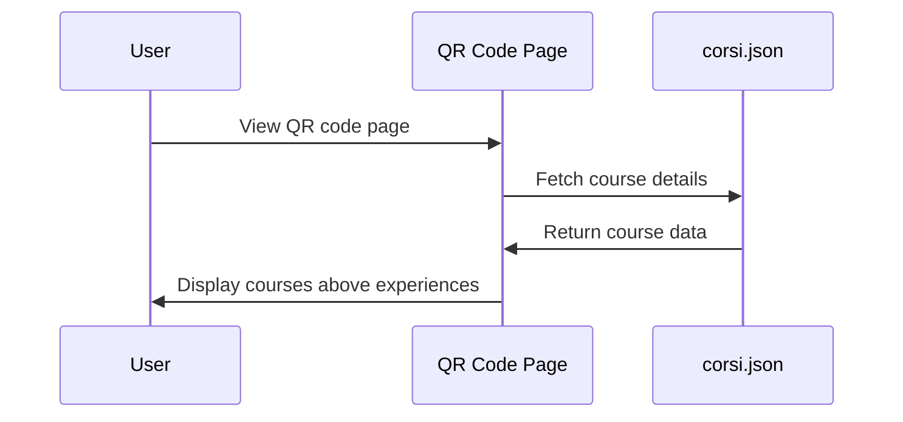

# QR Page Display Enhancement Plan

## Requirements

1. Move the matching courses list above the experiences list
2. Format the courses in the same style as the experiences
3. Include the same content (time/location) for courses as for experiences

## Implementation Plan

### 1. Update the ConfirmationPage Component Layout

We'll modify the ConfirmationPage component to display the matching courses above the experiences, using the same styling and format.



### 2. Enhance Course Display Format

We'll update the course display to match the experience display format, including:
- Same background color and styling
- Same layout for title, location, and time information
- Consistent formatting for all elements

### 3. Add Time and Location Information

We'll ensure that the course display includes:
- Course name (already implemented)
- Location (already implemented)
- Start and end times (need to add)
- Any other relevant information to match the experience display

## Detailed Code Changes

### 1. Update the ConfirmationPage Component

```typescript
// ConfirmationPage.tsx
return (
  <main className="min-h-screen bg-[#00A4E4] w-full">
    <div className="max-w-4xl mx-auto py-12 px-4">
      <h1 className="text-6xl font-viridian text-white tracking-wide leading-tight text-center mb-12">
        {t('welcomeToOpenDays')}
      </h1>
      <div className="max-w-lg mx-auto">
        <div className="text-center text-white text-xl mb-8 font-bold">
          {t('emailRecapSent')}
        </div>
        <div className="bg-white p-8 rounded-lg shadow-lg mb-12">
          
        </div>
        
        {/* Display matching courses FIRST */}
        {matchingCourses.length > 0 && (
          <div className="space-y-4 mb-16">
            <h2 className="text-2xl text-white font-bold text-center mb-4">
              {t('matchingCourses', 'Your Courses')}
            </h2>
            {matchingCourses.map((course, index) => (
              <div key={index} className="bg-[#0082b6] p-6 rounded">
                <h2 className="text-xl text-white font-extrabold mb-2">
                  {course.name}
                </h2>
                <div className="flex justify-between mt-2">
                  <div className="text-yellow-300 font-bold">
                    {t('location')}: {course.location || t('locationNotAvailable')}
                  </div>
                  {(course.orario_inizio || course.orario_fine) && (
                    <div className="text-yellow-300 font-bold">
                      {t('time')}: {course.orario_inizio || ''} 
                      {course.orario_inizio && course.orario_fine ? ' - ' : ''}
                      {course.orario_fine || ''}
                    </div>
                  )}
                </div>
              </div>
            ))}
          </div>
        )}
        
        {/* Then display selected activities */}
        <div className="space-y-4 mb-16">
          <h2 className="text-2xl text-white font-bold text-center mb-4">
            {t('selectedActivities', 'Your Activities')}
          </h2>
          {activities.map((activity, index) => (
            <div key={index} className="bg-[#0082b6] p-6 rounded">
              <h2 className="text-xl text-white font-extrabold mb-2">
                {activity.activity}
              </h2>
              <div className="text-yellow-300 font-bold">
                {activity.course}
              </div>
              <div className="flex justify-between mt-2">
                <div className="text-yellow-300 font-bold">
                  {t('location')}: {activity.location || t('locationNotAvailable')}
                </div>
                <div className="text-yellow-300 font-bold">
                  {t('duration')}: {activity.duration || t('durationNotAvailable')}
                </div>
              </div>
              <div className="text-yellow-300 mt-2 font-bold">
                ({t('booked')}: {activity.time})
              </div>
            </div>
          ))}
        </div>
        
        <div className="flex justify-center">
          
        </div>
      </div>
    </div>
  </main>
);
```

### 2. Update the i18n Translations

We'll need to add translations for the new section titles:

```typescript
// Add to translation files
{
  "matchingCourses": "Your Courses",
  "selectedActivities": "Your Activities",
  "time": "Time"
}
```

## Implementation Steps

1. Update the ConfirmationPage component to move the matching courses section above the experiences section
2. Enhance the styling of the matching courses to match the experiences
3. Add time information display for the courses
4. Add section titles for both courses and experiences
5. Update the translations for the new text

This implementation will ensure that the courses are displayed above the experiences, with the same styling and content format.