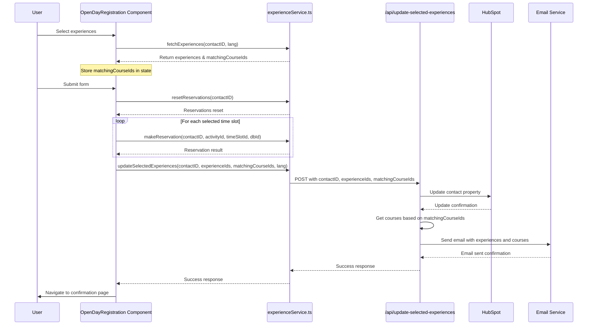

# Data Flow Diagram for Course IDs Implementation

The following diagram illustrates how the matchingCourseIds will flow through the system:

## Key Changes in Data Flow

1. **Frontend to Service**:
   - The `matchingCourseIds` are now passed from the OpenDayRegistration component to the experienceService's `updateSelectedExperiences` function

2. **Service to Backend**:
   - The experienceService now includes `matchingCourseIds` in the request body sent to the `/api/update-selected-experiences` endpoint

3. **Backend Processing**:
   - The backend endpoint extracts `matchingCourseIds` from the request
   - It uses these IDs to fetch the corresponding courses from corsi.json
   - The courses are included in the email sent to the user

This implementation ensures that the correct course IDs are passed from the frontend to the backend while maintaining all existing functionality.