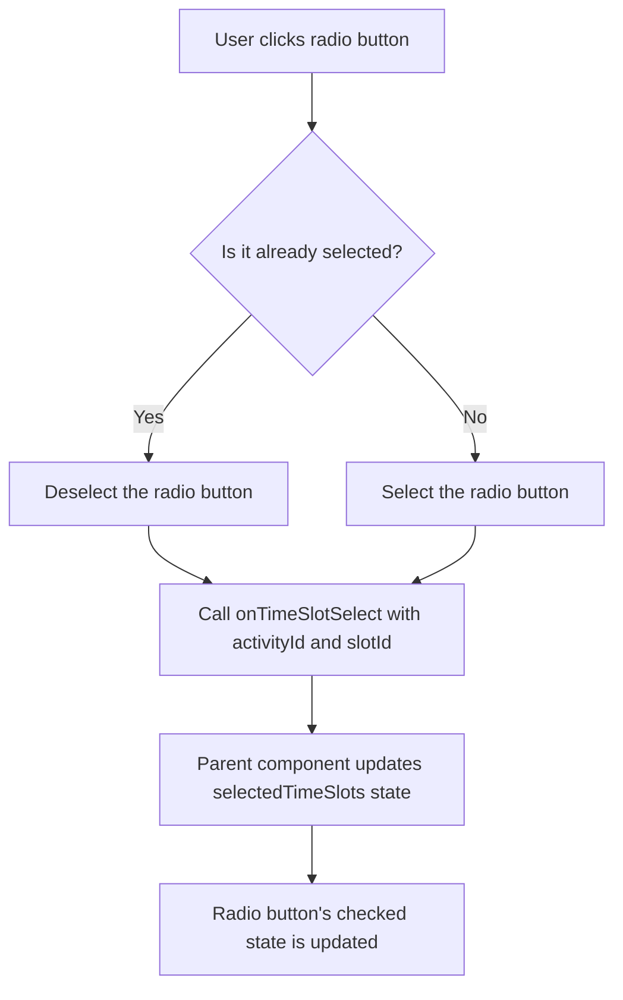

# Implementation Plan: Selectable/Deselectable Radio Buttons

## Problem Statement
In the experience selection screen in the `/front` directory, radio buttons are used to select time slots. Currently, these radio buttons can only be selected but not deselected. The requirement is to modify them to be selectable/deselectable (toggle behavior) while maintaining their visual appearance.

## Current Implementation Analysis

### OpenDayRegistration Component
- Already has logic for deselection in the `handleTimeSlotSelect` function (lines 331-348)
- Checks if a selected slot is clicked again and removes it from the selection state
- Manages the selection state in the `selectedTimeSlots` state variable

```typescript
const handleTimeSlotSelect = (activityId: number | string, timeSlotId: string) => {
  // Check if this is a deselection (clicking the same slot again)
  const isDeselection = selectedTimeSlots[activityId] === timeSlotId;
  
  let newSelectedTimeSlots;
  
  if (isDeselection) {
    // Create a new object without the deselected slot
    newSelectedTimeSlots = { ...selectedTimeSlots };
    delete newSelectedTimeSlots[activityId];
  } else {
    // Add or update the selected slot
    newSelectedTimeSlots = {
      ...selectedTimeSlots,
      [activityId]: timeSlotId
    };
  }
  
  // Update the selected time slots state
  setSelectedTimeSlots(newSelectedTimeSlots);
  
  // Calculate overlapping slots
  const newOverlappingSlots = checkTimeSlotOverlaps(newSelectedTimeSlots);
  
  // Update the overlapping slots state
  setOverlappingSlots(newOverlappingSlots);
};
```

### ActivityAccordion Component
- Renders radio buttons for time slot selection (lines 100-108)
- Radio buttons by their nature can only be selected, not deselected
- Uses standard HTML radio input with onChange handler

```tsx
<input
  type="radio"
  name={`timeSlot-${activity.id}`}
  value={slot.id}
  checked={selectedSlot === slot.id}
  onChange={() => onTimeSlotSelect(activity.id, slot.id)}
  className="h-4 w-4 text-yellow-300 border-white/30"
  disabled={isDisabled}
/>
```

## Proposed Solution

Modify the ActivityAccordion component to add a custom click handler to the radio button input that will:
1. Prevent the default radio button behavior
2. Manually call the onTimeSlotSelect function to handle both selection and deselection

### Code Changes

The main change will be to the radio button input in ActivityAccordion.tsx (around lines 100-108):

```tsx
<input
  type="radio"
  name={`timeSlot-${activity.id}`}
  value={slot.id}
  checked={selectedSlot === slot.id}
  // Empty onChange handler to avoid React warning about controlled component
  onChange={() => {}}
  // Add custom click handler to enable deselection
  onClick={(e) => {
    // Prevent default radio button behavior
    e.preventDefault();
    // Call the onTimeSlotSelect function to handle selection/deselection
    onTimeSlotSelect(activity.id, slot.id);
  }}
  className="h-4 w-4 text-yellow-300 border-white/30"
  disabled={isDisabled}
/>
```

## Implementation Flow



## Testing Strategy

After implementing the changes, we should test:
- Selecting a previously unselected radio button works as expected
- Clicking an already selected radio button deselects it
- The visual appearance remains consistent with radio buttons
- The selection state is correctly maintained in the parent component
- Disabled radio buttons remain non-interactive

## Next Steps

1. Switch to Code mode to implement the changes to ActivityAccordion.tsx
2. Test the implementation to ensure it works as expected
3. Verify that the radio buttons can be both selected and deselected