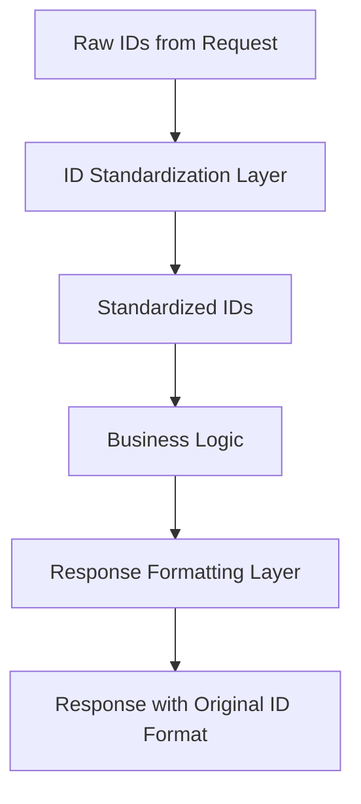
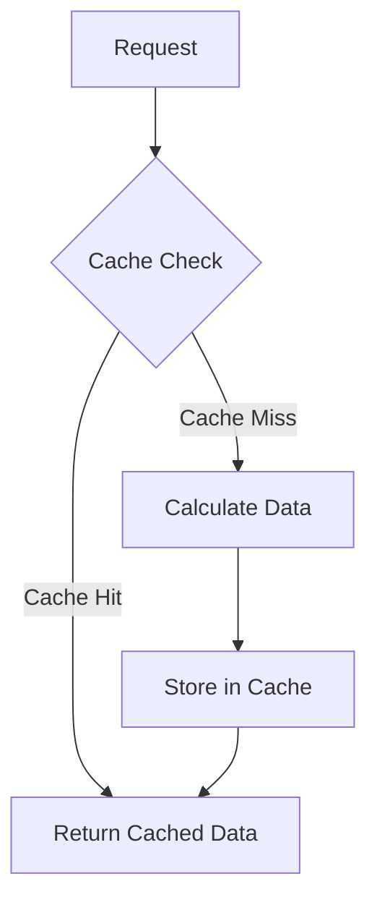
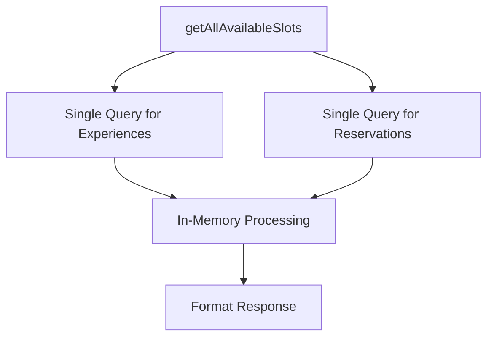
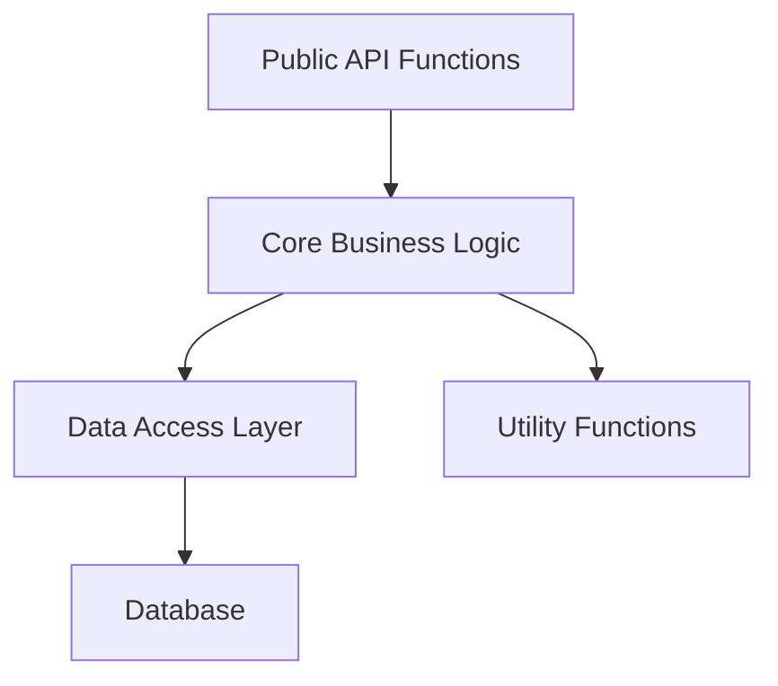

# Slot Calculation Simplification Plan

## Current Issues Identified

1. **Complex ID Transformations**: 
   - Multiple string manipulations to extract base experience IDs (removing number suffixes)
   - Conversions between different ID formats
   - Redundant transformations of the same IDs in different functions

2. **Confusing Key Formats**:
   - Multiple key formats for the same data (e.g., `baseExperienceId_baseTimeSlotId` and `experienceId_timeSlotId`)
   - Maintaining backward compatibility adds complexity

3. **Inefficient Query Patterns**:
   - Separate queries for max participants and reservation counts
   - Potential for N+1 query problems

4. **Code Readability Issues**:
   - Long functions with multiple responsibilities
   - Duplicated logic across functions
   - Excessive logging that obscures the core logic

## Proposed Solutions

### 1. Standardize ID Handling with Helper Functions



Create utility functions to handle ID transformations consistently:

- `standardizeExperienceId(id)`: Convert any experience ID to a standard format
- `standardizeTimeSlotId(experienceId, timeSlotId)`: Ensure time slot IDs use the standard format
- `formatResponseKey(baseId, timeSlotId)`: Generate consistent keys for response objects

### 2. Implement Caching for Frequently Used Data



- Cache experience metadata (max_participants) to reduce database queries
- Cache reservation counts with a short TTL (time-to-live)
- Implement a simple in-memory cache with automatic invalidation

### 3. Optimize Database Queries



- Reduce the number of database queries by fetching all needed data at once
- Process and transform data in memory rather than with multiple queries
- Use parameterized queries consistently for better security and performance

### 4. Improve Code Structure and Readability



- Separate concerns: data access, business logic, and response formatting
- Create smaller, focused functions with clear responsibilities
- Add comprehensive documentation for complex operations
- Reduce excessive logging to focus on important information

## Implementation Plan

### Phase 1: Create Utility Functions

1. Create a new module `slotCalculationUtils.js` with helper functions:
   - ID standardization functions
   - Key formatting functions
   - Validation functions

2. Refactor the existing code to use these utility functions without changing behavior

### Phase 2: Optimize Core Functions

1. Refactor `getAvailableSlots()` to use standardized IDs and reduce transformations
2. Optimize `getAllAvailableSlots()` to use fewer queries and process data more efficiently
3. Implement simple caching for frequently accessed data

### Phase 3: Improve Error Handling and Logging

1. Standardize error handling across all functions
2. Reduce excessive logging while maintaining important diagnostic information
3. Add more descriptive error messages for troubleshooting

### Phase 4: Testing and Validation

1. Create comprehensive tests to ensure the refactored code produces the same results
2. Validate performance improvements with benchmarks
3. Ensure backward compatibility with existing API consumers

## Expected Benefits

1. **Improved Readability**: Clearer code structure with well-named utility functions
2. **Better Performance**: Reduced database queries and optimized data processing
3. **Easier Maintenance**: Centralized ID handling logic makes future changes simpler
4. **Reduced Complexity**: Elimination of redundant transformations and calculations

## Proposed Implementation Details

### New Utility Module: `slotCalculationUtils.js`

```javascript
/**
 * Utility functions for slot calculation
 */
const logger = require('./logger');

/**
 * Standardize an experience ID by removing any number suffix
 * @param {string} experienceId - The experience ID to standardize
 * @returns {string} - The standardized experience ID
 */
function standardizeExperienceId(experienceId) {
  if (!experienceId) return '';
  return experienceId.replace(/-\d+$/, '');
}

/**
 * Standardize a time slot ID to ensure it uses the base experience ID
 * @param {string} experienceId - The experience ID
 * @param {string} timeSlotId - The time slot ID
 * @returns {string} - The standardized time slot ID
 */
function standardizeTimeSlotId(experienceId, timeSlotId) {
  if (!experienceId || !timeSlotId) return timeSlotId;
  
  const baseExperienceId = standardizeExperienceId(experienceId);
  
  // If the time slot ID starts with the full experience ID, replace it with the base ID
  if (timeSlotId.startsWith(experienceId)) {
    return `${baseExperienceId}${timeSlotId.substring(experienceId.length)}`;
  }
  
  return timeSlotId;
}

/**
 * Create a consistent key format for slot availability
 * @param {string} experienceId - The experience ID
 * @param {string} timeSlotId - The time slot ID
 * @returns {string} - The formatted key
 */
function formatSlotKey(experienceId, timeSlotId) {
  return `${experienceId}_${timeSlotId}`;
}

/**
 * Create all necessary key formats for backward compatibility
 * @param {string} experienceId - The original experience ID
 * @param {string} timeSlotId - The time slot ID
 * @returns {Object} - Object with dbKey and originalKey properties
 */
function createCompatibleKeys(experienceId, timeSlotId) {
  const baseExperienceId = standardizeExperienceId(experienceId);
  const baseTimeSlotId = standardizeTimeSlotId(experienceId, timeSlotId);
  
  // Database key format (primary format)
  const dbKey = formatSlotKey(baseExperienceId, baseTimeSlotId);
  
  // Original key format (for backward compatibility)
  const originalKey = formatSlotKey(experienceId, timeSlotId);
  
  return {
    dbKey,
    originalKey,
    // Only return different keys
    allKeys: dbKey === originalKey ? [dbKey] : [dbKey, originalKey]
  };
}

// Simple in-memory cache with TTL
const cache = {
  data: {},
  ttl: {},
  
  /**
   * Set a value in the cache with a TTL
   * @param {string} key - Cache key
   * @param {any} value - Value to cache
   * @param {number} ttlMs - Time to live in milliseconds
   */
  set(key, value, ttlMs = 60000) {
    this.data[key] = value;
    this.ttl[key] = Date.now() + ttlMs;
  },
  
  /**
   * Get a value from the cache
   * @param {string} key - Cache key
   * @returns {any|null} - Cached value or null if not found or expired
   */
  get(key) {
    // Check if key exists and is not expired
    if (this.data[key] && this.ttl[key] > Date.now()) {
      return this.data[key];
    }
    
    // Delete expired key
    if (this.data[key]) {
      delete this.data[key];
      delete this.ttl[key];
    }
    
    return null;
  },
  
  /**
   * Clear all cache entries
   */
  clear() {
    this.data = {};
    this.ttl = {};
  }
};

module.exports = {
  standardizeExperienceId,
  standardizeTimeSlotId,
  formatSlotKey,
  createCompatibleKeys,
  cache
};
```

### Refactored `slotCalculationService.js`

```javascript
/**
 * Service for standardized slot availability calculations
 */
const logger = require('./logger');
const utils = require('./slotCalculationUtils');

/**
 * Get the number of available slots for a specific experience and time slot
 * @param {Object} db - Database instance
 * @param {string} experienceId - Experience ID
 * @param {string} timeSlotId - Time slot ID
 * @returns {Promise<number>} - Number of available slots
 */
async function getAvailableSlots(db, experienceId, timeSlotId) {
  try {
    // Standardize IDs
    const baseExperienceId = utils.standardizeExperienceId(experienceId);
    const baseTimeSlotId = utils.standardizeTimeSlotId(experienceId, timeSlotId);
    
    logger.info(`Getting available slots for baseExperienceId: ${baseExperienceId}, baseTimeSlotId: ${baseTimeSlotId}`);
    
    // Get max_participants for this experience
    const maxParticipants = await getMaxParticipants(db, baseExperienceId);
    
    // Get current reservation count
    const reservationCount = await getReservationCount(db, baseExperienceId, baseTimeSlotId);
    
    // Calculate available slots
    const availableSlots = Math.max(0, maxParticipants - reservationCount);
    logger.info(`Available slots for ${baseExperienceId}, ${baseTimeSlotId}: ${availableSlots} (max: ${maxParticipants}, reserved: ${reservationCount})`);
    
    return availableSlots;
  } catch (error) {
    logger.error(`Error in getAvailableSlots: ${error.message}`);
    throw error;
  }
}

/**
 * Check if a slot is available
 * @param {Object} db - Database instance
 * @param {string} experienceId - Experience ID
 * @param {string} timeSlotId - Time slot ID
 * @returns {Promise<boolean>} - True if slot is available
 */
async function isSlotAvailable(db, experienceId, timeSlotId) {
  try {
    const availableSlots = await getAvailableSlots(db, experienceId, timeSlotId);
    return availableSlots > 0;
  } catch (error) {
    logger.error(`Error in isSlotAvailable: ${error.message}`);
    throw error;
  }
}

/**
 * Get the maximum number of participants for an experience
 * @param {Object} db - Database instance
 * @param {string} experienceId - Experience ID
 * @returns {Promise<number>} - Maximum number of participants
 */
async function getMaxParticipants(db, experienceId) {
  try {
    // Check cache first
    const cacheKey = `max_participants_${experienceId}`;
    const cachedValue = utils.cache.get(cacheKey);
    if (cachedValue !== null) {
      return cachedValue;
    }
    
    // Standardize the experience ID
    const baseExperienceId = utils.standardizeExperienceId(experienceId);
    
    return new Promise((resolve, reject) => {
      db.get(
        "SELECT max_participants FROM experiences WHERE experience_id LIKE ?",
        [`${baseExperienceId}%`],
        (err, row) => {
          if (err) {
            logger.error(`Error getting max_participants: ${err.message}`);
            reject(err);
          } else if (!row) {
            logger.warn(`No experience found with ID ${baseExperienceId}`);
            resolve(0);
          } else {
            // Cache the result for 5 minutes
            utils.cache.set(cacheKey, row.max_participants, 5 * 60 * 1000);
            resolve(row.max_participants);
          }
        }
      );
    });
  } catch (error) {
    logger.error(`Error in getMaxParticipants: ${error.message}`);
    throw error;
  }
}

/**
 * Get the current reservation count for an experience and time slot
 * @param {Object} db - Database instance
 * @param {string} experienceId - Experience ID
 * @param {string} timeSlotId - Time slot ID
 * @returns {Promise<number>} - Current reservation count
 */
async function getReservationCount(db, experienceId, timeSlotId) {
  try {
    // Standardize IDs
    const baseExperienceId = utils.standardizeExperienceId(experienceId);
    const baseTimeSlotId = utils.standardizeTimeSlotId(experienceId, timeSlotId);
    
    // Check cache first (short TTL for reservation counts)
    const cacheKey = `reservation_count_${baseExperienceId}_${baseTimeSlotId}`;
    const cachedValue = utils.cache.get(cacheKey);
    if (cachedValue !== null) {
      return cachedValue;
    }
    
    logger.info(`Getting reservation count for baseExperienceId: ${baseExperienceId}, baseTimeSlotId: ${baseTimeSlotId}`);
    
    // Get count using only the base experience ID format
    const count = await new Promise((resolve, reject) => {
      db.get(
        "SELECT COUNT(*) as count FROM opend_reservations WHERE experience_id = ? AND time_slot_id = ?",
        [baseExperienceId, baseTimeSlotId],
        (err, row) => {
          if (err) {
            logger.error(`Error getting reservation count: ${err.message}`);
            reject(err);
          } else {
            logger.info(`Reservation count for ${baseExperienceId}, ${baseTimeSlotId}: ${row ? row.count : 0}`);
            resolve(row ? row.count : 0);
          }
        }
      );
    });
    
    // Cache the result for 30 seconds
    utils.cache.set(cacheKey, count, 30 * 1000);
    
    return count;
  } catch (error) {
    logger.error(`Error in getReservationCount: ${error.message}`);
    throw error;
  }
}

/**
 * Get all available slots for all experiences
 * @param {Object} db - Database instance
 * @returns {Promise<Object>} - Object with keys in the format "experienceId_timeSlotId" and values representing available slots
 */
async function getAllAvailableSlots(db) {
  try {
    // Get all experiences with their max_participants in a single query
    const experiences = await new Promise((resolve, reject) => {
      db.all(
        "SELECT experience_id, max_participants FROM experiences",
        (err, rows) => {
          if (err) {
            logger.error(`Error getting experiences: ${err.message}`);
            reject(err);
          } else {
            resolve(rows);
          }
        }
      );
    });
    
    // Get all reservation counts in a single query
    const reservationCounts = await new Promise((resolve, reject) => {
      db.all(
        "SELECT experience_id, time_slot_id, COUNT(*) as count FROM opend_reservations GROUP BY experience_id, time_slot_id",
        (err, rows) => {
          if (err) {
            logger.error(`Error getting reservation counts: ${err.message}`);
            reject(err);
          } else {
            const counts = {};
            rows.forEach(row => {
              const key = utils.formatSlotKey(row.experience_id, row.time_slot_id);
              counts[key] = row.count;
            });
            resolve(counts);
          }
        }
      );
    });
    
    // Calculate available slots for each experience and time slot
    const availableSlots = {};
    
    for (const exp of experiences) {
      // Standardize the experience ID
      const baseExperienceId = utils.standardizeExperienceId(exp.experience_id);
      
      // Assume up to 5 time slots per experience
      for (let i = 1; i <= 5; i++) {
        // Create the time slot ID
        const dbTimeSlotId = `${baseExperienceId}-${i}`;
        
        // Get the compatible keys for this experience and time slot
        const keys = utils.createCompatibleKeys(exp.experience_id, dbTimeSlotId);
        
        // Get reservation count for the database key
        const reservationCount = reservationCounts[keys.dbKey] || 0;
        
        // Calculate available slots
        const availableSlotCount = Number(Math.max(0, exp.max_participants - reservationCount));
        
        // Store the same value for all key formats (for backward compatibility)
        keys.allKeys.forEach(key => {
          availableSlots[key] = availableSlotCount;
        });
        
        logger.info(`Generated key: ${keys.dbKey} with availability: ${availableSlotCount}, reservation count: ${reservationCount}`);
      }
    }
    
    return availableSlots;
  } catch (error) {
    logger.error(`Error in getAllAvailableSlots: ${error.message}`);
    throw error;
  }
}

module.exports = {
  getAvailableSlots,
  isSlotAvailable,
  getReservationCount,
  getAllAvailableSlots
};
```

## Benefits of the New Implementation

1. **Centralized ID Handling**: All ID transformations are now handled by utility functions, making the code more consistent and easier to maintain.

2. **Improved Performance**: 
   - Caching of max_participants and reservation counts reduces database queries
   - Single queries for all experiences and reservation counts in getAllAvailableSlots

3. **Better Code Organization**:
   - Separation of utility functions from business logic
   - Clearer function responsibilities
   - More consistent error handling

4. **Maintained Compatibility**:
   - The API behavior remains the same
   - Backward compatibility with existing key formats is preserved
   - No database schema changes required

This implementation significantly simplifies the slot calculation logic while maintaining all existing functionality and compatibility.