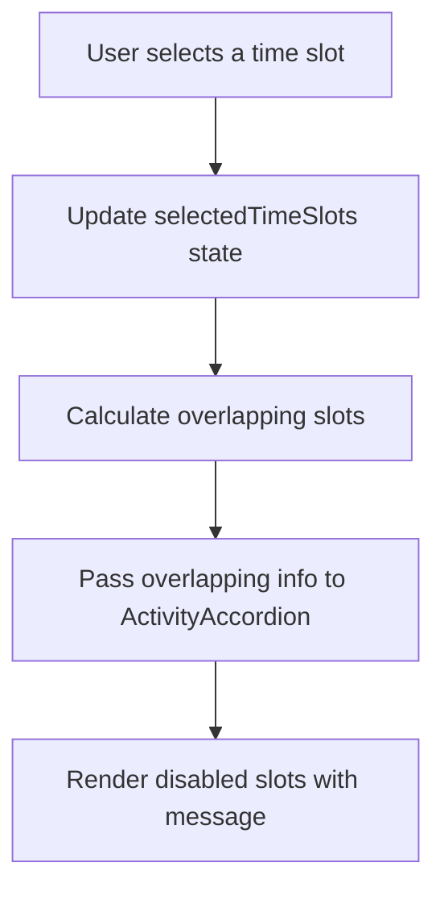

# Implementation Plan for Time Slot Overlap Feature

## Overview

When a user selects a time slot for an activity, we need to:
1. Identify time slots in other activities that overlap with the selected one
2. Make those overlapping time slots non-selectable
3. Display a message indicating that the user is already busy at that time

## Technical Approach

We'll implement this feature by modifying the following components:

### 1. OpenDayRegistration Component

We'll enhance this component to:
- Track all selected time slots and their time ranges
- Determine which time slots in other activities overlap with selected ones
- Pass this information to the ActivityAccordion components

### 2. ActivityAccordion Component

We'll update this component to:
- Disable time slots that overlap with selected slots from other activities
- Display a message indicating that the user is already busy at that time

## Detailed Implementation Steps

### Step 1: Modify the OpenDayRegistration Component



1. Add a new state to track overlapping time slots:
   ```typescript
   const [overlappingSlots, setOverlappingSlots] = useState<Record<string, boolean>>({});
   ```

2. Create a function to check for time slot overlaps:
   ```typescript
   const checkTimeSlotOverlaps = (selectedSlots: Record<number, string>) => {
     const overlaps: Record<string, boolean> = {};
     
     // For each selected slot
     Object.entries(selectedSlots).forEach(([activityId, slotId]) => {
       const activity = activities.find(a => a.id === parseInt(activityId));
       const selectedSlot = activity?.timeSlots.find(s => s.id === slotId);
       
       if (activity && selectedSlot && selectedSlot.time && selectedSlot.endTime) {
         // Check all other activities for overlaps
         activities.forEach(otherActivity => {
           if (otherActivity.id !== parseInt(activityId)) {
             otherActivity.timeSlots.forEach(otherSlot => {
               // Check if this slot overlaps with the selected slot
               if (
                 (otherSlot.time >= selectedSlot.time && otherSlot.time < selectedSlot.endTime) ||
                 (otherSlot.endTime && otherSlot.endTime > selectedSlot.time && otherSlot.endTime <= selectedSlot.endTime) ||
                 (otherSlot.time <= selectedSlot.time && otherSlot.endTime && otherSlot.endTime >= selectedSlot.endTime)
               ) {
                 overlaps[otherSlot.id] = true;
               }
             });
           }
         });
       }
     });
     
     return overlaps;
   };
   ```

3. Update the handleTimeSlotSelect function to check for overlaps:
   ```typescript
   const handleTimeSlotSelect = (activityId: number, timeSlotId: string) => {
     const newSelectedTimeSlots = {
       ...selectedTimeSlots,
       [activityId]: timeSlotId
     };
     
     setSelectedTimeSlots(newSelectedTimeSlots);
     
     // Calculate overlapping slots
     const newOverlappingSlots = checkTimeSlotOverlaps(newSelectedTimeSlots);
     setOverlappingSlots(newOverlappingSlots);
   };
   ```

4. Pass the overlapping slots information to the ActivityAccordion component:
   ```tsx
   <ActivityAccordion
     key={activity.id}
     activity={activity}
     isOpen={openAccordion === activity.id}
     onClick={() => setOpenAccordion(openAccordion === activity.id ? null : activity.id)}
     selectedSlot={selectedTimeSlots[activity.id] || null}
     onTimeSlotSelect={handleTimeSlotSelect}
     overlappingSlots={overlappingSlots}
   />
   ```

### Step 2: Update the ActivityAccordion Component

1. Update the component props to include overlapping slots:
   ```typescript
   interface ActivityAccordionProps {
     activity: ActivityDetails;
     isOpen: boolean;
     onClick: () => void;
     selectedSlot: string | null;
     onTimeSlotSelect: (activityId: number, timeSlotId: string) => void;
     overlappingSlots: Record<string, boolean>;
   }
   ```

2. Modify the time slot rendering to disable overlapping slots and show a message:
   ```tsx
   {activity.timeSlots.map(slot => {
     const isOverlapping = overlappingSlots[slot.id];
     
     return (
       <div key={slot.id} className="flex items-start space-x-3 p-2 rounded hover:bg-white/5">
         <div className="flex items-center">
           <input 
             type="radio" 
             name={`timeSlot-${activity.id}`} 
             value={slot.id} 
             checked={selectedSlot === slot.id} 
             onChange={() => onTimeSlotSelect(activity.id, slot.id)} 
             className="h-4 w-4 text-yellow-300 border-white/30" 
             disabled={isOverlapping}
           />
         </div>
         <div className="flex flex-col">
           <span className={`text-white ${isOverlapping ? 'opacity-50' : ''}`}>
             {slot.endTime ? `${slot.time} - ${slot.endTime}` : slot.time}
           </span>
           <span className="text-sm text-white/70">
             ({t('spotsAvailable', { count: slot.available })})
           </span>
           {isOverlapping && (
             <span className="text-sm text-red-300 mt-1">
               {t('alreadyBusy')}
             </span>
           )}
         </div>
       </div>
     );
   })}
   ```

### Step 3: Update the Translation Files

Add a new translation key for the "already busy" message:

```json
{
  "alreadyBusy": "You are already busy at this time"
}
```

## Testing Plan

1. Test selecting a time slot and verifying that overlapping slots in other activities become disabled
2. Test that the "already busy" message appears for disabled slots
3. Test selecting different time slots and verifying that the disabled slots update correctly
4. Test deselecting a time slot and verifying that previously disabled slots become selectable again

## Considerations and Edge Cases

1. **Time Format Handling**: Ensure proper comparison of time strings. We're assuming the backend provides consistent time formats.

2. **Partial Overlaps**: We're handling cases where a slot partially overlaps with another (starts during another or ends during another).

3. **Complete Containment**: We're also handling cases where one slot completely contains another.

4. **Performance**: The overlap calculation happens on each selection, which should be efficient for a reasonable number of activities and time slots.

5. **Accessibility**: Ensure that disabled inputs are properly styled and that the "already busy" message is clear and accessible.